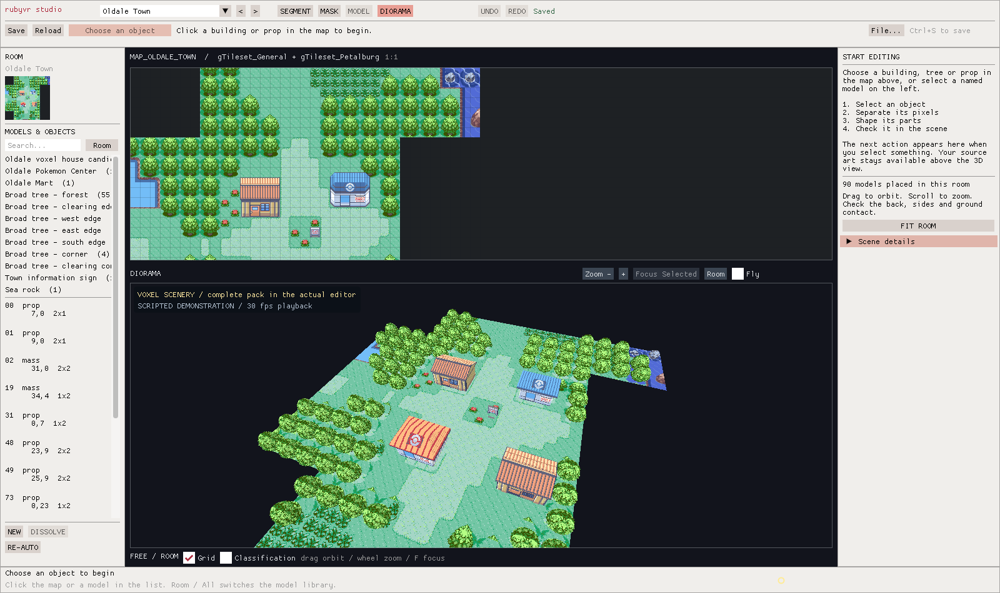
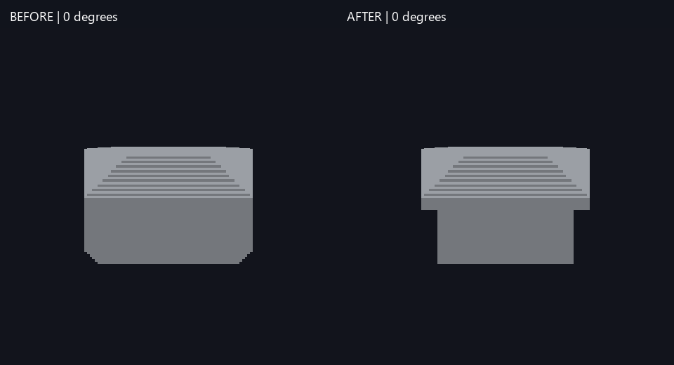
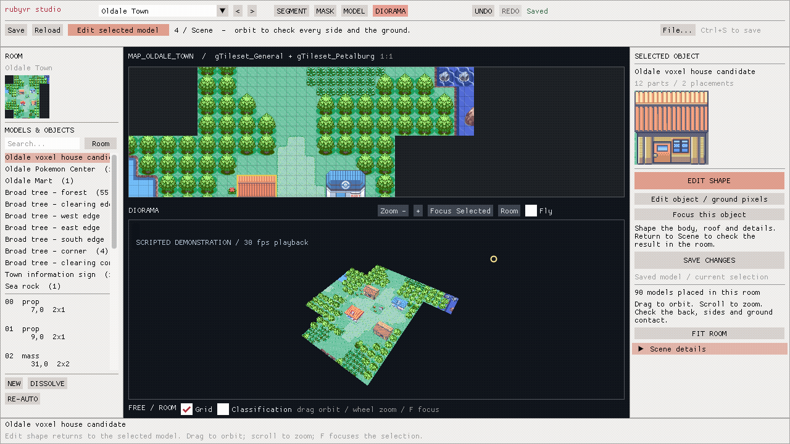

# RubyVR Studio

**Help build an editable voxel Hoenn.** RubyVR Studio turns Ruby's map drawings
into editable buildings, trees and props, with a shared C++ renderer intended
for a native PC VR game integration.

Select a group, separate object pixels from ground and shadow, give its parts
depth, and inspect the result in the map. Models retain their source-pixel
artwork and can be reused wherever their tile pattern matches exactly.



**Early development:** the native Linux/WSL editor and common scenery starters work.
Initial authored terrain controls and shared neighbour heights are available;
complete terrain reconstruction, the playable voxel game and runtime time/weather
are still being built. Artists, testers, documentation writers and AI-assisted programmers
are welcome. Start with [Contributing](CONTRIBUTING.md) and the
[open contribution issues](https://github.com/ChronoHaxx/rubyvr-studio/issues).
The [work-package index](docs/issues/README.md) explains scope and dependencies.

**Delivery priority:** [one-week desktop demo target](docs/roadmap.md#one-week-desktop-demo-target),
with substantial batches and one combined review/playtest per batch. The target
is a small playable area another player can install, with public runner setup
still to resolve. Free walking/camera modes merged in PR #35 and
[common indoor playability](docs/common-interiors.md) in PR #36. The current
batch adds [a play screen and remembered settings](docs/demo-runner.md).

The native game integration keeps [RubySapphireRecomp](integration/README.md).
The prepared desktop demo supports the original player and nearby NPCs,
connected outdoor walking, original menus/dialogue, and Third person and First
person free cameras. Developer controls provide named checkpoints, pause/step,
speed and obstacle bypass. See [the demo guide](docs/developer-mode.md).

**Watch the current result:** [short native gameplay GIF and playtest](docs/acceptance.md).
[The roadmap](docs/roadmap.md) tracks the remaining art, gameplay, camera,
performance, public installation and VR work. Completed PRs and their bounded
human results are recorded there; they do not imply full-game acceptance.

## What works

**Current batch for review: [local demo startup](docs/demo-runner.md).**
Choose a camera and named situation in the Play screen. Camera preferences and
the last saved/opened checkpoint survive reopening; debug toggles reset. Local
preparation stages runtime DLLs and checks inputs. The public runner remains open.

**Merged in PR #36: [common houses, shops, Centers and labs](docs/common-interiors.md).**
Reusable guarded room recipes extend free Third/First person beyond May's house.
Four new checkpoints lead directly into representative rooms. The guide includes
native gameplay footage and the short playtest; furniture art and broad acceptance
remain provisional. [Free walking and camera modes](docs/free-camera-movement.md)
merged in PR #35 with seven checked human steps for `c7ed26d`.

The merged [two-floor May house pilot](docs/free-camera-movement.md) remains
available, with furniture collision, dialogue and stairs. Unsupported room
recipes and battles use the original view. Camera obstacle avoidance, ledge
corner repairs, all-map art acceptance and public runner setup remain open.

**PR #34 merged at `4a6f2246` on 13 September:**
[demo controls, distant NPCs and Route 101 ledges](docs/desktop-demo-batch.md).
Its individual human checks remain unreported. The current build includes those
controls and scenery changes. [Host integration audit](docs/runtime-host-audit.md).

- [Terrain authoring](docs/terrain-authoring.md): explicit heights, steps,
  materials/underlays and layered decks, with undo/save/reopen. A local
  [six-map example](docs/terrain-regions.md) exercises connected heights and
  copied-neighbour ownership. The [connected explorer](docs/connected-scene.md)
  merged in PR #30. [Model reuse and a six-map view](docs/region-model-reuse.md)
  merged in PR #31: Littleroot to Petalburg, with less mesh memory.
  Complete world terrain and live map transitions remain open.
  The optional [Route 104 bridge example](docs/terrain-bridge.md) merged in PR #25:
  water below a solid boardwalk, with level bank contact and a Petalburg join.

- SEGMENT → MASK → MODEL → DIORAMA authoring, source-role brushes and flood fill.
- Editable boxes, stepped/gabled roofs and sprite reliefs; recessed doors/windows.
- Pixel-sized transforms, per-face artwork, edge artwork, material repeat/offset.
- Click parts in the 3D view, see their names/outlines, and Move / Resize / Rotate;
  Shift+F frames the selected part while F frames the whole model.
- Orbit/fly cameras, orthographic views, neutral geometry inspection and undo/redo.
- Current-room model browsing/search, source thumbnails and a visible next action
  from selecting an object through masking, shaping and saving.
- Exact save/reopen and structural matching of repeated scenery across maps.
- A [coverage ledger](docs/coverage-ledger.md) with per-map remaining work,
  source events/scripts/animation inventories, independent visual/live/headset
  reviews and invalidation when inputs change.
- **Review…** searches static scenery by missing model, unresolved, unreviewed
  or failed status, then opens the exact source placement in the map.
- Optional neutral/dawn/noon/dusk/night lighting preview with a pixelated sky;
  source art and saved geometry stay unchanged. [Evidence and limits](docs/environment-verification.md).
- Recipes for **66 starter models:** 37 buildings, 22 tree/bush variants,
  five rocks and two signs, plus six masks that restore ground around trees.
  Generate the models locally from source assets.

An eight-angle shape review caught front walls extending beyond the body.
Before is on the left; the corrected model is on the right. These are actual
editor renders with textures disabled, not concept art.



The current pack has been audited against 394 maps: 3,653 model placements inside
64 maps, plus 1,121 copies in connection padding. Ground cleanup masks are counted
separately. The editor regression suite
has 270 checks. These are separate measures; they are **not a whole-game
completion percentage**. See [verification](docs/verification.md) for limits.

## Build and try it

The standalone editor builds without a game ROM, BIOS, `gbarecomp` or an
OpenXR runtime. Its current map loader needs a local, pinned `pret/pokeruby`
checkout for source art/data; those assets are not bundled here. The supported
workflow uses Ubuntu/WSL2, Bash, SDL2, OpenGL, zlib, OpenXR headers and Python.
The GUI needs a working display; native batch checks can run headlessly.

Follow [the build guide](docs/building.md), then run from this repository:

```bash
bash tools/build.sh --jobs 4
python3 tools/prepare-assets.py
bash tools/run-studio.sh --fresh
```

For a worker or CI host without a display:

```bash
bash tools/build.sh --batch-only --build-dir build-linux
build-linux/rubyvr_studio --test-connected
```

The existing editor and connected exploration suites also pass natively on WSLg.
Linux OpenXR gameplay remains unsupported. [Verification and limits](docs/native-wsl.md).

Your edits save to a personal file under `build/`. The supplied recipes stay
separate. The [authoring guide](docs/authoring.md) walks through the first model.

The current guided workflow, captured from actual scripted SDL input. This
shows selecting, shaping, masking and viewing an existing model; it is not a
timed human authoring trial.



## Where the game comes from

The game integration was developed on
[mstan/RubySapphireRecomp](https://github.com/mstan/RubySapphireRecomp), using
[mstan/gbarecomp](https://github.com/mstan/gbarecomp). That path translates GBA
ARM/Thumb ROM code into native code and models the surrounding GBA hardware;
the framework also has interpreter/self-healing paths where static coverage is
incomplete. RubyVR adds scenery authoring and presentation around that work.

This repository contains the standalone editor and our integration source.
It does not contain a finished game runner or an installable `.gbamod` package.
The renderer-to-runner connection still needs a supported public integration.
See [architecture and integration](docs/architecture.md).

[Gen2Recomped](https://github.com/UNDERdecoded/Gen2Recomped) describes its engine
as a LÖVE2D recreation with hand-written Lua gameplay/script logic and
ROM-imported data. It has its own mod platform. Our game base follows the binary
recompilation approach instead. The [comparison and tool evaluation record](docs/references.md)
explains the tradeoffs, what was inspected, and what was never benchmarked.

## What needs help

1. Review and improve one scenery family from all sides, including ground contact.
2. Classify and review static scenery and source-state records in the coverage ledger.
3. Add authored terrain surfaces: cliffs, stairs, bridges, water and placement heights.
4. Improve manual editing, templates and preserving personal edits during pack updates.
5. Complete live state, animated characters, UI/battles and the native runtime connection.
6. Connect time/weather to the game, then measure controls, comfort and headset performance.

Use the [roadmap and progress tracker](docs/roadmap.md) to see what is complete
and what remains, with dependencies, evidence and milestone exit criteria.
Small, reproducible contributions are more useful than large unverified rewrites.
AI tools are welcome; [the contributor remains responsible for the result](docs/ai-contributions.md).

The [Dramatic Studio demo audit](docs/reference-parity.md) records what the
reference actually demonstrates and which editing conveniences we still lack.
This is an initial usability pass, not a claim of complete feature parity.

## Credits and licences

Copyright (c) 2026 ChronoHaxx and RubyVR Studio contributors.

Original code, tools, recipes, documentation and accepted original models/assets
are free software under the [GNU General Public License, version 3 or later](LICENSE)
(`GPL-3.0-or-later`), except where separately noted. Use, modification and
redistribution, including commercial distribution, are welcome under the GPL.
Distributed covered derivatives must retain GPL freedoms and provide their
corresponding source as the GPL requires. There is no custom sales ban.
See [licensing and earlier grants](docs/licensing.md) for the precise scope.

Dear ImGui and the credited DRAMALESS_SHAPE techniques retain their MIT notices. The external
`gbarecomp` and current RubySapphireRecomp use PolyForm Noncommercial; the older
pinned runner predates its licence declaration. This editor's licence does not relicense
those projects or make the complete game stack FOSS.

See [third-party notices](THIRD_PARTY_NOTICES.md) and [asset policy](docs/asset-policy.md).
Pokémon and related game art/trademarks belong to their respective owners.
This is an unaffiliated fan project. No ROMs, BIOS, saves or generated game data
are distributed here.
