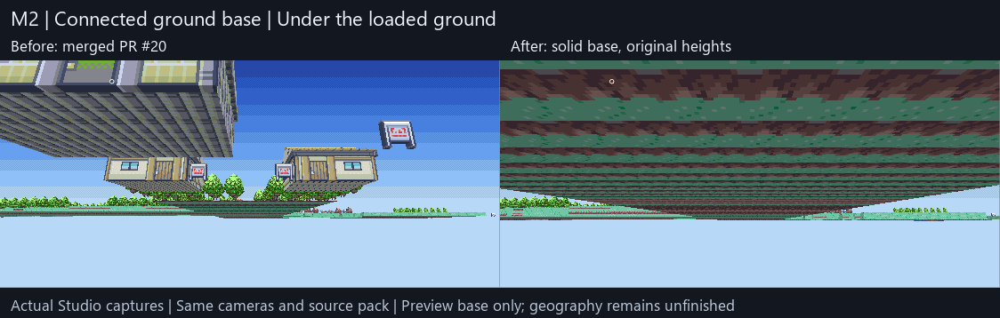
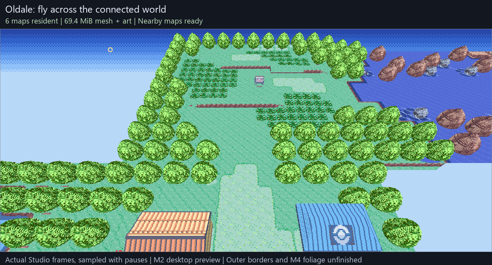
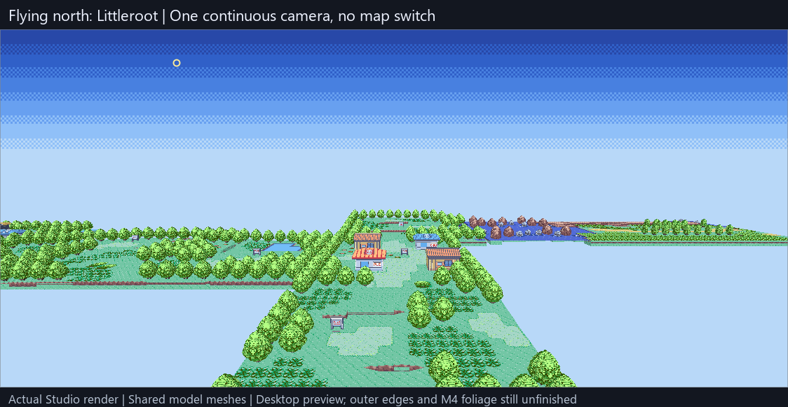
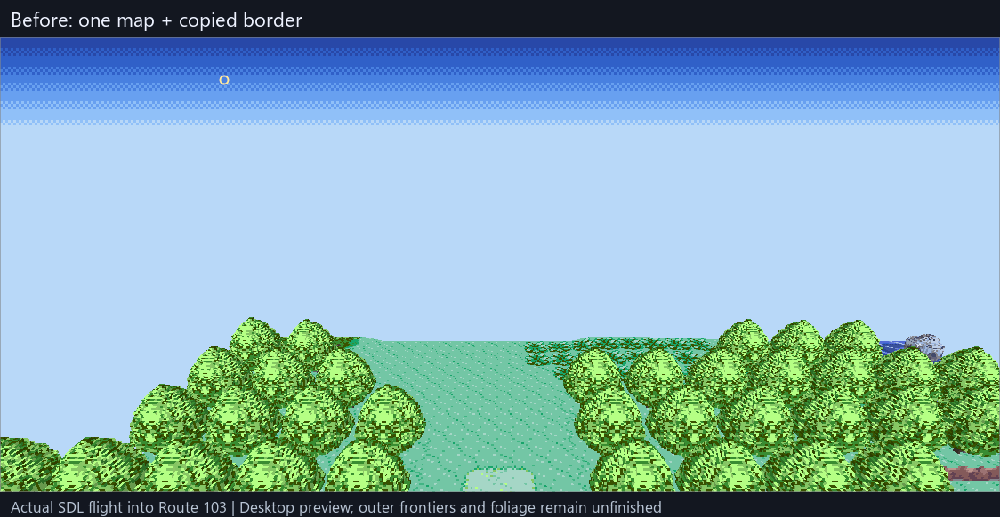
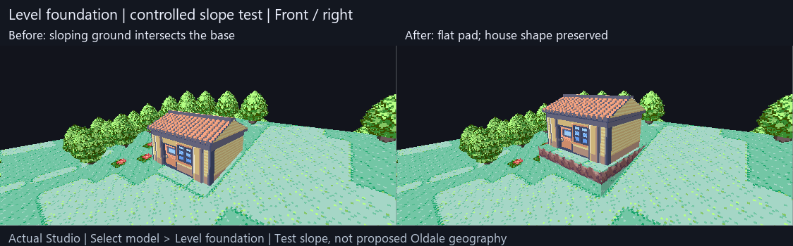
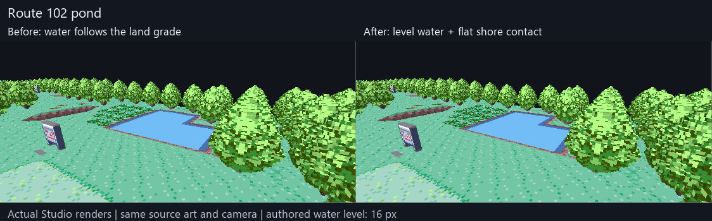
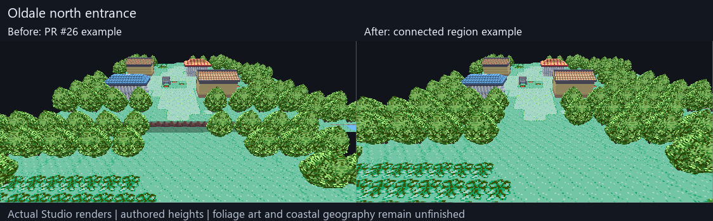
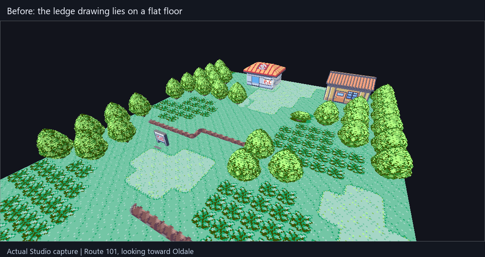
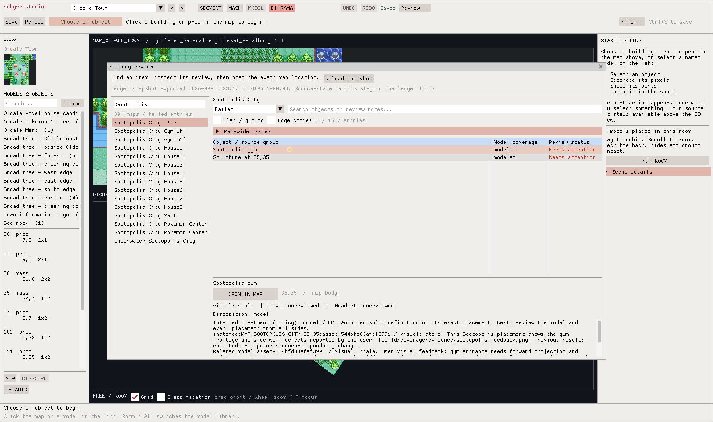

# Watch the acceptance check

**Local, unmerged follow-up: [solid ground base](connected-ground-base.md).**
The 12-second comparison shows the underside and exposed edge closing while
existing scenery stays in place. Native and desktop regressions pass; this
does not finish outer geography or headset acceptance.

## Merged camera-driven map loading

**11 seconds. Fly to Petalburg and back while the loaded area follows you.**

**[PR #20, merged](https://github.com/ChronoHaxx/rubyvr-studio/pull/20) — camera-driven map loading: desktop checks PASS.** Nearby maps
prepare in the background, unchanged GPU buffers are reused, and distant maps
are released. The visible window drops from six maps (**69.4 MiB**) to three
near Petalburg (**42.0 MiB**), then returns to the same geometry and coordinates.
The separate Littleroot journey drops to **29.6 MiB**. Editing and source data
stay unchanged, including cancellation while loading.

The frames are sampled with pauses. Uploads still have a measured **50.8 ms**
main-thread peak; this is desktop progress, not a headset FPS result. The visible
outer borders remain the next M2 task, and foliage remains M4.
[Run it and see the limits](camera-map-streaming.md) ·
[Exact evidence](camera-map-streaming-evidence-2026-09-10.json) · [Roadmap](roadmap.md).

## Merged model reuse and six-map explorer — PR #31

**13 seconds. Fly from Littleroot through Oldale, then see Petalburg and all six maps.**

**Merged — [PR #31](https://github.com/ChronoHaxx/rubyvr-studio-archive-20260910/pull/31), model reuse and six-map exploration: desktop checks PASS.**
The same four-map scene uses **47.1 MiB instead of 198.4 MiB** for mesh and
indexed art; the wider six-map scene uses **69.4 MiB**. Original shapes, source
art and terrain heights are preserved. Twenty original views match pixel for
pixel, and the wider flight, source boundaries and editor regressions pass.

This preloads two authored connection hops. Loading while travelling, outer
borders and full geography remain M2; foliage appearance remains M4. Whole-app
and headset performance are still unverified.
[Run it and see the measurements](region-model-reuse.md) ·
[Exact evidence](region-model-reuse-evidence-2026-09-10.json) · [Roadmap](roadmap.md).

## Merged connected explorer — PR #30

**11 seconds. Fly from Oldale into the full Route 103 map, then fit all four maps.**

**Merged — [PR #30](https://github.com/ChronoHaxx/rubyvr-studio-archive-20260910/pull/30), connected explorer: desktop checks PASS.** **Explore area** joins
Oldale with Routes 101, 102 and 103 in one view. Returning to editing restores
the original camera and leaves the document unchanged. Seventeen native checks,
20 SDL checkpoints and the existing terrain/editor regressions pass.

This is a bounded desktop preview: four full map bodies, 198.4 MiB of mesh plus
indexed art, no loading further maps while flying. Outer frontiers remain M2;
foliage appearance stays in M4. Live game and headset acceptance remain open.
[One-command launch and controls](connected-scene.md) ·
[Exact evidence](connected-scene-evidence-2026-09-10.json) · [Roadmap](roadmap.md).

## Merged Level foundation — PR #29

**12 seconds. A flat pad stops a rigid house intersecting a slope.**

**Merged — [PR #29](https://github.com/ChronoHaxx/rubyvr-studio-archive-20260910/pull/29), M2 foundation action: desktop checks and source/build CI PASS.** Select a model and
choose **Level foundation**. It raises the pad to the highest ground corner
under the base; the house keeps its shape and source art. Undo, redo, repeat,
save and reopen pass at both tested window sizes.

**This hill is a controlled test, not proposed Oldale geography.** The example
levels 16 cells to 24 px. Entrance steps or approach grading still need authoring.
Codex inspected all three paired views and ran 23 native checks, 14 foundation
SDL checkpoints and the existing terrain/editor regressions. Live/headset
acceptance remains open. [Scope and height rule](terrain-foundations.md) ·
[Exact evidence](terrain-foundations-evidence-2026-09-10.json).

The exposed map edge remains M2 work; sky/horizon and distance fog remain M8.
Neutral mode uses a dark backdrop, while Noon already previews a sky.
[Current roadmap](roadmap.md).

## Merged level water and shore contact — PR #28

**12 seconds. Water stays level instead of following nearby land slopes.**

**Merged — [PR #28](https://github.com/ChronoHaxx/rubyvr-studio-archive-20260910/pull/28), M2 water/shore contact: desktop checks and source/build CI PASS.** This is a small
geometry correction: 495 selected water cells and 266 adjoining shore cells
stay at an authored 16 px. All 100 map-boundary segments still match in both
views. The source art and Route 101 profile are preserved.

The four paused comparisons use actual Studio renders at identical cameras.
Codex inspected them and ran 13 source-free tests, 197 native checks, 49 SDL
checkpoints and the regional source/mesh checks. Deliberate water steps,
changed source guards and conflicting anchors are rejected.

Water is **not yet lowered below the bank**: the immediate shore shares its
height, and the original art supplies the visible bank edge. Raised banks,
underwater depth, rigid foundations and complete map streaming remain M2 work.
Foliage appearance stays in M4. [Scope and run command](terrain-water.md) ·
[Exact evidence](terrain-water-evidence-2026-09-10.json) · [Roadmap](roadmap.md).

## Merged connected-region example — PR #27

**12 seconds. Oldale's north and west map-edge walls are gone; the neighbouring
routes now have connected authored terrain.**

**Merged — [PR #27](https://github.com/ChronoHaxx/rubyvr-studio-archive-20260910/pull/27), M2 connected-region example: desktop checks PASS.** Six maps
provide terrain or connection context. All 100 included boundary segments match
in both map views, with no internal walls. The eight solver tests, 197 native
checks and 49 SDL checkpoints pass. A deliberately introduced 1 px seam gap
is caught. The default scenery and personal files remain unchanged.

The GIF shows four paused actual-render comparisons. At that baseline,
rigid foundations and different-atlas neighbours were pending; see the newer
slices above. Coastal geography and live traversal remain open, with foliage
deferred to M4. This older GIF shows one map plus padding. [Scope and run command](terrain-regions.md) ·
[Evidence](terrain-regions-evidence-2026-09-10.json) · [Roadmap](roadmap.md).

## Merged first terrain foundation — PR #26

**16 seconds. Route 101 now has two authored 8 px ledges with continuous
walk-around grades. Its northern surface joins Oldale at 16 px.**

**Desktop foundation: PASS; complete terrain and foliage art: unfinished.**
Merged in [PR #26](https://github.com/ChronoHaxx/rubyvr-studio-archive-20260910/pull/26), with passing
source/build CI. Further foliage art iteration is deferred to M4.
Both ledges are local authored choices. At that baseline, Oldale's other neighbours, full geography,
rigid foundations and live traversal remain open. The recipe does not replace
the default starter pack. The visible flat vegetation and foliage quality remain
M4 work; follow the [working art direction](art-direction.md).

| Checked | Verdict |
|---|---|
| Surface editing, material picking, both slope directions, undo/redo, erase, deck refusal and save/reopen | 49 actual SDL checkpoints at two sizes; input pack unchanged |
| Shared terrain, layers, native UVs, corner grades, flexible placement, guards and persistence | 197 original synthetic checks pass |
| Source connection provenance | All 394 maps built; 36,834 copied cells checked against their owners |
| Terrain consistency in copied borders | 720 visible copies use their canonical authored cells |
| Oldale–Route 101 join | 40 matching height edges across both views; no internal terrain wall |
| Route 101 terrain | 746 non-cliff edges match at endpoints/midpoint; both 8 px drops and southern 0 px boundary checked |
| Local art experiments | 69 model families rendered; 2 additional Blender alternatives pass closed-geometry/save checks; visual quality is unapproved |
| Default scenery | 66 models and 6 cleanup masks; experimental grass requires an explicit generator flag |
| Existing editor | Full regression suite, including eight unchanged frozen geometry hashes, passes |

Codex inspected the actual application captures. The GIF crops the 3D viewport,
adds captions and edits pauses; it uses the production renderer. Desktop
captures do not establish live traversal, human usability or headset acceptance.
The 394-map check validates source ownership; it does **not** approve terrain
height or appearance on all 394 maps.

[Format, references and remaining work](terrain-authoring.md) ·
[Evidence](terrain-evidence-2026-09-10.json) · [Single roadmap](roadmap.md)

## Merged treatment and ownership browser — PR #25

**20 seconds. Studio now explains an entry's intended treatment, why it was
chosen and which milestone owns the next action. Desktop acceptance passes.**

| Checked | Verdict |
|---|---|
| Reasons and work ownership | Every one of 199,335 entries has a treatment, reason, evidence and next action |
| Honest uncertainty | 163,271 remain unresolved; all 374 native trace gaps remain open |
| Studio filters and notes | PASS at 1600×950 and 1280×720; 36 captured checkpoints including edit protection |
| Oldale example | Known object intent clears the nonflat unresolved queue; 208 ground entries stay unresolved and 65 object entries stay visually unreviewed |
| Persistence and validation | Ledger and pack byte-identical; 57 synthetic tests pass; native reader validates all 165,777 static browser rows |

Recorded decisions override the defaults. Source families, partial/mixed roles
and unknown sprite domains are not guessed. Warps, script commands and weather
settings can be **runtime state**, with no standalone drawing to voxelize.

**M1 remains open:** ambiguous ownership and the remaining source/runtime audits.
The gym and missing scenery shown in the GIF remain M4 defects; terrain height
is M2. Codex inspected the actual captures. Pauses are edited for readability;
this is desktop agent acceptance, not human usability, live-game or headset
acceptance. The renderer and authored models are unchanged.

[Evidence and capture identities](disposition-evidence-2026-09-09.json) ·
[Treatment rules and filters](coverage-dispositions.md) · [Single roadmap](roadmap.md)

## Merged Studio browser — 20-second desktop check

The earlier [PR #23 browser GIF](media/review-browser-acceptance.gif) and
[its evidence](review-browser-evidence-2026-09-08.json) remain available, as do
the [PR #24 native audit results](native-audit-acceptance.md) and
[earlier editor acceptance](media/acceptance-preview.gif).
