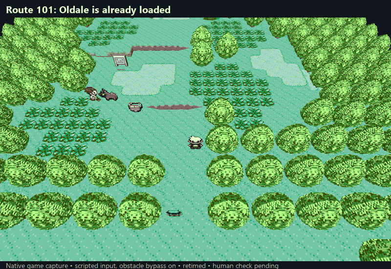
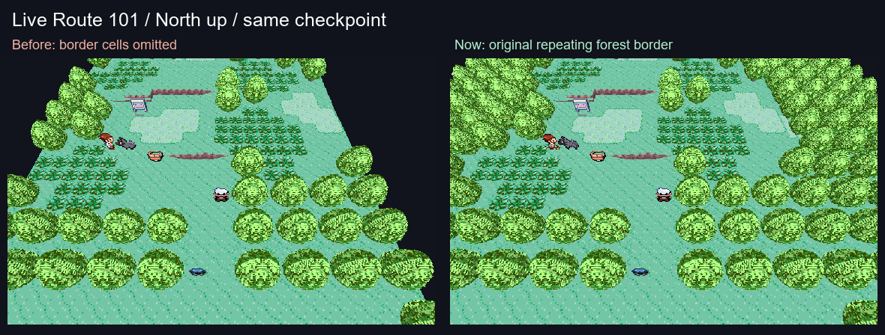
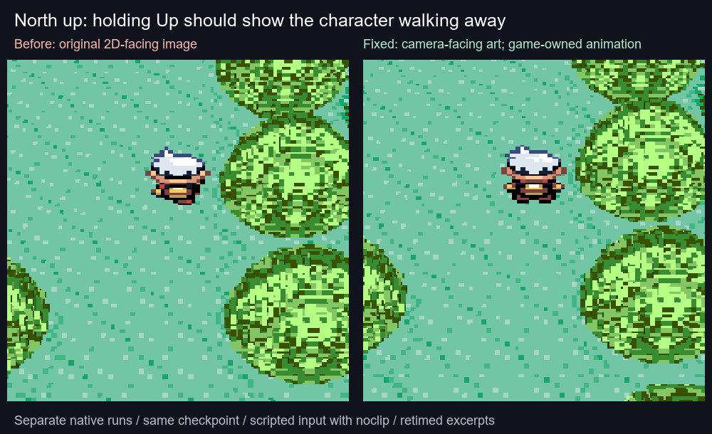
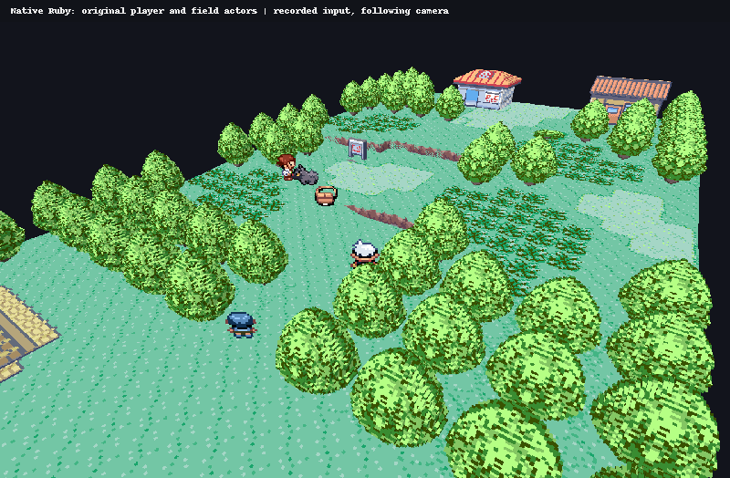
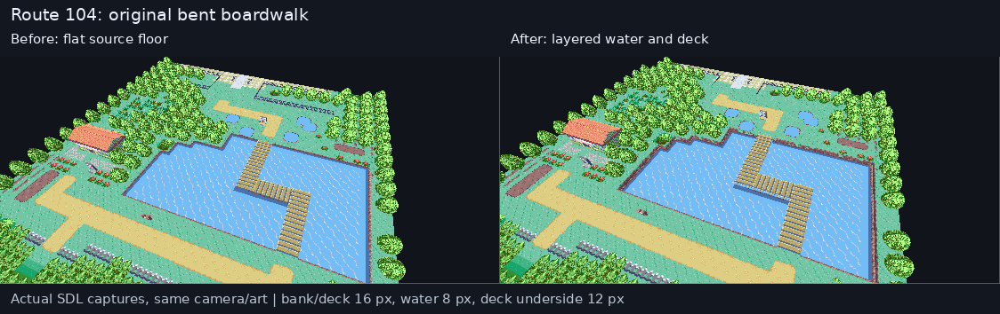
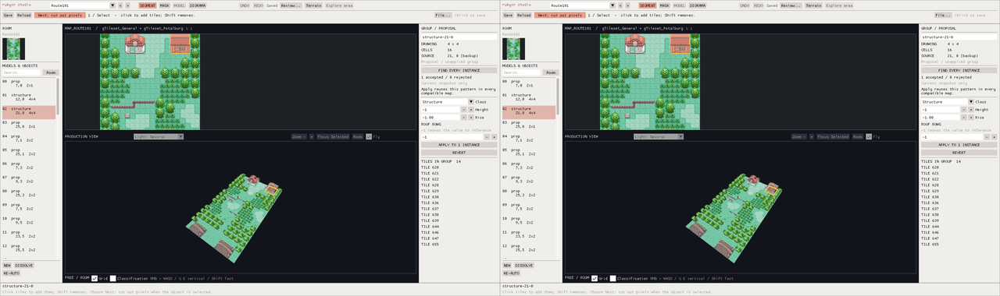
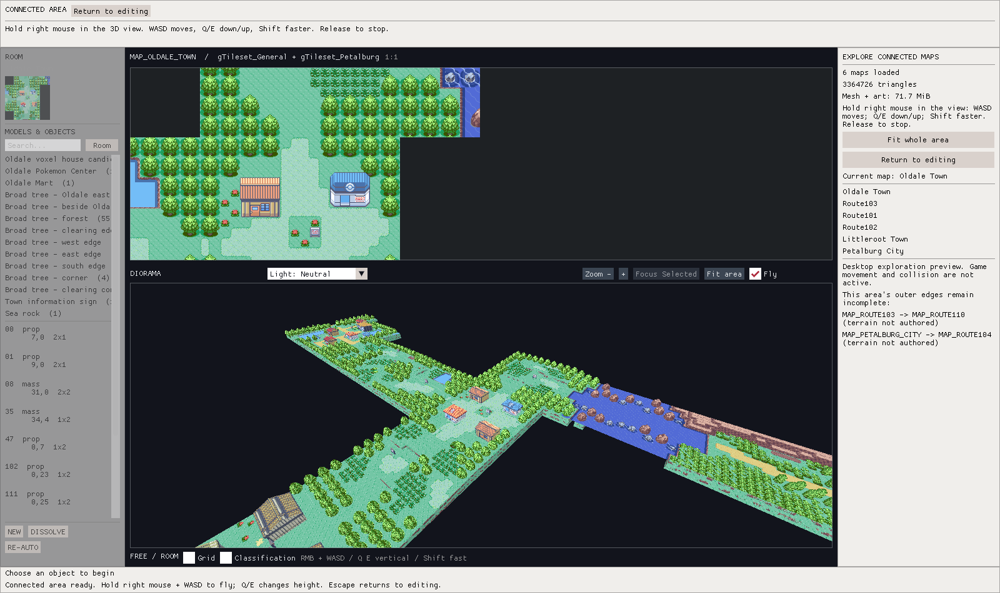

# Watch the acceptance check

**Latest accepted slice — [connected native scenery](live-connected-world.md), M5/M2, merged PR #31.**
Route 101 → Oldale → look back → Route 101, driven through native game movement.
Complete nearby scenery stays in place. Component/sanitizer, actual GL and native
checks pass. All four maintainer human steps are checked for `c5bc19f`;
merge `f8a9e8d` was verified on 2026-09-12. Use the guide's existing
camera-session launch command and recorded human checklist.

Retimed actual application captures. Three-map limit, distant NPC pop-in (M6),
bounded noclip (M5/M9), foliage polish (M4), ledge alignment (M2/M5) and Bag world
retention (M5/M7) remain open. This does not establish whole-world or VR performance.

**Merged PR #29 — [live border forest](live-borders.md), M2/M5.**
The missing source border now appears in the real game view. A 394-map source
audit, 75 component checks and ten native checks pass. PR #29 merged into main
at `9d895c7`; the launch/border/camera human step is checked on `2e07576` and
the other four combined developer steps remain unreported.
[Historical border evidence and visible limitations](live-borders.md).

Twelve seconds of stationary before/after captures, held three seconds per view.
Ledge collision/depth (M2/M5), foliage polish (M4), other actor defects (M6), Bag
world retention (M5/M7) and the additional geometry cost (M10) remain open.

The camera and developer recordings below are historical evidence for the
included changes. Current testing uses the combined launcher above.

**PR #30, merged into parent PR #29 — [north-up and camera-relative walking](live-camera.md), bounded M9
support for the M5 desktop proof.** Four compass presets, camera-relative grid
movement in the focused 3D window, J/L quarter-turns, and a north-up reset. Windows/WSL component,
sanitizer, shared GL and ten native scripted checks pass. The follow-up repairs
[normal player camera-facing art and displayed animation phase](live-facing.md).
That recording does not establish physical input; NPC/special-pose facing (M6) and Bag world retention (M5/M7)
remain open beside the [single launch command and human checks](live-camera.md#try-this-camera-build).
The maintainer reported animation and distant sprite pop-in on `6911329`;
the normal-player facing/phase subset is now merged. Pop-in and other
actor coverage remain open. The recording does not accept complete actor fidelity.

Sixteen seconds: close-up before/after walking from separate checkpoint-based
runs, then stationary camera turns from the corrected run. Retimed for viewing;
noclip is enabled for scripted walking. The idle original/3D pairs differ by at
most 101 ms. This is not a performance or physical-keyboard demonstration.

**Merged in PR #29 — [native developer tools](developer-mode.md), M5.** Named isolated
checkpoints, pause/one-frame step, whole-game speed including uncapped, and
walking through trees while ordinary collisions remain intact when disabled.
Component checks pass on Windows/WSL; eight native functional checks pass. The
final capture misses the exploratory 2x throughput target (1.63x at 4x requested,
1.76x at MAX); this remains M10 work. Human physical
input checks remain unreported. This recording is historical; the current
prepared build also includes camera and border repairs. Bag world retention
remains open beside the [launch/checklist](developer-mode.md#try-the-prepared-build).

This local harness recording shows the native game and shared voxel viewer.
It does not establish physical mouse/keyboard or headset acceptance.

**Merged in PR #28 — [native player and field actors](live-actors.md), bounded RV-010 / M5–M6.**
The original player walks and turns through authored scenery with a following
camera. Five field actors appear in the verified native sequence. Component,
GL, native replay and editor regressions pass; the merged PR records five checked
human steps. The subsequent report of camera/control/facing mismatch and missing
surrounding forest remains open. This recording does not accept those behaviors.
See the [known limitations](live-actors.md#known-visible-limitations-after-merge).
Menu composition, full actor/effect coverage and headset performance remain open.

12 seconds at nominal game-frame timing; captured from actual native execution,
not editor flight. [One launch command and human checks](live-actors.md#try-the-prepared-local-build).

**Merged — [verified live map identity](live-map-identity.md), PR #27 / RV-008 / M5.**
The native adapter recognizes Route 101, clears its scene during Bag and
restores it on return. Asset-free, local GL and native frame-sink checks pass;
the maintainer passed all five human checks on `825b1ae` and merged on 2026-09-12.
This is a foundation for the monitor gameplay proof, not completed playable
voxel rendering. Clearing during Bag is an interim safeguard: M5/M7 must retain
the world behind recognized menus. The passed checks do not approve that interim
presentation as the final menu experience.

**Merged — [connected-region query component](terrain-region-query-review.md), PR #26 / RV-003 / M2.**
This backend change has no visible gameplay yet. Its review records actual
headless/component and full-project checks; all three human CLI checks are
recorded passed on `d2755ce` (merge `b894df7`).
The footage below belongs to previously merged visual changes.

## Merged Route 104 bridge over water — PR #25

**Merged — [Route 104 bridge over water](terrain-bridge.md), RV-003 / M2.**
The original boardwalk now has a solid deck above continuous water, with level
bank contact at both entrances. Source/native/SDL and save/reopen checks pass;
the PR records all four human checks passed on `cf4817f` (exact reporting time
unknown). Other Route 104 geography is unfinished.

12-second slideshow of three actual paired views, with identical camera/source
art. [Run it and see the checklist](terrain-bridge.md#run-it).

## Merged WSL mouse repair — PR #24

**Merged — [PR #24](https://github.com/ChronoHaxx/rubyvr-studio/pull/24), [WSL mouse repair](wsl-mouse-look.md). All four maintainer checks passed on 2026-09-11.**
The old build is on the left and corrected drag input on the right. This is a
12-second slideshow of actual SDL captures with synthetic inconsistent mouse
deltas. All twelve new checks and the existing camera/connected/streaming checks
pass. The physical-pointer [human checklist](wsl-mouse-look.md#human-functional-check--required-before-merge)
was reported passed by the maintainer separately from CI and these captures.

## Merged native Linux and WSL editor — PR #22

**Merged — [PR #22](https://github.com/ChronoHaxx/rubyvr-studio/pull/22): [native Linux/WSL editor](native-wsl.md).**
The 12-second slideshow shows actual native Linux captures: the six-map
explorer, roof-part selection and a saved editing session. Bash launch/save/
resume, existing editor regressions and headless geometry checks pass.
Hosted Linux source/build CI also passes. RV-014 is complete for its native
editor scope; Linux OpenXR remains unsupported.

[Build and run](building.md) · [Checks and limitations](native-wsl.md) · [Roadmap](roadmap.md).

## Merged solid ground base — PR #21

**Merged — [PR #21](https://github.com/ChronoHaxx/rubyvr-studio/pull/21): [solid ground base](connected-ground-base.md).**
The 12-second comparison shows the underside and exposed edge closing while
existing scenery stays in place. Native and desktop regressions pass; this
does not finish outer geography or headset acceptance.

## Merged camera-driven map loading

**11 seconds. Fly to Petalburg and back while the loaded area follows you.**

**[PR #20, merged](https://github.com/ChronoHaxx/rubyvr-studio/pull/20) — camera-driven map loading: desktop checks PASS.** Nearby maps
prepare in the background, unchanged GPU buffers are reused, and distant maps
are released. The visible window drops from six maps (**69.4 MiB**) to three
near Petalburg (**42.0 MiB**), then returns to the same geometry and coordinates.
The separate Littleroot journey drops to **29.6 MiB**. Editing and source data
stay unchanged, including cancellation while loading.

The frames are sampled with pauses. Uploads still have a measured **50.8 ms**
main-thread peak; this is desktop progress, not a headset FPS result. The visible
outer borders remain the next M2 task, and foliage remains M4.
[Run it and see the limits](camera-map-streaming.md) ·
[Exact evidence](camera-map-streaming-evidence-2026-09-10.json) · [Roadmap](roadmap.md).

## Merged model reuse and six-map explorer — PR #31

**13 seconds. Fly from Littleroot through Oldale, then see Petalburg and all six maps.**

**Merged — [PR #31](https://github.com/ChronoHaxx/rubyvr-studio-archive-20260910/pull/31), model reuse and six-map exploration: desktop checks PASS.**
The same four-map scene uses **47.1 MiB instead of 198.4 MiB** for mesh and
indexed art; the wider six-map scene uses **69.4 MiB**. Original shapes, source
art and terrain heights are preserved. Twenty original views match pixel for
pixel, and the wider flight, source boundaries and editor regressions pass.

This preloads two authored connection hops. Loading while travelling, outer
borders and full geography remain M2; foliage appearance remains M4. Whole-app
and headset performance are still unverified.
[Run it and see the measurements](region-model-reuse.md) ·
[Exact evidence](region-model-reuse-evidence-2026-09-10.json) · [Roadmap](roadmap.md).

## Merged connected explorer — PR #30

**11 seconds. Fly from Oldale into the full Route 103 map, then fit all four maps.**

**Merged — [PR #30](https://github.com/ChronoHaxx/rubyvr-studio-archive-20260910/pull/30), connected explorer: desktop checks PASS.** **Explore area** joins
Oldale with Routes 101, 102 and 103 in one view. Returning to editing restores
the original camera and leaves the document unchanged. Seventeen native checks,
20 SDL checkpoints and the existing terrain/editor regressions pass.

This is a bounded desktop preview: four full map bodies, 198.4 MiB of mesh plus
indexed art, no loading further maps while flying. Outer frontiers remain M2;
foliage appearance stays in M4. Live game and headset acceptance remain open.
[One-command launch and controls](connected-scene.md) ·
[Exact evidence](connected-scene-evidence-2026-09-10.json) · [Roadmap](roadmap.md).

## Merged Level foundation — PR #29

**12 seconds. A flat pad stops a rigid house intersecting a slope.**

**Merged — [PR #29](https://github.com/ChronoHaxx/rubyvr-studio-archive-20260910/pull/29), M2 foundation action: desktop checks and source/build CI PASS.** Select a model and
choose **Level foundation**. It raises the pad to the highest ground corner
under the base; the house keeps its shape and source art. Undo, redo, repeat,
save and reopen pass at both tested window sizes.

**This hill is a controlled test, not proposed Oldale geography.** The example
levels 16 cells to 24 px. Entrance steps or approach grading still need authoring.
Codex inspected all three paired views and ran 23 native checks, 14 foundation
SDL checkpoints and the existing terrain/editor regressions. Live/headset
acceptance remains open. [Scope and height rule](terrain-foundations.md) ·
[Exact evidence](terrain-foundations-evidence-2026-09-10.json).

The exposed map edge remains M2 work; sky/horizon and distance fog remain M8.
Neutral mode uses a dark backdrop, while Noon already previews a sky.
[Current roadmap](roadmap.md).

## Merged level water and shore contact — PR #28

**12 seconds. Water stays level instead of following nearby land slopes.**

**Merged — [PR #28](https://github.com/ChronoHaxx/rubyvr-studio-archive-20260910/pull/28), M2 water/shore contact: desktop checks and source/build CI PASS.** This is a small
geometry correction: 495 selected water cells and 266 adjoining shore cells
stay at an authored 16 px. All 100 map-boundary segments still match in both
views. The source art and Route 101 profile are preserved.

The four paused comparisons use actual Studio renders at identical cameras.
Codex inspected them and ran 13 source-free tests, 197 native checks, 49 SDL
checkpoints and the regional source/mesh checks. Deliberate water steps,
changed source guards and conflicting anchors are rejected.

Water is **not yet lowered below the bank**: the immediate shore shares its
height, and the original art supplies the visible bank edge. Raised banks,
underwater depth, rigid foundations and complete map streaming remain M2 work.
Foliage appearance stays in M4. [Scope and run command](terrain-water.md) ·
[Exact evidence](terrain-water-evidence-2026-09-10.json) · [Roadmap](roadmap.md).

## Merged connected-region example — PR #27

**12 seconds. Oldale's north and west map-edge walls are gone; the neighbouring
routes now have connected authored terrain.**

**Merged — [PR #27](https://github.com/ChronoHaxx/rubyvr-studio-archive-20260910/pull/27), M2 connected-region example: desktop checks PASS.** Six maps
provide terrain or connection context. All 100 included boundary segments match
in both map views, with no internal walls. The eight solver tests, 197 native
checks and 49 SDL checkpoints pass. A deliberately introduced 1 px seam gap
is caught. The default scenery and personal files remain unchanged.

The GIF shows four paused actual-render comparisons. At that baseline,
rigid foundations and different-atlas neighbours were pending; see the newer
slices above. Coastal geography and live traversal remain open, with foliage
deferred to M4. This older GIF shows one map plus padding. [Scope and run command](terrain-regions.md) ·
[Evidence](terrain-regions-evidence-2026-09-10.json) · [Roadmap](roadmap.md).

## Merged first terrain foundation — PR #26

**16 seconds. Route 101 now has two authored 8 px ledges with continuous
walk-around grades. Its northern surface joins Oldale at 16 px.**

**Desktop foundation: PASS; complete terrain and foliage art: unfinished.**
Merged in [PR #26](https://github.com/ChronoHaxx/rubyvr-studio-archive-20260910/pull/26), with passing
source/build CI. Further foliage art iteration is deferred to M4.
Both ledges are local authored choices. At that baseline, Oldale's other neighbours, full geography,
rigid foundations and live traversal remain open. The recipe does not replace
the default starter pack. The visible flat vegetation and foliage quality remain
M4 work; follow the [working art direction](art-direction.md).

| Checked | Verdict |
|---|---|
| Surface editing, material picking, both slope directions, undo/redo, erase, deck refusal and save/reopen | 49 actual SDL checkpoints at two sizes; input pack unchanged |
| Shared terrain, layers, native UVs, corner grades, flexible placement, guards and persistence | 197 original synthetic checks pass |
| Source connection provenance | All 394 maps built; 36,834 copied cells checked against their owners |
| Terrain consistency in copied borders | 720 visible copies use their canonical authored cells |
| Oldale–Route 101 join | 40 matching height edges across both views; no internal terrain wall |
| Route 101 terrain | 746 non-cliff edges match at endpoints/midpoint; both 8 px drops and southern 0 px boundary checked |
| Local art experiments | 69 model families rendered; 2 additional Blender alternatives pass closed-geometry/save checks; visual quality is unapproved |
| Default scenery | 66 models and 6 cleanup masks; experimental grass requires an explicit generator flag |
| Existing editor | Full regression suite, including eight unchanged frozen geometry hashes, passes |

Codex inspected the actual application captures. The GIF crops the 3D viewport,
adds captions and edits pauses; it uses the production renderer. Desktop
captures do not establish live traversal, human usability or headset acceptance.
The 394-map check validates source ownership; it does **not** approve terrain
height or appearance on all 394 maps.

[Format, references and remaining work](terrain-authoring.md) ·
[Evidence](terrain-evidence-2026-09-10.json) · [Single roadmap](roadmap.md)

## Merged treatment and ownership browser — PR #25

**20 seconds. Studio now explains an entry's intended treatment, why it was
chosen and which milestone owns the next action. Desktop acceptance passes.**

| Checked | Verdict |
|---|---|
| Reasons and work ownership | Every one of 199,335 entries has a treatment, reason, evidence and next action |
| Honest uncertainty | 163,271 remain unresolved; all 374 native trace gaps remain open |
| Studio filters and notes | PASS at 1600×950 and 1280×720; 36 captured checkpoints including edit protection |
| Oldale example | Known object intent clears the nonflat unresolved queue; 208 ground entries stay unresolved and 65 object entries stay visually unreviewed |
| Persistence and validation | Ledger and pack byte-identical; 57 synthetic tests pass; native reader validates all 165,777 static browser rows |

Recorded decisions override the defaults. Source families, partial/mixed roles
and unknown sprite domains are not guessed. Warps, script commands and weather
settings can be **runtime state**, with no standalone drawing to voxelize.

**M1 remains open:** ambiguous ownership and the remaining source/runtime audits.
The gym and missing scenery shown in the GIF remain M4 defects; terrain height
is M2. Codex inspected the actual captures. Pauses are edited for readability;
this is desktop agent acceptance, not human usability, live-game or headset
acceptance. The renderer and authored models are unchanged.

[Evidence and capture identities](disposition-evidence-2026-09-09.json) ·
[Treatment rules and filters](coverage-dispositions.md) · [Single roadmap](roadmap.md)

## Merged Studio browser — 20-second desktop check

The earlier [PR #23 browser GIF](media/review-browser-acceptance.gif) and
[its evidence](review-browser-evidence-2026-09-08.json) remain available, as do
the [PR #24 native audit results](native-audit-acceptance.md) and
[earlier editor acceptance](media/acceptance-preview.gif).
