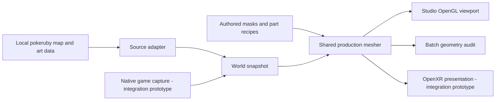

# Architecture

RubyVR Studio is a C++ authoring tool and a shared scenery renderer. The
standalone build is usable without the native game runner. The longer-term
product is a complete Ruby adventure presented in a voxel field world in PC VR.

## Components

| Path | Responsibility | Useful entry points |
|---|---|---|
| `src/studio/decomp_source.*`, `snapshot_build.*`, `png4bpp.*` | Load map definitions, indexed art and connection padding into a disk-built snapshot | `Decomp`, source lookup and snapshot construction |
| `src/studio/gui.cpp`, `gui_voxel.inl`, `workspace.h` | SDL/ImGui authoring, cameras, input ownership, history and viewport | `App`, preview/apply/save, voxel controls |
| `tools/coverage_review.py`, `src/studio/coverage_view.*`, `gui_coverage.inl` | Read-only per-map review export, validated loading, queue filters and guarded placement navigation | `export-studio`, `Review…` |
| `tools/dynamic_inventory.py`, `native_trace.py`, `coverage-ledger.py` | Source candidates, conservative native helper/callback witnesses and persistent independent reviews | `inventory-dynamics.py`, `sync`, `report --category native_mutation_trace` |
| `tools/coverage_disposition.py` | Read-only treatment rules and next-action ownership; recorded intent overrides defaults | Shared by CLI reports/show and Studio export; `--milestone`, `--disposition` |
| `src/studio/group.*`, `pattern_io.*` | Source membership, selection, document persistence | Group document and pattern writer |
| `src/studio/platform_io.*`, `capture.*` | One portable implementation of exclusive same-directory temporaries, synchronise-before-rename publication, directory sync and stderr capture | `replace_file`, `capture_stderr`; [Linux boundary](native-wsl.md) |
| `src/vr/overrides.*`, `cutout.*` | Versioned patterns, structural matching, source-role masks | `OverrideSet` and load/validation |
| `src/vr/diorama.*`, `part_geometry.*`, `voxel_parts.inl` | The renderer used by editor, batch tool and integration | Segmentation, accepted instances, exposed voxel faces |
| `src/vr/tileset.*` | Indexed source material sampling and texture data | Tile definitions, palette/texel identity |
| `src/vr/ruby_world.h`, `world_io.*` | Shared snapshot structure and disk persistence | `Snapshot` |
| `src/vr/terrain.*`, `terrain_mesh.inl`, `src/studio/gui_terrain.inl` | Guarded authored surfaces, layer query, border ownership and terrain editing | `terrain::resolve`, `Resolved::query`, Terrain toolbar |
| `src/studio/foundation.*` | Explicit atomic ground-pad edit from the production model base; preserves shapes, art and outside terrain | `foundation::level`, Level foundation; [scope](terrain-foundations.md) |
| `src/studio/connected_scene.*`, `gui_connected.inl`, `src/vr/region_mesh.inl`, `placed_mesh.inl` | Bounded neighbour graph, source ownership, shared model meshes and per-map textures | `connected::build`, `build_region`, Explore area; [scope](connected-scene.md) |
| `src/studio/compare.cpp`, `asset_catalog.*`, `mesh_audit.*` | Source inventory, frozen scenes, structural/mesh checks | `rubyvr_studio` command-line executable |
| `recipes/`, `tools/` | Reproducible starter generation and review | Recipes, pack audit and hidden SDL journeys |
| `integration/runtime/` | Our existing native capture and OpenXR presentation prototype | See [integration notes](../integration/README.md) |

The GUI uses SDL2, OpenGL and vendored Dear ImGui; zlib reads indexed source
images. OpenXR headers provide shared pose/FOV types without an XR loader.
CMake builds native Linux batch and GUI targets; platform_io owns file/path
portability. Bash is the supported launcher workflow. Native editor, connected
exploration and streaming checks pass on WSLg with local source data; Linux
OpenXR runtime integration remains unsupported. See [native verification](native-wsl.md).

## Data and rendering contracts

- **Native scale:** one source pixel starts at 1/16 map cell. Depth and unseen
  surfaces are authored assumptions. Painted darkness is not a depth map.
- **Ownership:** object, ground and source cast shadow are different roles.
  Removing a building must restore an appropriate floor beneath it. Legitimate
  green leaves/decorations must survive masking.
- **Shared geometry:** preview, batch audit and game integration call the same
  mesher. A separate attractive preview cannot establish game fidelity.
- **Versioned documents:** v5 parts/cutouts, v6 voxel definitions and v7 terrain coexist.
  Do not silently reinterpret old files. Save/reopen and undo must preserve the
  complete document, source choice and geometry.
- **Exact matching:** reuse depends on source tile structure and membership,
  not only a display name or screenshot resemblance. Connection-padding copies
  and placements inside the primary map are counted separately.
- **Materials:** keep source palette/index and animation identity. Color equality
  in a single frame is insufficient justification for merging materials.
- **Input:** painting, numeric text entry, modals and drag handles own their
  events. Camera controls must not steal them.

MODEL picking asks the shared mesher for optional triangle ownership. The
CPU picking mesh splits voxel strips at part boundaries before edge conformance;
the regular GPU mesh still merges those strips. Ray tests retain clockwise
culling, nearest visible surface, indexed transparency and perspective/orthographic
camera rules. The picking cache is rebuilt lazily after a model change. Selection
alone does not alter the document's geometry, undo history or GPU mesh.

DIORAMA uses explicit v7 terrain surfaces where their map and source guards
match; other cells keep the legacy flat floor. The source adapter records map
group/number and copied-neighbour rectangles in snapshot v2. A border cell
queries its owning map's recipe at the original source coordinate, then meshes
at the visible copied coordinate. Single-map padding from different tileset
pairs remains unresolved. The connected explorer loads actual neighbour bodies
with separate indexed textures, using their validated terrain for neighbour
occlusion. Source grids remain intact for matching/ground recovery; primary
bodies replace padding, and model anchors choose one owner without clipping
overhangs. The shared shader submits cached map buffers with conservative
whole-map bounds culling; leaving the explorer releases them without replacing
the editing buffer. Rigid models share one mesh per pattern per source map,
with placement offsets and ordered instanced draw ranges; ground-following
models stay deformed per placement. No cross-atlas geometry cache is assumed.
Expanded geometry hashes/bounds enumerate the original ordered vertices without
retaining those copies in the renderer. Initial entry is synchronous; subsequent
camera-map changes prepare a bounded window in one worker owning its Decomp,
snapshots and recipes. `prepare_region` performs CPU work; `publish_region`
compares geometry/materials and stages GL resources before an atomic replacement.
Unchanged buffers transfer to the new window and departed buffers are released.
Cancellation prevents late publication after returning to editing. Origins stay
fixed, including remembered identities of unloaded maps. The window keeps two
hops within authored terrain, one without, and at most nine maps. See
[streaming limits and evidence](camera-map-streaming.md) and [model reuse](region-model-reuse.md).
V1 snapshots retain unknown
identity. The live prototype explicitly clears source identity and connections;
verified runtime identity, feet/camera placement and complete regional terrain
remain pending. See the [format and authoring contract](terrain-authoring.md).

## Editor environment preview

`src/studio/environment_preview.*` owns the session-only phase, six-band sky
palette and background GL resources. It draws within the 3D viewport without
writing depth and restores its GL state. The source map and masks use their
existing untinted rendering path. A per-draw `diorama::Tint` multiplies scene
colors after indexed palette lookup; every caller defaults to identity, and
debug views ignore it. No mesher, document or save-format field stores lighting.
The sky module builds only into the GUI. See the [reuse review](reuse-review.md).

## Relationship to the game

The development game base is [RubySapphireRecomp](https://github.com/mstan/RubySapphireRecomp)
and [gbarecomp](https://github.com/mstan/gbarecomp): GBA ARM/Thumb ROM code is
translated to native code around a hardware model. The upstream framework also
has interpreter/self-healing paths. A build or a short capture is not proof of
a complete strictly static playthrough.

The Studio source adapter uses decompilation data as an authoring input. It is
not a Lua gameplay recreation, nor does Studio compile `pokeruby`'s gameplay C.
The public editor build does not produce a playable game. Packaging our renderer
against a supported upstream API remains a separate integration task.

See [references](references.md) for exact source pins and comparisons,
[verification](verification.md) for evidence, and [the roadmap](roadmap.md) for
what is still needed.
