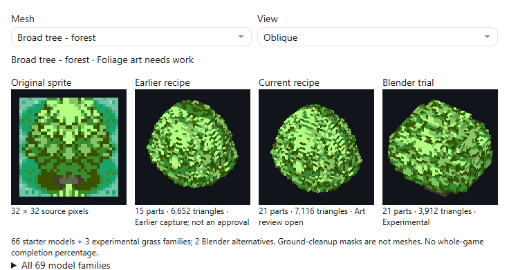
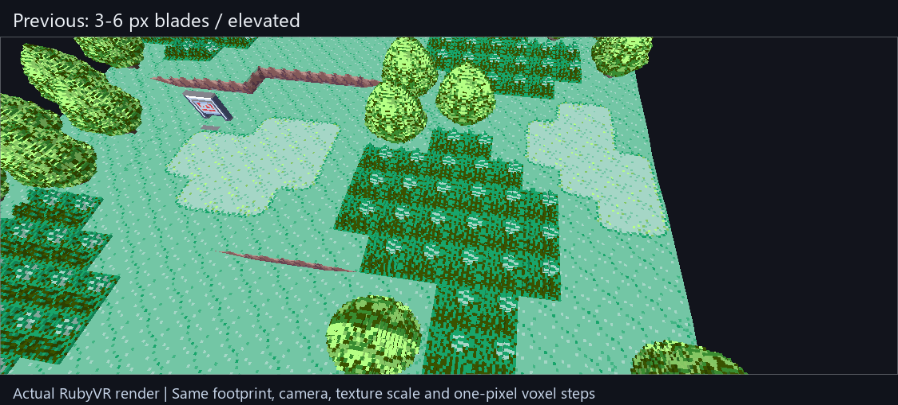
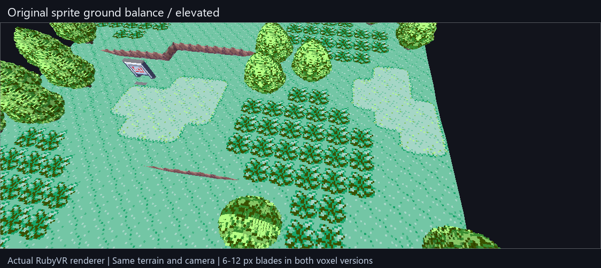

# Art direction: Ruby's pixel art given depth

Working direction, 2026-09-10. Requested by the maintainer after reviewing the
tree and encounter-grass experiments. This defines how to judge the next art
pass; it does not approve the existing foliage or establish a finished style.
Completion stays in [the roadmap](roadmap.md), under M3, M4 and M8.
The guide and trials merged in PR #26. The maintainer still finds the grass
stick-like and has deferred further foliage art iteration to M4 while M2's
connected terrain work remains active.

## Keep the charm

Start with the original Ruby drawing, its silhouette, palette, proportions and
large colour clusters. Give those forms coherent volume and readable depth.
The intended result should still feel like the same place from the familiar
game angle, and make spatial sense when viewed from its sides and rear.

Use DramaticShape and Ceedrack as visual references for cohesion and useful
authoring choices. Ruby's own art is the primary reference. Different games'
palettes, scale and foliage shapes are not interchangeable style templates.
Reference footage shows a result; it does not establish its implementation.

## Shared visual rules

| Area | Working rule | A reason to revise an asset |
|---|---|---|
| Geometry | Scenery uses a common source-pixel voxel grid: one pixel is 1/16 tile. Sloping roofs and leaf silhouettes resolve to small cube steps in the production mesh. | Smooth thin leaves, large arbitrary block tiers, stretched voxels or incompatible detail scales. |
| Silhouette | Match the source's major contours first. Choose hidden depth deliberately; preserve an object's identity from front, side and rear. | A round tree becomes a pyramid, a clipped crown, or a stack of shelves. |
| Palette and texture | Retain native palette/index identity and sharp texels. Choose coherent source regions for unseen faces. | Blurred pixels, invented high-resolution textures, random colour noise or a repeated whole sprite on every face. |
| Outlines and shading | Keep dark marks at their native thickness. Separate drawn shading from geometry and from cast shadows. | Black pixels become deep trenches, thick beams, repeated side-wall stripes or a second ground shadow. |
| Buildings | Keep a solid, proportionate body, centred roof structure and deliberate recesses/projections. Side/rear symmetry concerns structure; source-facing doors remain on their intended wall. | A paper facade, a door repeated around the building, an unexplained rear extrusion or a missing projecting entrance. |
| Trees and shrubs | Build a few connected crown masses around a grounded trunk. Round shrubs retain rounded stepped silhouettes and low proportions. | Identical perfect cones, floating foliage, uniformly noisy surfaces, crown gaps or sprite remnants at neighbouring tiles. |
| Encounter grass | Use upright, solid, stepped clumps with pale ground visible between them. Preserve the drawing's balance of leaf, outline, highlight and ground colours. Judge height and repeated fields at elevated and eye-level angles. | A solid dark green carpet, uniformly speckled faces, rows of posts, lawn-like stubble, smooth blades, raised square trays or obvious tile seams. |
| Terrain and contact | Regions share edge heights. Keep broad walkable slopes continuous and ledges readable; plant roots and foundations meet that surface. | Individual raised ledge tiles, visible map-boundary walls, holes, floating roots or missing ground. |
| Lighting | Judge shapes first under the same neutral renderer settings. Add modest depth cues while keeping the palette readable. | Glossy plastic, strong bloom, cinematic blur or lighting that hides poor geometry. |
| Motion and environment | Keep later foliage motion, water and day/night effects restrained and consistent with the small-scale pixel world. | Realistic effects that overwhelm the original art or change gameplay readability. |

Continuous terrain grades are an explicit surface choice; they do not require
smooth mesh leaves or curved scenery. Voxel objects may be rendered as merged
exposed faces. Keeping the voxel silhouette does not require drawing a separate
cube for every occupied cell.

The sprite's screen-space blade length is not its world-space height: its
elevated view compresses vertical forms and mixes them with ground depth.
The first grass experiment used 3..6 px blades and read too short. The revised
trial uses 6..12 px blades with the same footprint, native texels and one-pixel
voxel steps. This is an authored height choice, not an exact projection recovered
from the drawing. Check it beside existing scenery from both viewing angles.

This 15-second comparison uses the production renderer with the same authored
terrain in both packs. All three grass variants retain their source roles and
footprints and pass closed-mesh/save checks. The maintainer rejected its dark,
incohesive appearance; increasing height did not resolve the colour treatment.
[Recorded height/source/save checks](grass-height-evidence-2026-09-10.json).
Recipe authors can set `blade_height_px` to a whole-grid peak from 6 to 24;
the other blades retain the shared clump profile. Taller grass remains opt-in.

### Ground and leaf colour correction

The common source tile contains 89 pale ground texels out of 256 (palette 2,
index 13). The previous full-width leaf mat hid that ground and repeated only
leaf/shade colours across the floor. The revised trial buries the connecting
root layer 1..2 px below the floor and uses separate, low, stepped tuft bases.
Its above-ground footprint leaves 124 of 256 grid positions open. That footprint
is an authored choice; visible ground also depends on the viewing angle.

Leaf sides retain source texture. Green upper faces and sparse pale tips use
existing leaf/highlight indices 15 and 12. Ground ownership, the 6..12 px blade
heights, native voxel scale and tree-crown cleanup masks remain unchanged.
The 18-second comparison uses the actual production renderer and identical
terrain/cameras. All three variants pass closed-mesh and exact save/reopen checks.
[Recorded evidence](grass-cohesion-evidence-2026-09-10.json).

This corrects the dark floor coverage; it does not establish an accepted foliage
style. Upright clumps still repeat too regularly and side textures remain busy.
Keep the experiment opt-in and settle the silhouette before expanding it. A
literal extrusion of the source mask was also evaluated locally, but rejected
because diagonal pixel contacts produced nonmanifold edges. It is not included
in the recipe or this comparison; the mesh checks remain unchanged.

## Repeated foliage

M4 polish, tracked as **SC-006** in the [known defects](known-scenery-defects.json).
The maintainer reports that repeated trees look too uniform at eye level/in VR;
lighting may contribute. The cause is not yet established. Settle the base tree,
shrub and grass style first, then compare dense repeated placements under neutral
and directional lighting with the same camera before deciding what to vary.

Prefer a small reusable set of subtle crown silhouettes and whole-pixel height
variants. Preserve the original palette, shading direction, native texel/voxel
scale, source footprint, planted roots and gameplay clearance. Do not stretch
voxels or add arbitrary colour noise. Rotate variants only where their shapes
and baked shading remain coherent.

Choose a variant consistently from the canonical placement identity so the same
tree survives reloads, revisits and copied map borders unchanged. Keep mesh reuse
and bounded memory; a unique mesh for every tree is not the goal. Review the
result at the familiar elevated angle, in first person and in an actual headset.
This is future foliage polish; M2 terrain work remains active.

## Reference scene and review

Use one small Oldale/Route 101 scene containing the accepted house, a broad
tree, a shrub, encounter grass, a sign and a ledge. Review it under neutral
lighting at the familiar elevated angle and at player eye level. Keep the
original sprite beside isolated front, side, back and oblique model views.

Before promoting a new family, record the following in its existing coverage
review: recognisable silhouette; common pixel scale; deliberate unseen faces;
clean object/ground/shadow ownership; planted contact; repeated-tile continuity;
production-renderer appearance; and exact source/matching/save checks. Technical
checks passing alone never mean visual approval. Capture a short scene orbit
so review does not depend on reading a long report.

Start with one tree, one shrub and one grass patch together. Settle their
relationship before expanding variants across the game. Test dense placements
for mesh size, rebuild time and frame time on named hardware. Neither Blender's
viewport nor desktop captures establish headset performance.

## Experiments so far

| Method | What exists | Current assessment |
|---|---|---|
| Source-mask relief with authored depth bands | Current trees, shrubs and much of the starter library | Useful source identity and matching; foliage quality remains open after maintainer feedback. |
| Cuboid grass recipe | Three experimental grass families with grounded roots | Production voxels, but repeated clumps and texture treatment still need a cohesive art pass. Opt-in only. |
| Blender shape trial | One tree and one grass patch, editable source references and native-part export | Workflow proof. Large tree tiers and slanted leaf construction are not the accepted style. Keep for comparison. |
| Blockbench | Considered as an alternative manual editor | No edited model or functioning import bridge demonstrated here. |

The next visual target is a compact stepped canopy and upright encounter grass in the
same scene, following the rules above. Do not keep adding alternatives merely
to compensate for an undecided silhouette or texture treatment.

References: [Dramatic Studio editing demo](https://x.com/DramaticShape/status/2088398259224035347),
[DramaticShape's newer clip](https://x.com/DramaticShape/status/2097510852215685286),
and the maintainer's supplied Ceedrack Discord screenshots. The newer post was
opened on 2026-09-10; its video still needs a visual frame review. These are
references, not claims of copied code, available editor source or feature parity.
