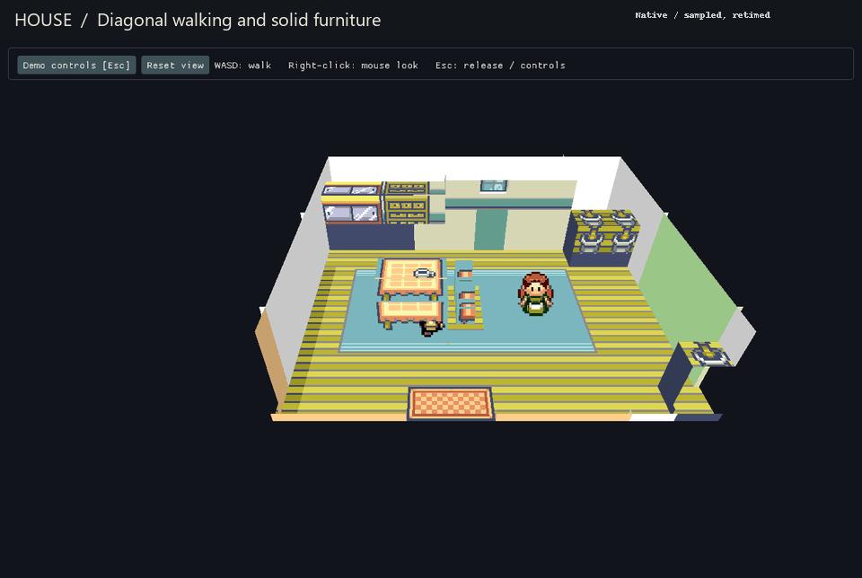

# Common interiors in the playable demo

**M4/M5/M9 — in review.** The same native viewer can now walk into common houses,
shops, Pokémon Centers and labs in Third person or First person. Support comes
from the loaded room recipes instead of a C++ list containing one house.



This is sampled, captioned and retimed native gameplay using the shared renderer.
It shows four representative rooms, not acceptance of every generated interior.
Furniture shapes, projected sprite cleanup and material placement are still a
first pass. The existing May house models are preserved.

## Try this build

Close the old game and use the same prepared Windows launcher:

```powershell
& E:\Coding\vr-modding-research\_worktrees\live-camera\tools\run-dev-game.ps1
```

The prepared manifest now starts at **Oldale Center ready**. The launcher prints
and verifies its implementation/build identity. In **Demo controls**, choose
**Third person** or **First person** under **Camera and movement**. WASD/arrows
walk, right-click toggles mouse look, X talks/confirms, Z backs out and Enter
opens Start. Escape releases the cursor and opens the controls.

The checkpoint list adds **Oldale house ready**, **Oldale Mart ready**,
**Oldale Center ready** and **Birch lab ready**. Select a situation and choose
**Load selected situation**. Earlier checkpoints and the normal save are kept.
Loading resets speed and obstacle bypass. This prepared native Windows game is
separate from the WSL Studio editor; public player installation remains M11.

## Human playtest — pending before merge

Use the implementation shown in the PR and launcher. Each result below is
separate from the agent's scripted checks.

- [ ] Start with the command above. Select Third person. Walk diagonally around
  the Center and rotate with the mouse; expect steady movement and solid counters.
- [ ] Walk up to the nurse and press X. Read the original dialogue, then use Z
  to return. Try First person and walk outside; expect the same selected camera
  mode and heading when Oldale appears.
- [ ] Load Oldale Mart ready. Talk to the clerk, open the original shop menu,
  back out with Z and walk outside. Expect working menus and no stuck movement.
- [ ] Load Oldale house ready, then Birch lab ready. Try both free camera modes,
  approach the furniture and leave each room. Expect working collision and exits.
  Check May's existing upstairs/downstairs once as a nearby regression.
- [ ] Release mouse look with Escape, then Alt-Tab away/back. Load one new room,
  save under a new checkpoint name, wait for Saved, close and reopen. Load that
  saved situation; expect normal input, the same room and previous saves intact.

**Known visible limits beside this playtest:** furniture/materials and some
leftover flat details remain provisional (M4). New recipes cover 127 common
rooms across four tileset families; only the four named rooms above have this
native journey evidence. Special interiors, caves and all-map art acceptance
remain open (M4/M5). Missing, incomplete or changed recipes use the original view
and controls; this can occur in alternate/dynamic room states. Grid uses Ruby's
original tile collision. Camera obstacle avoidance, remembered camera settings
and VR comfort remain M9; a first-person camera can still encounter wall/prop
clipping. Battles remain original 2D (M7). Outdoor ledge corners, foliage polish,
public setup and release performance are not fixed by this batch.

## What changed

- Reusable profiles author 70 GenericBuilding, 31 PokémonCenter, 22 Shop and
  4 Lab rooms from the user's local pinned source. Trick House puzzle/corridor
  rooms and the department-store rooftop are excluded from this indoor shell.
- V8 room fragments declare an exact map identity, source origin, dimensions
  and cutaway boundary. Ordinary catalog patterns continue to repeat normally.
  Explicit room placements take priority over repeating motifs.
- Free indoor control requires complete nonoverlapping fragments, matching
  source metatiles/definitions, and a complete guarded flat floor. Ruby's
  collision/sprite-priority layers are preserved separately from physical height.
- The published scene must match the live identity, layout and load epoch before
  it can own input. Original native callbacks still handle warps, dialogue,
  shop/Center interactions, NPC collision and progression.
- Furniture uses ordinary axis-aligned Studio boxes. The shared voxel compositor
  retains original source texels; front details are inset ahead of their backing
  bodies so they appear once instead of repeating vertically. Ceilings and the
  perimeter stay closed in first person; the existing cutaway opens near walls
  and ceilings in third-person/Grid views.
- Studio preserves v8 data on save/reload and foundation editing. V5–v7 packs
  retain their meanings, including the earlier two-floor house recipe.

## Verification and boundaries

The four-room native journey passes 30 assertions: room publication, diagonal
movement, visible fixture contact, original counter interactions, first-person
views, native exits and resumed outdoor input. Test setup uses native map loading
inside isolated copied checkpoints; exits/interactions use the original game.
The previous two-floor house journey also passes its 12 assertions. Six
fresh-process checks confirm all four new checkpoints reopen with free walking
and that missing or incomplete packs retain working original indoor movement.

Public synthetic tests cover complete/partial/overlapping rooms, stale source
and collision data, scene identity/load epoch, fixed placement precedence,
legacy refusal and exact Studio persistence. The generated pack is additionally
checked through the production loader, matcher and serializer for every covered
cell. This is structural coverage, not all-room gameplay or visual acceptance.
Windows native checks and Linux/WSL sanitizer checks are recorded separately:
13,404 generated-pack assertions, 21 synthetic room checks including sanitizers,
66 presentation checks, 1,372 camera checks and 67 free-walk checks pass. Both
Linux tools compile. The 39 native portability checks pass on WSL's Linux
filesystem; the first attempt on `/mnt/e` failed the expected case-sensitive
filename contract of that suite. This is not a physical WSL mouse test.
No headset, physical input, broad performance or fresh public installation
acceptance is claimed.

Local review corrected repeated front art, a front-panel composition-order error,
perimeter gaps above low furniture, source map-name reconstruction and version
preservation in editor operations. A broader native check exposed a connection-
return regression: the new scene guard delayed the source camera's partial-scroll
repair. The camera now finishes that transition while movement still requires
the correct published scene. The encounter/Run, Bag and outdoor return journey
passes after the correction. Astra owns acceptance. No DeepSeek/API worker
was run or billed for this batch. The previously approval-blocked external review
was not retried with unpublished code.

## Contributor setup and format

The user-facing workflow above uses prepared inputs. For development, first
follow [building](building.md) and [native integration](../integration/README.md).
Generate the existing house pack, then the common-room pack, using separate outputs:

```bash
python3 tools/build-indoor-house-example.py --pack mod-assets/voxel-world-v6.json
python3 tools/build-interior-scenes.py --pack build/indoor-house/pack.json
python3 tools/test-indoor-scenes.py --pack build/interior-scenes/pack.json
```

The report beside the generated pack lists room/profile, fragment/part counts,
provisional tile IDs and unreviewed acceptance. Generated packs and source art
remain local. They are not baked mesh files or public game assets.

A v8 pattern adds `indoor: {group, number, width, height, wall_front}`. Bounds
and `source.x/y` use backup-map cells. Each fragment is placed at that origin
only in that map/dimension pair. All fragments covering a room must agree on its
bounds and cover the primary body exactly once. `wall_front` is the north cutaway
boundary; the shader retains the existing quarter-cell wall allowance. A matching
v7-style terrain map supplies the complete zero-height floor with original layers.
Currently live body collision supports unrotated boxes; unsupported authored
geometry keeps the original control/view fallback rather than guessing colliders.

The display-free checks require C++20 and the existing OpenXR **headers**, but no
OpenXR runtime, SDL/OpenGL linkage, game assets or physical input:

```bash
python3 tools/test-interior-recipes.py
python3 tools/test-indoor-scenes.py
python3 tools/test-indoor-scenes.py --sanitize
```

Reference findings are in [the focused reuse note](references.md#common-interiors-2026-09-15).
