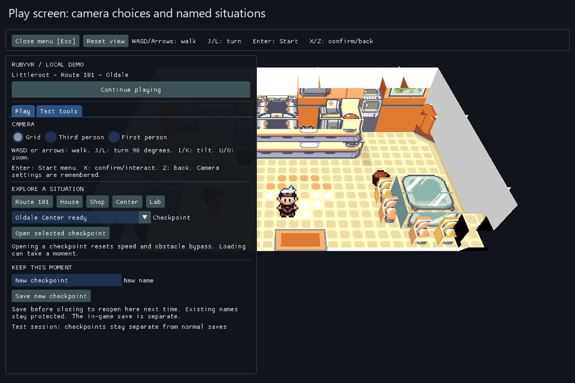

# Local demo startup and remembered settings

**M9/M10/M11 — merged in PR #37 at `ca2d3b7` (16 September).** Open the prepared game, choose a situation and camera,
and play. The Play tab puts the route, house, shop, Center and lab together.
Pause, speed and obstacle bypass live in **Test tools**. The same native game,
renderer and checkpoint service still own gameplay.

**17 September follow-up:** the maintainer reports a major map-crossing bug,
poor performance and little apparent speed increase above 2x. [Issue #38](https://github.com/ChronoHaxx/rubyvr-studio/issues/38)
tracks M5/M10 repair. The [connected walking/performance batch](playable-performance.md)
reproduces a split-frame camera jump, a held-key stall and an unoptimized native
build. Its prepared Release runner is the current launch target below; human
confirmation of the originally reported journey remains pending.
The five individual PR #37 human checks remain unreported. Earlier automated
results below are preserved; broad transition/performance acceptance is pending.

Camera mode, heading, pitch, zoom and mouse speed survive a process restart.
The launcher opens the last successfully saved/opened named checkpoint; an
explicit `-Checkpoint` overrides it. This is a saved snapshot, not an automatic
capture of where you last closed the window. Save a new checkpoint first to keep
that exact moment. Normal in-game saves remain separate.



This 19.84-second montage samples/captions/retimes two actual native UI captures.
It shows the play screen, camera choice, test tools and a shop load. It does not
show a process restart or establish physical mouse feel.

## One launch and reopen command

Prerequisites for this prepared handoff: Windows x64, Python 3 on PATH and the
maintainer's existing local ROM/BIOS. Close the previous game first. From any
PowerShell directory:

```powershell
& E:\Coding\vr-modding-research\rubyvr-studio\build\playable-demo\run-dev-game.ps1
```

The viewer opens **Play & test**. Choose **Grid**, **Third person** or **First
person**, then **Continue playing**. WASD/arrows walk, X interacts/confirms,
Z goes back and Enter opens Start. In free modes, right-click toggles mouse
look; Escape releases it and opens the play screen. J/L turn, I/K tilt, U/O zoom
and R resets the view. The original game's menus keep their normal controls.

On the Play tab, use a quick situation button, or choose any named checkpoint
and click **Open selected checkpoint**. Successful loading closes the panel;
failure keeps its error visible. Loading resets speed and obstacle bypass. Save
under a new name and wait for **Saved** before closing. Existing names are never
replaced. Reopening starts with normal speed, pause/noclip off and no captured mouse.

Test tools also reports **actual speed** from guest-frame progress. The selected
multiplier is a target; MAX uses available hardware capacity. The current
[four-step playtest](playable-performance.md#try-this-revision) replaces the
historical PR #37 checklist below for this handoff.

For setup diagnostics, add `-Check` to that same command. It validates the prepared
files and exact input revision without opening a game. `-Fresh` starts at the title
screen with this session's isolated in-game save; it does not erase that save.

## Scope and known limitations beside the playtest

- **M11 / RV-007:** this prepares an already-built private Windows runner for
  local use. A reproducible public runtime/API and combined distribution route
  remain unresolved. This is not a public game download or Linux live-game build.
- **M4:** common-room furniture, trees, shrubs and encounter grass remain
  provisional. PR #36 merged with five human steps still unreported; this batch
  changes the entry/settings workflow, not that artwork.
- **M2/M5/M9:** ledge corners, lip-exact contact, camera obstruction and wider
  all-map fidelity remain open. Free cameras do not imply all-Hoenn acceptance.
- **M10:** a named checkpoint can take a while to reach a safe native dispatch
  boundary (an earlier route save took about 28 seconds). Wait for the Saved/Loaded
  message. This batch does not claim that delay or release performance is fixed.

## Human playtest — results unreported

The PR records the exact source/build hashes. Agent/native checks and this
physical-input checklist are separate; all boxes below are initially unchecked.

- [ ] Launch with the command above. Expect the Play screen over the game and
  a usable pointer; click Continue playing, then Escape to return to the screen.
- [ ] Choose Third person, click **Shop**, walk and interact using WASD/X, then
  right-click to look around. Escape must release the mouse and open the screen.
  Try First person too; opening a situation should retain the selected mode.
- [ ] Set mouse speed to Slow and choose a recognizable view with J/L, I/K and
  U/O. Save a new checkpoint named **Demo restart check**, wait for **Saved**, close
  the game, then use the same command. Expect that checkpoint, mode and view back,
  with the Play screen open and the mouse released.
- [ ] Open Test tools and try 2x speed, pause/one-frame step and obstacle bypass.
  Restore pause off, close and reopen. Expect 1x speed, pause/bypass off and the
  camera choice retained. Earlier checkpoint names and the ordinary save remain.
- [ ] Use **Route 101**, walk, open Start/Bag and return. Switch away from the game
  and back. Expect normal controls without a stuck movement key or captured mouse;
  confirm the earlier named checkpoint still opens.

## Developer setup for another local directory

This is an alternative setup path, not another required human launch command.
Build the compatible native runner with `-DCMAKE_BUILD_TYPE=Release`; an empty
single-configuration build type is refused because it caused the measured plateau.
It requires an existing compatible private runner built from the stated Studio
revision, its MinGW runtime dependencies, your exact Ruby USA revision 1 ROM,
GBA BIOS, generated scenery pack and compatible local checkpoints. Python 3.10+
and a PE-capable `objdump` are preparation tools. No game inputs are downloaded.

```text
python tools/prepare-dev-game.py --runner /path/to/RubyRecomp.exe --source-commit FULL_STUDIO_COMMIT --pack /path/to/pack.json --rom /path/to/ruby_usa.gba --bios /path/to/gba_bios.bin --checkpoints /path/to/checkpoints --default-checkpoint "Oldale Center ready" --dll-dir C:/msys64/mingw64/bin --output "build/my local demo"
```

Use `--save /path/to/existing.sav` to copy an existing normal save into the new
session. An existing nonempty output directory is refused. Imported checkpoints
and saves are copied, never moved or overwritten. The ROM/BIOS stay at their
original paths. The resulting folder contains the hashed runner, recursively
resolved non-system DLLs, generated local config, scenery pack and launcher.
Run its `run-dev-game.ps1`; `-Check` diagnoses missing/changed files before launch.
The folder can move on this machine as long as the external ROM/BIOS paths remain
valid. This does not establish redistribution permission or another-PC support.

Session data: `checkpoints/*.state`, `test-session.sav`, `preferences.json`,
`last-run.out.log`, `last-run.err.log`. A session lock prevents two launchers
writing the same save. Camera settings use atomic replacement; malformed,
unsupported-version and linked preference files are preserved and reported.
To recover from a rejected settings file, close the game and rename that file
before reopening. Old-format handoffs still work through their original checkout;
new sessions use their own config/DLLs and do not need the source checkout at runtime.

## Verification

Run the asset-free contracts with:

```text
python tools/test-demo-runner.py
python tools/test-demo-preferences.py
python tools/test-dev-session.py
```

For the hidden UI test (SDL2/OpenGL development files and a GL driver required;
no game assets, cursor movement or desktop focus):

```text
python tools/test-demo-panel.py
```

The preference test also accepts `--sanitize` on Linux. Prepared-file checks
are not binary authenticity, visual quality or physical-input acceptance. The
native review uses copied inputs/saves and the production viewer, including a
fresh-process reopen and launch from a relocated directory without MSYS2 on PATH.
Results on 16 September:

- 11 preparation/launcher tests pass on Windows and WSL. They cover relocation,
  missing/changed dependencies, exact input validation, malformed settings,
  preserved input saves/checkpoints, environment isolation and session locking.
- Preferences: 224 checks pass with native MinGW; 228 pass on WSL with ASan/UBSan,
  including link tests unavailable to the unprivileged Windows test process.
  The existing checkpoint/transport suite still passes all 40 checks.
- 22 native startup/save/load/restart assertions pass in copied sessions. They
  cover both free cameras, remembered view/mouse preset/checkpoint, mouse release
  on Escape and reset debug toggles. All 17 original checkpoints and the source
  ordinary save retain their original bytes.
- The production panel passes 16 hidden-window widget checks on Windows and WSL: mode selection,
  quick Shop selection/load dispatch, busy-state protection, text entry/Save,
  pause/step/bypass, Continue, toolbar reopen, Escape and foreign-window rejection.
  Input is injected into the test's own ImGui/SDL event path. The window remains
  hidden, never obtains keyboard focus and never enables relative mouse capture.
- The previous prepared runner also launches successfully after relocation,
  using only its staged DLLs/config and the user's external inputs. That is a
  packaging compatibility check, separate from the new native UI checks.

The tested WSL SDL2 lacks its optional offscreen driver, so the Linux run uses
a hidden X11/WSLg window with Mesa software GL. No visible window or desktop
input is needed.

Desktop mouse automation was stopped after it interfered with the maintainer's
cursor and produced unreliable input/timing results. Routine widget tests now
use the hidden harness above. The 22 native lifecycle checks are distinct from
these 16 UI checks; neither substitutes for the human playtest.

### Worker contribution and repairs

Claude Opus (reported `claude-opus-5`), xhigh, authored the bounded preferences
component/tests with read/write/edit access to an isolated seven-file public
source snapshot; no shell/network tools or private game data were provided.
Successful session `98c5e47e-621f-4dfd-adc2-1421472d12bb` took 906.945 seconds
and 54 turns. CLI accounting estimates USD4.527457 at list prices; this used
subscription authentication, not an authorized paid API purchase or evidence
of an actual charge. The initial sandbox connection failure took 185.602 seconds
with zero reported model usage. There was one successful network retry.

The coordinator performed compilation, integration and acceptance. Repairs added
parse-from-memory to remove a double-read validation race, strict JSON number/
control-character checks with negative cases, and a safe temporary-directory test
wrapper with sanitizer support. No edits to native gameplay/collision were needed.
External editors modifying settings during replacement and non-ASCII Windows
paths are not certified by these checks. Automated input still does not certify
physical-input feel or human acceptance.

The focused [reference pass](references.md#local-demo-launchsettings-reference-pass-16-september-2026)
and [current public host check](runtime-host-audit.md) document what informed this
batch and what remains outside it. No restricted reference implementation was copied.
