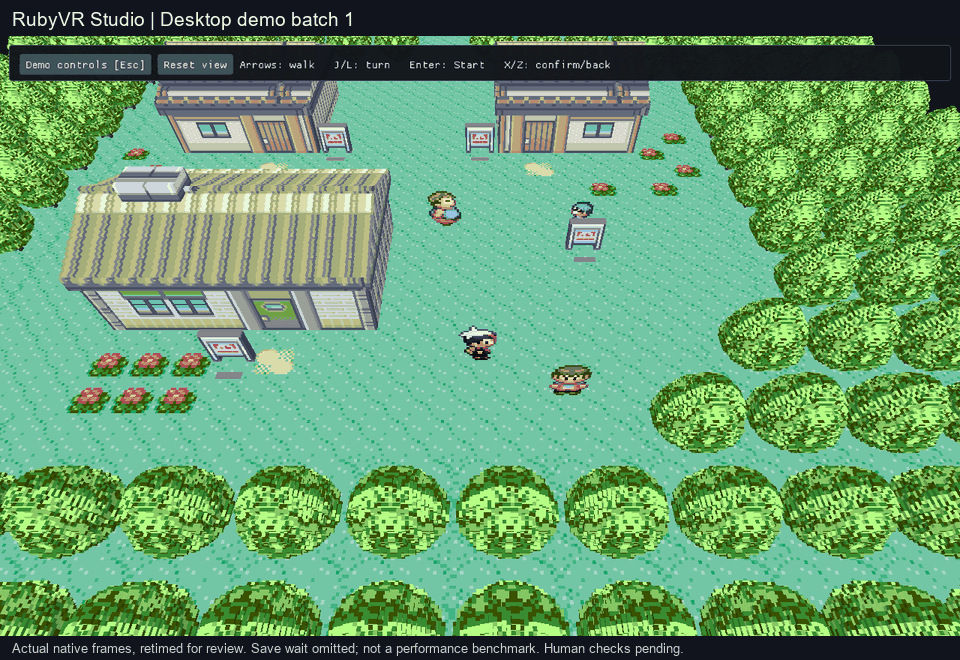

# Desktop demo: controls, distant NPCs and ledge contact

**Batch 1, M2/M5/M6/M7 — implementation ready for combined review; human checks
pending.** Open the test controls directly over the voxel game, select a named
situation, change speed, pause/step, save/load or enable obstacle bypass. Ordinary
NPCs previously seen on the current map can remain visible after Ruby releases
their distant sprite slots. Route 101's rocky ledge occupies its actual jump
barrier tile, and the player stays visible while crossing its neutral elevation.



Retimed actual application frames from scripted SDL input and the original game
loop. This shows the shared production renderer, not a mockup or physical-input
acceptance. The pause and checkpoint interval is edited for length; it is not a
performance demonstration. Public setup remains [blocked on host integration](runtime-host-audit.md).

## Try the prepared build

Use the same prepared Windows launcher:

```powershell
& E:\Coding\vr-modding-research\_worktrees\live-camera\tools\run-dev-game.ps1
```

It starts **NPC views** beside Littleroot's walkers. Click **Demo controls** or
press **Esc in the voxel viewer**. The original Ruby window keeps its existing
menu. **Return to game** closes the panel; arrows walk, J/L turn 90 degrees,
R resets the camera, Enter opens Start, X confirms/talks and Z goes back.

The list includes **Demo ledge**, **Demo battle**, **Demo lab ready** and the
existing named states. Select a row and click **Load selected situation**.
Loading resets speed to 1x and switches obstacle bypass off. Existing checkpoint
names are never overwritten; saves stay separate from the ordinary game save.
The launcher verifies its prepared executable/pack hashes before starting.
The WSL Studio editor remains a separate program; this prepared game is Windows.

## Known limits beside the playtest

- **M6:** retained NPCs use their last observed pose. The source game stops
  updating them at distance. Unseen actors, actors from neighbour maps, special
  poses and full offscreen simulation remain unfinished. Source hiding,
  template changes, scripts, map changes and loads invalidate retained poses.
- **M2/M5:** this ledge correction is bounded to Route 101's authored profile.
  Other routes, bridges and broader collision/geometry coverage remain open.
  Noclip stays on-foot and within normal map/story limits; use the actual path
  opening to cross a map border.
- **M5/M10:** a route checkpoint save took about 28 seconds to reach the runner's
  safe save boundary. It completed; the delay still needs fixing. Wait for the
  saved status before closing. MAX speed remains limited by hardware/runtime.
- **M9, batch 2:** camera turns remain 90 degrees. Smooth third-person,
  continuous movement and first-person are the next combined batch.
- **M4/M7/M10/M11:** foliage polish, full effects, diegetic VR menus, measured
  release performance and installation for another player remain open. Ordinary
  menus retain the scene; battles/interiors still show the original game.

## Combined human check — pending

Use the exact prepared revision and hashes recorded in the PR. Agent results
below do not tick these boxes.

1. [ ] Launch with the command above. Open **Demo controls** in the voxel viewer.
   Pause, advance a frame and resume; choose 4x and return to 1x. Expect controls
   to respond without switching windows, and no game movement while typing.
2. [ ] Save under a new name, wait for **Saved**, move after returning to the
   game, then load that situation. Expect the saved place, 1x speed and obstacle
   bypass off. Try the same name again: expect refusal, preserving that save.
3. [ ] Load **NPC views**, turn with J/L, and walk north toward the town exit.
   Look back at the previously seen walkers. Expect retained sprites rather
   than disappearance at the original draw/spawn range; source-stopped distant
   poses are a known limitation. Walk through the actual forest opening.
4. [ ] Load **Demo ledge**. Press Down to jump; then try Up from below. Expect a
   visible character crossing the rocky descent, landing below, and the original
   collision blocking the climb back up. No noclip is needed for the jump.
5. [ ] Open/close the original Bag/Party UI, load **Demo battle** or **Demo lab
   ready**, then return to **NPC views**. Close and reopen using the same launcher.
   Expect correct scene/UI ownership and existing checkpoint names preserved.

## Evidence and scope

- Native scripted SDL clicks pass toolbar, pause, exact one-frame step, resume,
  4x choice, noclip, new checkpoint save/load and return-to-game checks.
- The native journey observes retained ordinary NPCs while walking from
  Littleroot through the original Route 101 connection. The two-cell ledge jump
  stays rendered on continuous ground; ordinary collision prevents climbing
  back. No story/actor/position bytes are written by the harness. Noclip is used
  only to prepare the takeoff position, then disabled before saving/testing it.
- Actor visibility/capture: **25** source-free checks, optimized and ASan/UBSan.
  They cover template/flag hiding, inside/outside both source removal bounds,
  recycled OBJ data, respawn, script locks, map/load changes and unseen actors.
- Shared terrain query: **17 cases / 9,316 checks**, optimized and ASan/UBSan.
  New neutral-ground cases preserve explicit water/deck layer refusal. The
  Route 101 profile has no internal cracks and keeps its town boundary heights.
- Actual Windows GL regression covers live/distant actors, layers, connected
  scenery, menu composition, two ImGui contexts and viewer event/lifecycle
  ownership. Native source and public Studio targets compile separately.
- Existing accepted PR #32/#33 menu/NPC evidence is retained for unchanged
  coverage. No new whole-game, physical-input, headset or release claim.

The private recording, isolated checkpoint copies and build logs remain under
the prepared workspace's `build/dev-session/demo-*` runs; they are not public
game data. All nine existing prepared checkpoints are preserved. **Demo ledge**
is an additional local situation. The PR records the final source/binary/pack
hashes and the concise combined checklist.

## Source comparison and acceptance repairs

The focused source pass used the pinned `pret/pokeruby`
`63a8cbf0016b351a4e68f7036fa0b77e23d2f2c1`:
`event_object_movement.c` spawn/removal rectangles, event flag removal,
`IsZCoordMismatchAt`, and two-cell jump routines;
`field_player_avatar.c` destination-cell ledge checks;
`global.fieldmap.h` event/template layouts; and `event_data.c` flag lookup.

The cached Gen2Recomped engine at `b2a28281b1042eb25ce0b83941be0ef756fcade9`
(`src/world/OverworldController.lua`) confirms source visibility must win over
presentation caching. Companion `4a114b3e344db629ac7c7ac5108bd3d910fc4554`
(`mod/lib/VoxelScene.lua`, `mod/lib/FreeMove.lua`) supplied the relevant stable
scene/source-movement reference. These are behavior references; restricted Lua
implementation was not copied or translated into this GPL code. Ruby retains
its native event simulation and collision.

Acceptance repaired an ImGui context initialization conflict, preserved overlay
registration through viewer initialization, and fixed the neutral ledge surface
lookup found by the live jump. The native harness was corrected to use the
actual two-cell forest opening and to wait for a step action to complete before
counting it. The public GL test now has an explicit Windows SDL entry point.
One combined Codex review is used; the previously blocked private-source Claude
handoff was not retried. No paid API call or DeepSeek spending was used here.
