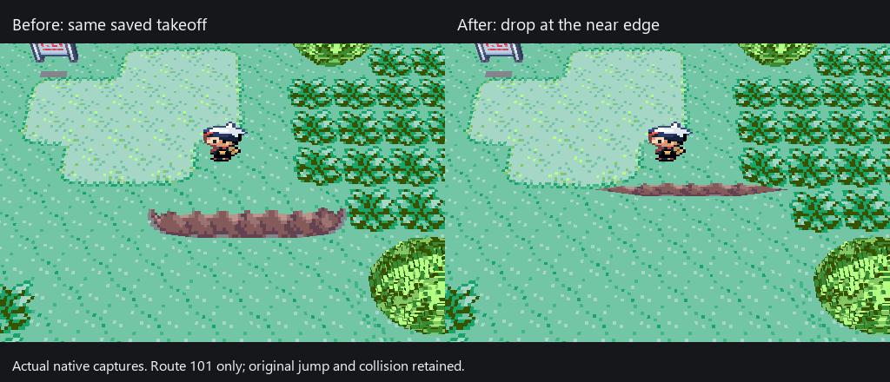

# Desktop demo: controls, distant NPCs and ledge contact

**Batch 1, M2/M5/M6/M7 — implementation ready for combined review; human checks
pending.** Open the test controls directly over the voxel game, select a named
situation, change speed, pause/step, save/load or enable obstacle bypass. Ordinary
NPCs previously seen on the current map can remain visible after Ruby releases
their distant sprite slots. Route 101 keeps its fuller rocky ledge and the player
visibly approaches before lifting into the jump.



**Ledge follow-up, 13 September:** the maintainer's screenshots showed that the
earlier correction still left a broad strip of apparently walkable grass before
the visible drop. The subsequent thin vertical-face revision was also rejected
as uglier. The fuller prior terrain and original artwork are restored exactly.
The first 12 ticks of a validated on-foot jump now stay visibly grounded while
the player approaches; the captured original ROM arc plays over the remaining
20 ticks. X/Z motion, total duration, landing and one-way collision stay under
Ruby's control. This applies only over a resolved authored sloping ground ledge;
vertical cliffs retain the original arc, and water/decks are not borrowed.

The 14-second recording compares the same saved takeoff, then shows the actual
native jump and blocked return climb. It is cropped and retimed. This changes
visible takeoff timing, not the physical trigger: a grid input still commits the
whole jump, including its original sound timing. Freely stopping at the lip and
a smaller physical trigger belong to batch 2's continuous movement. Human retest
of step 4 remains pending; the recording is not physical-input acceptance.


Retimed actual application frames from scripted SDL input and the original game
loop. This shows the shared production renderer, not a mockup or physical-input
acceptance. The pause and checkpoint interval is edited for length; it is not a
performance demonstration. Public setup remains [blocked on host integration](runtime-host-audit.md).

## Try the prepared build

Use the same prepared Windows launcher:

```powershell
& E:\Coding\vr-modding-research\_worktrees\live-camera\tools\run-dev-game.ps1
```

It starts **NPC views** beside Littleroot's walkers. Click **Demo controls** or
press **Esc in the voxel viewer**. The original Ruby window keeps its existing
menu. **Return to game** closes the panel; WASD or arrows walk, J/L turn 90 degrees,
R resets the camera, Enter opens Start, X confirms/talks and Z goes back.

The list includes **Demo ledge**, **Demo battle**, **Demo lab ready** and the
existing named states. Select a row and click **Load selected situation**.
Loading resets speed to 1x and switches obstacle bypass off. Existing checkpoint
names are never overwritten; saves stay separate from the ordinary game save.
The launcher verifies its prepared executable/pack hashes before starting.
The WSL Studio editor remains a separate program; this prepared game is Windows.

**Controls follow-up, 13 September:** WASD is an additional direction binding in
the voxel viewer, including ordinary game menus. Arrows and X/Z/Enter keep working;
the original Ruby window keeps its configured bindings. Opening the demo panel or
changing focus blocks gameplay input while typing. Release a held movement key
before continuing after a menu/focus change. J/L turns wait for WASD release too.
The launcher can select a separately named, verified executable, so preparing an
update does not replace an executable that is still running. Close the old game
and reopen with the same command to use an update.

Per the maintainer's clarification, **right-click toggle mouse look for free
third-person orbit** will arrive with continuous movement in batch 2. It is not
enabled by this WASD change. The GIF above predates the WASD label; its batch-1
behavior remains representative and is not new keyboard-input evidence.

The focused camera/input check now passes **1,107 assertions** on Windows and
under WSL ASan/UBSan. These include WASD at all four views, combined arrow/action
input, menu direction, focus/panel suppression and deferred turns. The runtime
adds aliases before the existing mapper and recording boundary; replay input is
not remapped a second time. The original host's configured bindings stay intact.
The cached Emerald `OverworldController.lua` / `FreeMove.lua` and APK 2.4.2
`FreeMove.lua` input gates were rechecked; their scripted-movement ownership is
retained as the reference for batch 2, without copying restricted implementation.

## Known limits beside the playtest

- **M6:** retained NPCs use their last observed pose. The source game stops
  updating them at distance. Unseen actors, actors from neighbour maps, special
  poses and full offscreen simulation remain unfinished. Source hiding,
  template changes, scripts, map changes and loads invalidate retained poses.
- **M2/M5:** this ledge correction is bounded to Route 101's authored profile.
  Other routes, bridges and broader collision/geometry coverage remain open.
  Noclip stays on-foot and within normal map/story limits; use the actual path
  opening to cross a map border.
- **M5/M10:** a route checkpoint save took about 28 seconds to reach the runner's
  safe save boundary. It completed; the delay still needs fixing. Wait for the
  saved status before closing. MAX speed remains limited by hardware/runtime.
- **M9, batch 2:** camera turns remain 90 degrees. Smooth third-person,
  continuous movement and first-person are the next combined batch.
- **M4/M7/M10/M11:** foliage polish, full effects, diegetic VR menus, measured
  release performance and installation for another player remain open. Ordinary
  menus retain the scene; battles/interiors still show the original game.

## Combined human check — pending

Use the exact prepared revision and hashes recorded in the PR. Agent results
below do not tick these boxes.

1. [ ] Launch with the command above. Try WASD and arrows, including after a J/L
   turn, then open **Demo controls** in the voxel viewer.
   Pause, advance a frame and resume; choose 4x and return to 1x. Expect controls
   to respond without switching windows, and no game movement while typing WASD
   into a new checkpoint name. Release keys before returning to the game.
2. [ ] Save under a new name, wait for **Saved**, move after returning to the
   game, then load that situation. Expect the saved place, 1x speed and obstacle
   bypass off. Try the same name again: expect refusal, preserving that save.
3. [ ] Load **NPC views**, turn with J/L, and walk north toward the town exit.
   Look back at the previously seen walkers. Expect retained sprites rather
   than disappearance at the original draw/spawn range; source-stopped distant
   poses are a known limitation. Walk through the actual forest opening.
4. [ ] Load **Demo ledge**. Expect the fuller original rocky ledge. Press S/Down:
   the player should approach before lifting into the hop, then land below.
   Try W/Up from below: original collision must still block climbing. Noclip is
   off. This retimes the visible hop; the grid input still commits the full jump.
5. [ ] Open/close the original Bag/Party UI, load **Demo battle** or **Demo lab
   ready**, then return to **NPC views**. Close and reopen using the same launcher.
   Expect correct scene/UI ownership and existing checkpoint names preserved.

## Evidence and scope

- Native scripted SDL clicks pass toolbar, pause, exact one-frame step, resume,
  4x choice, noclip, new checkpoint save/load and return-to-game checks.
- The native journey observes retained ordinary NPCs while walking from
  Littleroot through the original Route 101 connection. The two-cell ledge jump
  stays rendered across the sloping terrain; ordinary collision prevents
  climbing back. No story/actor/position bytes are written by the harness. Noclip is used
  only to prepare the takeoff position, then disabled before saving/testing it.
- Actor visibility/capture: **25** source-free checks, optimized and ASan/UBSan.
  They cover template/flag hiding, inside/outside both source removal bounds,
  recycled OBJ data, respawn, script locks, map/load changes and unseen actors.
- Shared terrain query: **17 cases / 9,316 checks**, optimized and ASan/UBSan.
  New neutral-ground cases preserve explicit water/deck layer refusal. The
  Route 101 profile has no internal cracks and keeps its town boundary heights.
- Actual Windows GL regression covers live/distant actors, layers, connected
  scenery, menu composition, two ImGui contexts and viewer event/lifecycle
  ownership. Native source and public Studio targets compile separately.
- Ledge follow-up: the two existing geometry tests and **13** region tests are
  retained. **3,500** actor-frame checks pass optimized and ASan/UBSan, covering
  all four Jump2 directions, every source tick,
  stale/finished actions, independent midjump capture, the real unified capture
  entry point, and sampling original ROM arc data after the grounded approach.
  The Windows GL consumer checks approach/flight/landing and valid water/deck
  refusal fixtures. Native replay checks grounded approach, later visible lift,
  original two-cell landing and blocked climbing. The prepared terrain/object
  pack is byte-identical to the version before the rejected thin-face revision.
- Existing accepted PR #32/#33 menu/NPC evidence is retained for unchanged
  coverage. No new whole-game, physical-input, headset or release claim.

The private recording, isolated checkpoint copies and build logs remain under
the prepared workspace's `build/dev-session/demo-*` runs; they are not public
game data. All nine existing prepared checkpoints are preserved. **Demo ledge**
is an additional local situation. The PR records the final source/binary/pack
hashes and the concise combined checklist.

## Source comparison and acceptance repairs

The focused source pass used the pinned `pret/pokeruby`
`63a8cbf0016b351a4e68f7036fa0b77e23d2f2c1`:
`event_object_movement.c` spawn/removal rectangles, event flag removal,
`IsZCoordMismatchAt`, and two-cell jump routines;
`field_player_avatar.c` destination-cell ledge checks;
`global.fieldmap.h` event/template layouts; and `event_data.c` flag lookup.
The Ruby rev1 imported data-symbol table places the normal arc at `0x083761B6`;
the address-like historical symbol name `Unknown_837619E` is not its rev1 address.
The runtime uses the unified `capture_object_directions` path for the player too.

The cached Gen2Recomped engine at `b2a28281b1042eb25ce0b83941be0ef756fcade9`
(`src/world/OverworldController.lua`) confirms source visibility must win over
presentation caching. Companion `4a114b3e344db629ac7c7ac5108bd3d910fc4554`
(`mod/lib/VoxelScene.lua`, `mod/lib/FreeMove.lua`) supplied the relevant stable
scene/source-movement reference. These are behavior references; restricted Lua
implementation was not copied or translated into this GPL code. Ruby retains
its native event simulation and collision.
The focused ledge recheck traced `FreeMove.lua`'s blocked push into
`OverworldController.lua`'s `checkLedgeHop` / `startLedgeHop`. Its continuous
collision body can approach before handing a special move to the engine; Ruby's
current grid mode tests the destination tile. There is no box-size setting to
change in `ShouldJumpLedge`. The smaller physical trigger remains M9 work.

Acceptance repaired an ImGui context initialization conflict, preserved overlay
registration through viewer initialization, and fixed the neutral ledge surface
lookup found by the live jump. The native harness was corrected to use the
actual two-cell forest opening and to wait for a step action to complete before
counting it. The public GL test now has an explicit Windows SDL entry point.
One combined Codex review is used; the previously blocked private-source Claude
handoff was not retried. The ledge follow-up tried the official DeepSeek Harness
SDK through the maintainer's configured InferX `deepseek-v4.1-flash` free offer.
That worker read the scoped sources but produced no patch before its 600-second
limit (600.074 seconds including teardown). Astra implemented and accepted the
local correction; there was no worker patch to repair. Offer-based expected
cost is $0, with no provider billing receipt or final in-flight usage returned.
The viewer's generic DeepSeek cost estimate is not an InferX charge. Raw worker
sessions and configuration remain private. Future authorized InferX runs use the
maintainer's requested 30-minute limit; this completed trial retains its timing.
