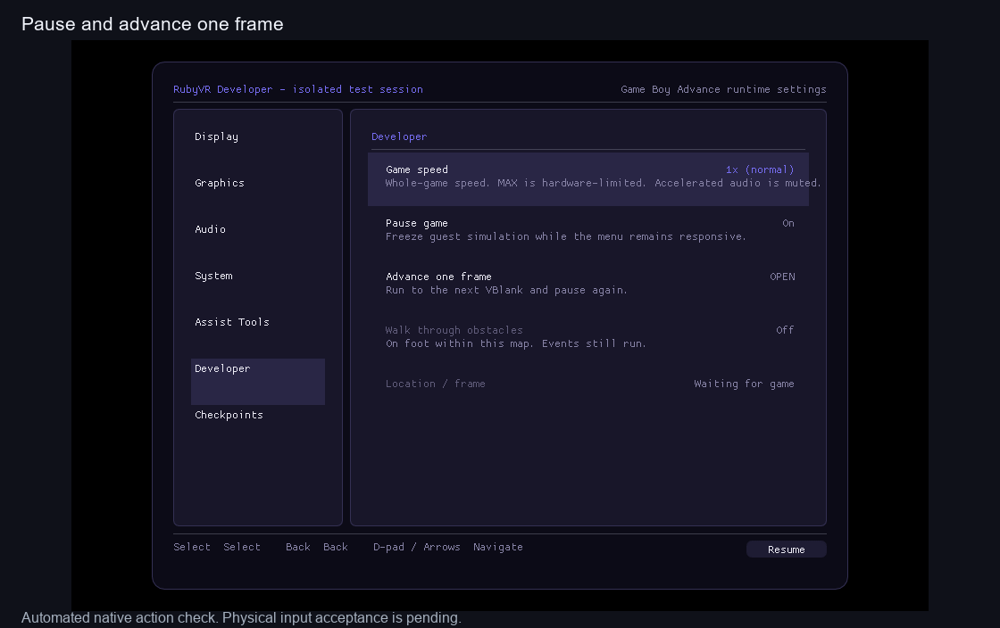

# Native developer mode

**M5: implementation in review; human input checks pending.** This adds visible
test controls to the private Windows Ruby runner. It is not the Studio map editor
or an installable public game/mod package.

The current combined PR #29 build includes these tools, PR #30's merged
[camera/facing fixes](live-camera.md), and [border forest restoration](live-borders.md).
Use the single camera-session launcher below. Its checkpoints are preserved;
the older developer build in the main checkout is historical.



The recording comes from the actual native game and shared voxel renderer.
The local harness drives the menu callbacks and guest input; it does not prove
physical mouse/keyboard acceptance. Windows Computer Use capture failed with
`SetIsBorderRequired: No such interface supported` on this machine.

## Try the prepared build

For the maintainer's prepared Windows workspace:

```powershell
& E:\Coding\vr-modding-research\_worktrees\live-camera\tools\run-dev-game.ps1
```

In the **original Ruby window**, press **Esc**:

- **Developer:** game speed, pause, advance one frame, and walk through obstacles.
- **Checkpoints:** select a named situation, load it, or enter a new name and
  save the current situation. Names are never overwritten. Previous/Next select
  the checkpoint; Load actually restores it.

The prepared session includes **Route 101**, **Bag open**, and **Back from bag**.
Create captures before a trainer, interaction, map transition or battle to return
to that exact situation. Up to 64 named captures appear in the session.
Checkpoint files and the test battery save live in `build/dev-session`, separately
from normal play. The launcher prevents two instances sharing this test session.

Normal speed is **1x**. The other choices target **2x, 4x, 8x, 16x, 32x, 64x** or
**MAX**, which removes the limiter. These speed up the whole game, including
dialogue and battles. Hardware and rendering still limit the actual rate;
accelerated sound is muted. Accelerated rendering targets 20 presentations per
second while guest execution continues between them.

**Walk through obstacles** bypasses the player's collision query while on foot
inside the verified current map. It does not disable events, grant invincibility,
edit map data, or replace border transitions. Bikes, surfing, underwater movement,
menus and unsupported ROMs retain normal behavior. Load a checkpoint to recover
if an event or position stops further movement. Loading switches noclip off and
returns speed to 1x.

To reopen another named capture, supply `-Checkpoint 'Your name'` to the same
launcher. `-Fresh` boots normally at the title screen using the isolated test
battery save. `-Check` verifies the prepared executable and inputs without opening
the game. These are options to the same workflow, not additional required steps.

## Known visible limitations beside the test steps

- **M9/M6:** camera-relative cardinal controls and normal-player facing are
  included. NPC/special-player facing, distant pop-in and free walking remain open.
- **M2/M5:** the source border forest is included. The newly reported ledge
  depth/geometry-versus-collision mismatch remains open; noclip does not fix it.
- **M4/M10:** tree/grass polish and live geometry reuse/performance remain open.
  Restoring the border increases the rendered tree count.
- **M5/M7:** the voxel view still clears during Bag/unsupported scenes; use the
  original game window. Keeping the world behind menus is still pending.
- **M5:** arbitrary map warp, event/party/flag editing, encounter switches and
  invincibility remain unimplemented. Existing Studio editing stays separate.
- **M10:** the final recording reaches 1.63x at 4x requested and 1.76x at MAX,
  missing the exploratory 2x throughput target with both windows and capture
  enabled. MAX is not a promise
  that this scene can run at 64x. No headset or Linux live-game acceptance is claimed.

## Human functional check — pending

Use the build revision recorded in the PR and printed by the launcher. Close its original Ruby
window when finished; the same launcher reopens the session.

- [ ] Launch with the command above. Press Esc in original Ruby and open
  Developer; the five controls/status rows are visible.
- [ ] Turn Pause on, then Advance one frame. The frame counter advances once
  and remains still; turn Pause off to resume.
- [ ] Try 4x and MAX, then return to 1x. Movement/dialogue speeds up subject to
  the PC's limit, and ordinary movement works again at 1x.
- [ ] Open Checkpoints, enter a new name and Save new checkpoint. Resume and
  move, then Load that checkpoint: return to the captured position. Try saving
  the same name again; it must report that the name already exists.
- [ ] At the Route 101 start, try walking right into the trees. Enable Walk
  through obstacles and walk right again: the player can enter the trees.
  Load Route 101; noclip is off and speed is 1x again. Story triggers still run.
- [ ] Load Bag open, then Back from bag. Close the game, reopen the same launcher,
  and load your named capture. The saved situation remains available. Switch
  focus between windows and verify ordinary movement and key release.

## Verification and integration boundary

`python tools/test-dev-session.py` compiles the host checkpoint/transport code
with C++20 and runs 40 checks without SDL, OpenGL, game data or a display. It
passes on Windows/MinGW and WSL/GCC and runs in hosted Linux CI.

Native verification exercises the real runner: pause, exactly one VBlank step,
new checkpoint publication, reload, blocked tree movement with noclip off,
passing through those trees with it on, reset of speed/noclip on load, and
accelerated/uncapped execution. The initial pause and pacing faults failed this
probe before repair. A westward movement test was rejected as a collision test
after source inspection identified Birch's coordinate event; the final test
uses the trees immediately east of the start. Events remain enabled.

Eight native functional checks pass. The separate throughput threshold does
**not** pass in the final capture: 119 guest frames at normal, 194 at 4x requested,
and 210 at MAX, each over two seconds. The speed controls accelerate execution,
but this measured performance limitation remains M10 work. Earlier runs reached
the 2x threshold; that does not override the final measurement.

The pinned local integration uses RubySapphireRecomp `dad4c68251aa3adde77be47884b17870a151f429`
and gbarecomp `13cab0418106e86708cfd10b817379fe2318b201`, with the existing local
runner changes. Only Ruby USA revision 1 is supported. The collision entry is
`CheckForPlayerAvatarCollision`, Thumb `0x08058DD4`, from the imported function
symbols and pinned pokeruby `63a8cbf0016b351a4e68f7036fa0b77e23d2f2c1`.

The public files are our host session controller and runtime-menu adapter.
The external runner is separately licensed and its modified source, executable,
ROM, BIOS and captures/checkpoints remain local. A fresh public checkout alone
cannot produce this private developer build. See [integration](../integration/README.md).

The local runner adapter must:

1. Call `vr::dev::configure(opts)` before starting the runtime. An absent
   `RUBYVR_DEV_DIR` leaves normal execution unchanged; a valid directory opts in.
2. Attach the supplied runtime UI callbacks/items. Refresh location from verified
   guest data on the runtime thread. No GUI/VR thread writes guest memory.
3. Service checkpoint requests only after unwinding to the outer dispatch loop,
   using the runtime's existing snapshot save/load functions. Never restore
   memory inside the present-in-place callback. Re-arm that callback afterward;
   restore presentation and invalidate captured world state after a successful load.
4. Apply pause and frame-step boundaries to both the outer and present-in-place
   paths, keeping input/presentation responsive while paused. Do not count a
   repeated presentation of the same VBlank as another simulation frame.
5. Apply developer pacing in both presentation paths and disable the ordinary
   frame pacer while it owns timing. Suppress accelerated audio. Disable the
   legacy ROM-adjacent state-slot writes in the isolated developer session.
6. Retain the runtime's trusted function-entry hook registry for noclip. A build
   with this entry compiled ahead of time must emit its reviewed hook guard;
   the currently tested entry uses the runtime's existing interpreter bridge.

The private handoff manifest records the executable and prepared-input hashes.
It must be refreshed after rebuilding; Git checkout/pull does not refresh ignored
executables. Full map editing and the public runner packaging contract remain M5 work.
