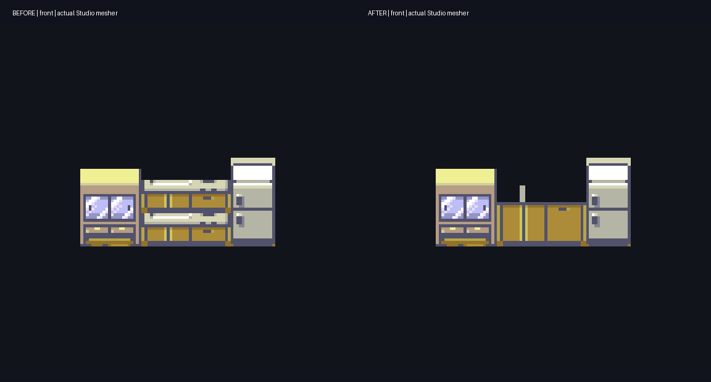

# Emerald geometry reuse evaluation

**17 September 2026: reuse selected generators and rules while keeping Ruby's
native gameplay and shared mesher.** The source/input evaluation and first
guarded kitchen adaptation are implemented and agent-reviewed. **In review:**
human art and native playthrough acceptance remain pending. Only the useful
matching roles/heights are adapted; this is not a wholesale Lua generator port.



The 12-second GIF uses identical source-scale cameras, filtering each pack to
the kitchen parts for inspection. It is Studio output, not native gameplay.
The [full-room view](media/kitchen-reuse-room.png) retains the complete candidate
pack, including walls, floor and neighbouring furniture.

The separate map-crossing, performance and apparent fast-forward plateau report
is recorded in [issue #38](https://github.com/ChronoHaxx/rubyvr-studio/issues/38)
under M5/M10. Its cause is unconfirmed. The maintainer prioritised this M4
evaluation before investigating it.

## What we actually inspected

- RubyVR base: `ca2d3b7c442054205f33c30c24a3987c48d6bcc5` (merged PR #37).
- [Gen2Recomped-DramaticShapes](https://github.com/UNDERdecoded/Gen2Recomped-DramaticShapes/tree/726782f223cac76b4e78cdadb24fa6ac78edaef0):
  `726782f223cac76b4e78cdadb24fa6ac78edaef0`, 15 September, newer than our earlier
  `4a114b3e` audit. Inspected the recursive tree and 21 pinned source/data/test files.
- Ruby inputs: `pret/pokeruby` at `63a8cbf0016b351a4e68f7036fa0b77e23d2f2c1`.
- Emerald comparison inputs: `pret/pokeemerald` at
  `c65e93f20a5275ab03b07d6f6411096a82a60ffd`, the source revision recorded in the
  companion's generated map metadata. Only five local tileset input families
  and two headers were retrieved; no ROM or game was run.

The companion's pinned [MIT licence](https://github.com/UNDERdecoded/Gen2Recomped-DramaticShapes/blob/726782f223cac76b4e78cdadb24fa6ac78edaef0/LICENSE)
permits code adaptation with its DramaticShape/UNDERdecodedHD notices retained.
This finding applies to that companion repository, not the separately licensed
engine, Dramatic Shape APK or game artwork. The initial evaluation copied no
implementation. The subsequent kitchen recipe adapts the role/height constants
with the [retained MIT notice](../LICENSES/Gen2Recomped-DramaticShapes-MIT.txt);
its face mapping and source guards are Ruby-specific.

The public tree contains procedural generators and authored tables, rather than
ready `.vox`, `.obj`, `.gltf` or `.bbmodel` scenery assets. The Python building
voxelizer and numbered building documentation largely concern Gen 1 templates;
they cannot be counted as completed Emerald buildings. Actual Gen 3 work lives
primarily in `Gen3.lua`, `Structures.lua` and the `data/gen3_*` tables.

## Which parts are useful

All upstream links below are pinned to the inspected revision.

| Area | Actual implementation and Ruby comparison | Decision |
|---|---|---|
| Trees and bushes | [`roundTemplate` and `buildCylinders`](https://github.com/UNDERdecoded/Gen2Recomped-DramaticShapes/blob/726782f223cac76b4e78cdadb24fa6ac78edaef0/lib/Structures.lua#L13139) read carved silhouettes, revolve row widths, taper clipped crowns and reuse templates. Our `build-voxel-world.py::foliage` already revolves rows and repairs clipped crowns, but uses authored masks. | Reuse applicable masking, neighbour ownership and canopy detection. Changing to the same broad shape method alone is unlikely to fix the rejected art. Test against Ruby pixels and six views. |
| Buildings and roofs | [`Gen3.buildingsOf`](https://github.com/UNDERdecoded/Gen2Recomped-DramaticShapes/blob/726782f223cac76b4e78cdadb24fa6ac78edaef0/lib/Gen3.lua#L7142) exposes inferred door-linked footprints; `Structures.buildVolume` and roof props consume them. Our starter roofs use explicit recipes and box/wedge parts. | Adapt footprint/roof inference for missing families. Retain editable parameters and Ruby's source guards. Do not transplant the four-shade Gen 1 building templates as Hoenn models. |
| Common interiors | [`gen3_shapes.lua`](https://github.com/UNDERdecoded/Gen2Recomped-DramaticShapes/blob/726782f223cac76b4e78cdadb24fa6ac78edaef0/data/gen3_shapes.lua#L918) identifies appliances, cabinets, TVs and stairs. `standGen3Furniture` recovers object tops from the row behind; `buildGen3Joinery` adds further furniture shaping. Our 127 room recipes use four coarser profiles. | **Best first implementation:** transfer the matching May/Brendan kitchen roles and adapt their standing-depth rules into our shared part generator. Preserve source artwork, furniture footprints and native interactions. |
| Terrain and bridges | `gen3_terraces.lua`, `gen3_palings.lua` and `Structures` contain many map-specific rules and exceptions. | Keep as targeted references. Emerald elevation/map pins are not Ruby world heights; do not bulk-replace our authored terrain or collision. |
| Build cost and caching | [`VoxelDiskCache`](https://github.com/UNDERdecoded/Gen2Recomped-DramaticShapes/blob/726782f223cac76b4e78cdadb24fa6ac78edaef0/lib/VoxelDiskCache.lua), `VoxelPrebake`, `BuildBudget` and `ChunkMesher.pump` cache/prebuild meshes and budget work. Ruby already reuses bounded map/model buffers. | Useful references when profiling #38. Adopting the generator does not establish a performance improvement: upstream also documents large mesh allocations and transition stalls. |

Upstream source comments also describe unresolved furniture misclassification
(including a false stair in May's living room) and incomplete Center stairwell
geometry. These are inspected limitations, not failures reproduced here. There
is no basis to call its entire Hoenn output visually accepted or bug-free.

## Executed input compatibility check

[`audit-emerald-reuse.py`](../tools/audit-emerald-reuse.py) compared every metatile
in five selected owning tilesets, reading both games' actual indexed PNGs and
binary definitions. It checks all eight 8px subtiles separately, including flips,
palette slots, transparent indices and the complete attribute word. Reordered
tile storage can match after decoding; changed artwork cannot pass merely
because IDs and definitions agree.

| Owning tileset | Emerald rows | Same-ID indexed-layer + attribute candidates | Different-ID candidates | No exact candidate | Unresolved pixels |
|---|---:|---:|---:|---:|---:|
| General | 512 | 284 | 0 | 228 | 0 |
| Petalburg | 144 | 21 | 0 | 121 | 2 |
| Building | 8 | 8 | 0 | 0 | 0 |
| Brendan/May house | 196 | 104 | 11 | 81 | 0 |
| Pokémon Center | 232 | 187 | 9 | 36 | 0 |

These are **candidate tile correspondences, not model counts or an art completion
percentage**. Palette RGB, animated frames, whole-object membership, local floor
ownership and placement/collision still need checks. Some unmatched artwork can
still use the same algorithm after adaptation. Missing pixels fail closed.

Concrete findings:

- General has **511/512 identical definitions and attributes**, yet only 284
  also match the indexed layers. Border-tree IDs 468/469/476/477 are among the
  artwork mismatches. A definition-only import would miss this distinction.
- House kitchen IDs **568–572** match, as do TV IDs 576/577; TV-related 586/691
  do not. Transfer the proven part of a rule instead of treating the entire
  tileset or room as interchangeable.
- Center stair IDs **640/641/648/649/656/657** all match at this level. The room
  placement and stairwell treatment still require Ruby-specific review.
- Petalburg 586/587 reference pixels beyond the supplied static sheet and remain
  unresolved. No blank or fabricated pixel data was substituted.

Run from the repository with Python and Pillow, using local source inputs:

```sh
python tools/audit-emerald-reuse.py --selftest
python tools/audit-emerald-reuse.py --ruby third_party/pokeruby --emerald build/emerald-reuse/pokeemerald --out build/emerald-reuse/input-comparison.json
```

The second command assumes the above pinned Emerald input subset is already
present; the tool does not download it. JSON includes every candidate ID,
rejection and SHA-256 of the inspected input files. The local retrieval receipt
records Git blob identities. No source art is committed. The synthetic check
passes pixel-order/flip, palette/attribute, changed-art, remapping and malformed
input cases. The real comparison completed without SDL/OpenGL or desktop input.

## Integration choice and next bounded proof

**Prefer adapting rules into the existing shared part generator.** It keeps
Studio editing, exact save/load and native runtime rendering on one path.
Start with one kitchen run in May's house; a Center stair and outdoor tree/roof
comparison follow after the first transfer establishes the contract.

There is also a useful offline comparison entry point:
[`ChunkMesher.geometry(map, bodyOnly, masks, split)`](https://github.com/UNDERdecoded/Gen2Recomped-DramaticShapes/blob/726782f223cac76b4e78cdadb24fa6ac78edaef0/lib/ChunkMesher.lua#L2178)
returns CPU vertices/indices, optionally separating water. It still needs a
real map/tileset context, atlas pixels, ground carving and engine-facing asset
interfaces; grass/flowers/figures use additional paths. We inspected this entry
point but did **not** execute a Lua geometry export. Upstream's interior test
also expects engine modules and a hard-coded generated Emerald data directory.
Its headless missing-pixel fallback can produce plain volumes, so passing that
path would not validate the intended shape.

A raw mesh exporter is therefore a possible comparison harness, not yet a
drop-in import. Ruby's v6 `voxel` field records pixel ownership, while editable
geometry remains box/billboard/wedge parts; it is not an arbitrary vertex or
voxel-grid payload. Adding such a payload would need a deliberate shared format,
material mapping and editor/runtime implementation. Embedding the entire Lua
engine would broaden the dependency and maintenance scope beyond this need.

## First transfer: May's kitchen — in review

| Candidate | Accepted into this patch | Deferred |
|---|---|---|
| Sink/worktop IDs 569/570 | Upstream's 16px height replaces our 24px counter. One native-scale sink/work surface; extend only the plain door band so handles and the kickboard appear once. A small box-built tap stands above it. | General furniture classification and other kitchen layouts. |
| Appliance ID 568 | Retain the 32px upright two-door face; sample plain casing texels on the sides and top. | Whole-sprite horizontal lid mapping from `buildGen3Joinery`: it would place appliance fronts on top and use edge texels down the sides. This risk was identified in source, not by executing the Lua exporter. |
| Glass cupboard | Keep our existing 28px cupboard. | Their 571/572 cabinet rules do not target this cupboard's 587/588 lower tiles. Raising it blindly would repeat its shorter front artwork. |
| Room integration | Move the kitchen's wall/window behind the work surface and extend the existing ceiling. The previous wall crossed the front of the sink. | Other walls, room families, TV reconstruction and outdoor scenery. |

The guard checks the exact May 1F layout, six placed tile/collision words and
indexed palette-slot/pixel identity of the kitchen. Unknown artwork/layouts
retain the old recipe and report `unchanged-source-mismatch`. RGB recolouring
still uses the local source palette. Runtime pattern guards continue to check
the loaded tileset definitions. No runtime, camera or movement code changes.

Verification on 17 September:

- `test-house-kitchen.py` passes without game assets: height, native surface
  dimensions, one handle band, plain fridge sides, footprint and unknown-source
  refusal. CI runs this check.
- With pinned local Ruby inputs, six ID/collision/pixel/palette/missing-art/room
  mutations fall back. All **1,188 other patterns**, all terrain, ordering and
  ownership masks are unchanged; regeneration is idempotent. New wall solids
  stay within native blocked cells. This footprint check is not a physical
  character-radius playthrough.
- The C++ production loader/serializer passes **13,404 checks**, including 127
  existing scoped rooms and exact complete-pack save/reload. The changed stripe
  has 32 parts and remains within the existing voxel memory/work bounds.
- Hidden WSL Studio renders front/back/left/right/top/oblique, neutral shape and
  complete-room views. Isolated models are closed and save/reload exactly.
  Agent review finds the repeated sink/cupboard and fridge-side artifacts fixed.
  The room view caught and corrected the existing wall occlusion. No shared
  pointer, foreground focus or desktop-wide keys were used.
- Candidate pack SHA-256:
  `c0b3466e72853d1fa2cfe3d79bf11f29c80228448cea21398d1e3422ae05bae4`.
  The separate prepared demo passes file/input/dependency verification and
  preserves all 17 checkpoint inputs. Native gameplay and human art acceptance
  of this candidate are **pending**; the existing runner binary is unchanged.

The first shell attempt exceeded the existing mesher work bound. Consolidating
the ceiling and keeping the back wall within the furniture depth resolved it;
the limit was not raised. Automatic approval review blocked an external Claude
source handoff before execution; the implementation and review were completed
locally, with no worker result or worker cost to report.

### Try the prepared local demo

Windows PowerShell, existing local ROM/BIOS and Python 3. Close the previous
game. Use this same command to launch and reopen the separate review session:

```powershell
& E:\Coding\vr-modding-research\rubyvr-studio\build\kitchen-demo\run-dev-game.ps1
```

It starts at **House 1F ready**. This is the maintainer's local handoff, not a
publicly downloadable game. The runner remains source `ba96cdd0541c4ac4fa4f43c8fe37e402af9191b6`,
binary SHA-256 `b0bce6b36358fefb815477efb1852280c014e6614955253399c8f1ff0dbde721`.
The PR identifies the recipe revision; the candidate pack above identifies the
new scenery independently of the unchanged binary.

Human checks — **pending**, approximately 3 minutes:

- [ ] Launch, choose **First person**, then **Continue playing**. Expect May's
  first floor, working WASD movement and the revised kitchen along the north wall.
- [ ] Approach the kitchen and right-click to look. Expect one sink, one row of
  cupboard doors and plain fridge sides. Escape must release look and open Play.
- [ ] Choose **Third person**; pass the TV, use the stairs up/down, then leave
  and re-enter the house. Expect clear approaches and normal transitions.
- [ ] Save a new named checkpoint **Kitchen check**, wait for **Saved**, close
  both game windows and reopen with the same command. Expect that checkpoint,
  remembered camera mode and the same kitchen. Existing checkpoints stay intact.

Known limitations beside this test: **M4** wider furniture/foliage fidelity and
other kitchen layouts are unchanged. **M5/M10 issue #38** map crossings,
performance and apparent speed saturation are not fixed by this patch.
**M11** public runtime reproduction/distribution remains unresolved. No headset
or physical input acceptance is inferred from the hidden captures.

<details>
<summary>Developer regeneration and hidden comparison</summary>

Use the pinned local inputs and an existing complete baseline pack; keep it
separate from the generated candidate. The baseline is not distributed here.

```sh
python tools/test-house-kitchen.py
python tools/test-house-kitchen.py --decomp third_party/pokeruby --baseline build/interior-scenes/pack.json
python tools/build-indoor-house-example.py --pack build/interior-scenes/pack.json --out build/emerald-reuse/kitchen/candidate/pack.json
python tools/test-indoor-scenes.py --pack build/emerald-reuse/kitchen/candidate/pack.json
```

On the supported Linux/WSL Studio build with a working graphics display:

```sh
bash tools/build.sh --jobs 4
python tools/review-house-kitchen.py --before build/interior-scenes/pack.json --after build/emerald-reuse/kitchen/candidate/pack.json
```

The renderer uses hidden windows and writes evidence under
`build/emerald-reuse/kitchen/review/`. Full-room captures preserve the whole pack;
isolated views deliberately omit unrelated parts. JSON records the exact binary
and input hashes. `--gui`, `--decomp` and `--out` select explicit local paths.
Do not substitute a generated replacement for a personally edited pack without
reviewing the changes.

</details>
