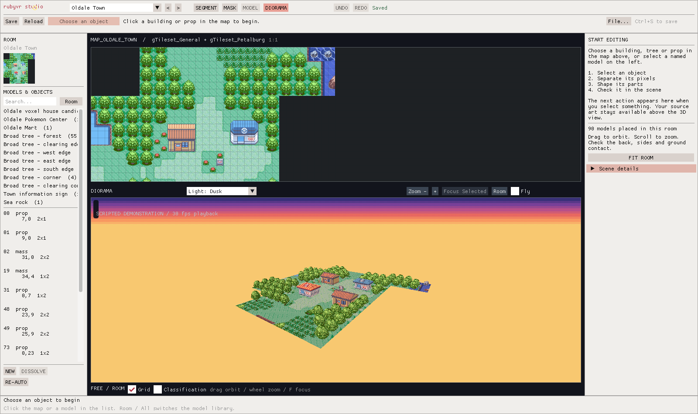

# Lighting preview verification

Recorded 2026-09-08 using the standalone Windows editor, NVIDIA GeForce RTX 3080
OpenGL driver and the pinned `pokeruby` source. No live game or headset was run.
The compact [machine report](environment-verification-2026-09-08.json) identifies
the GUI, pre-change GUI, source pack and geometry hashes.



The [neutral view from the pre-change binary](media/environment-neutral.png)
uses the same camera and source. The final neutral scene is pixel-identical.

## Reproduce

After the [local build and asset setup](building.md):

```powershell
python tools/test-studio-environment.py
```

The script selects the visible lighting dropdown, captures all four phases and
neutral from the same camera, resets, saves with Ctrl+S and exits normally.
Images and reports are written to ignored `build/environment-review/`.
Optional `--baseline-exe <previous-gui.exe>` also compares the neutral scene
with a pre-change binary. Without it, the neutral reset comparison still runs;
the historical-binary comparison is explicitly absent from the report.

## Results

All three layouts passed: 1600×950, 1280×720 and a 1280×720 window rendered at
1.5× framebuffer scale. This last case exercises scaling, not a claim that the
test changed the monitor's DPI setting.

- All four phases display six non-black sky colors through real OpenGL draws.
- Night multiplies the existing rendered scene pixels within two byte values
  of the expected tint. The test covers 18,880–42,507 scene pixels and 469–1,038
  dark pixels per layout. The replay banner is excluded from this art check.
- The source-map image, serialized working model data, input-pack bytes,
  geometry hash, placement set, undo count and camera remain unchanged.
- Lighting changes cause **zero mesh uploads**. Resetting to neutral restores
  the exact original scene pixels in each layout, including comparison with the
  pre-change GUI. User-facing chrome remains separate from the preview.
- Existing editor regressions passed: 270 self-checks, object invariants, eight
  frozen inference hashes, four layouts, 37 camera checks, 36 voxel UI checks
  and the guided workflow at both supported window sizes.

The wide-view warm draw cost was approximately **0.35–0.46 ms** across phases,
including sky and scenery; the three layouts together measured 0.32–0.46 ms.
These are means of 16 synchronized desktop samples per phase, with a `glFinish`
before and after each timed draw. They exclude UI drawing, shader initialization,
frame capture and scene rebuilds. Timing noise is large relative to this pass;
these numbers are not an FPS estimate, a reliable incremental cost or a VR budget.
Zero rebuilds were triggered by lighting, rather than rebuilding becoming free.

During development, a `texelFetch` version of the tiny RGB sky ramp produced
black despite valid uploaded texels and no GL error on this driver. The final
pass follows the upstream nearest-filtered texture-center sampling method.
The test checks visible bands explicitly so shader compilation alone cannot
mistake a black result for success. The exact driver cause was not established.

This verifies a deterministic editor preview. A running clock, celestial bodies,
cast shadows, water, weather, interior policy, VR brightness/comfort and a full
terrain horizon remain roadmap work. The recorded views do not approve every
model or placement artistically.
