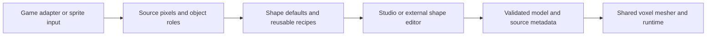

# External authoring and a reusable sprite-to-3D core

Status, 2026-09-10: a local Blender shape trial has been executed for one tree
and one grass patch. No general Blender bridge, Blockbench plugin, generic mesh
importer or second game adapter is implemented. The current
standalone application is an editor, not a standalone playable voxel game.

Keep the existing native renderer while testing Blockbench as a shape editor.
Its documented cuboid, pixel-texture and plugin workflow is a closer initial fit
than introducing a new game engine. Blender remains useful for procedural
geometry or shapes that require broader mesh tools. This is a design judgment;
no comparable end-to-end authoring time has been established here.
[Primary sources and evaluation limits](references.md).

## Bounded Blender trial

Blender 5.2 LTS generated a local editable scene with packed original sprite
references, 21 tree volumes and 10 grass volumes. Object translations/scales
export to the existing native part format with source/matching/role metadata
retained. The production renderer accepted both models as closed/connected and
saved/reopened them exactly: 3,912 tree triangles and 1,362 grass triangles.
The grass wedges become stepped voxels in the production mesher.

This tests a narrow procedural authoring path, not arbitrary vertex edits,
new UVs, rotations, a user-operated import flow or an exact Blender no-op
round trip. The Blender preview initially differed from the native format;
native parser validation caught and corrected the wedge field names.
Large canopy tiers and thin blades remain art problems. Both trials are
experimental and are not promoted into the default pack. Use the
[art direction](art-direction.md) to judge further edits.

The scene and native previews stay local under `build/foliage-authoring/`.
The model gallery compares merged starters, procedural trials and these native
Blender results under the same renderer, including original source sprites.

## First experiment: one editable house

Export one house to a custom Blockbench format, edit the body depth and roof,
and import it back as ordinary Studio parts. Retain stable model/part IDs,
pixel scale, local axes, transforms, source rectangles, face orientation,
tile/palette/animation identity, object/ground/shadow masks and matching metadata.
Round-trip a no-op edit exactly before measuring any authoring improvement.

Start with cuboids and preserve unsupported reliefs/wedges as their original
records. Unsupported edits must be visible; do not silently replace an editable
roof or masked sprite with an arbitrary mesh. A later wedge/voxel adapter can
expand the editable subset once its native-scale source sampling is verified.
Ordinary OBJ/glTF export alone does not preserve Studio's source/matching contract.

Acceptance: unchanged no-op save, a deliberate depth/roof edit reflected at all
matching placements, original source pixels and masks retained, unchanged
unrelated parts, one undoable import, and a full orbit in the production renderer.
Measure edit time, import/remesh time, vertex count and memory on named hardware.
The plugin should add no runtime dependency on Blockbench.

## Broader conversion workflow

Common buildings have strong useful defaults: aligned wall planes, a centred
roof ridge, a solid body and structural symmetry. Keep visible doors/windows on
their source-facing surfaces; use chosen siding for unseen walls. Distinguish
these editable assumptions from geometry established by multiple source views.
Trees need silhouette/depth defaults and cleanup of neighbouring sprite fragments
and baked shadows. Darkness alone is not a depth measurement.

Separate reusable shape editing/meshing from each game's source decoder,
tileset placement, animation and runtime integration. A generic PNG loses
structural matching and palette/animation identity unless supplied separately.
The first cross-game milestone is a small second adapter that uses the same
model contract, not a promise to reconstruct every GBA game automatically.

Voxel describes the geometry; 2.5D describes presentation and can include voxel
models. An HD-2D look adds lighting, camera and effects choices. None of those
labels requires a new engine. Profile dense forests and large towns first;
instancing, chunking and upload invalidation are candidates if measurements show
that the current renderer is the bottleneck. A new engine is a separate decision
with a concrete performance or capability requirement.
