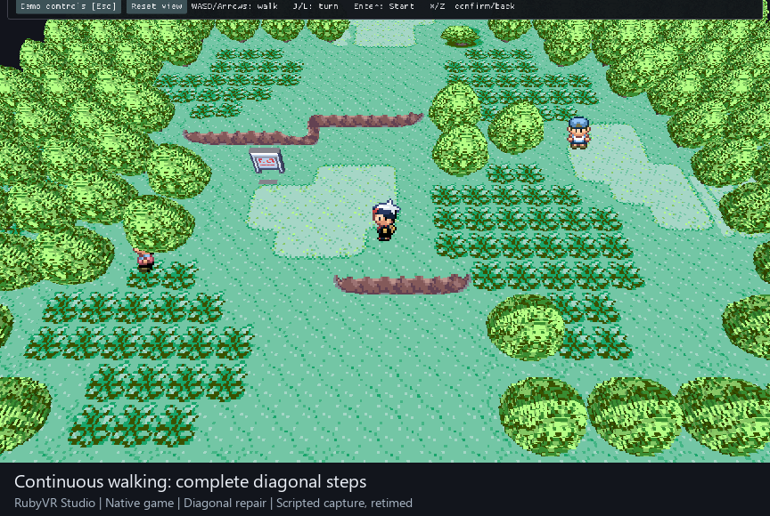
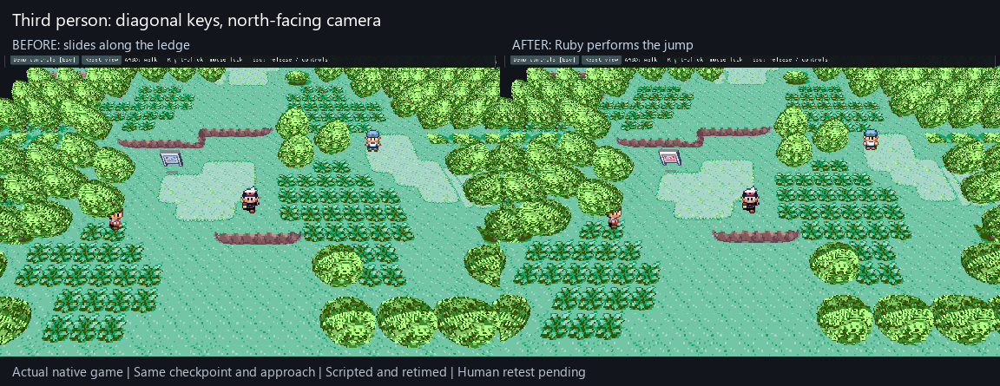
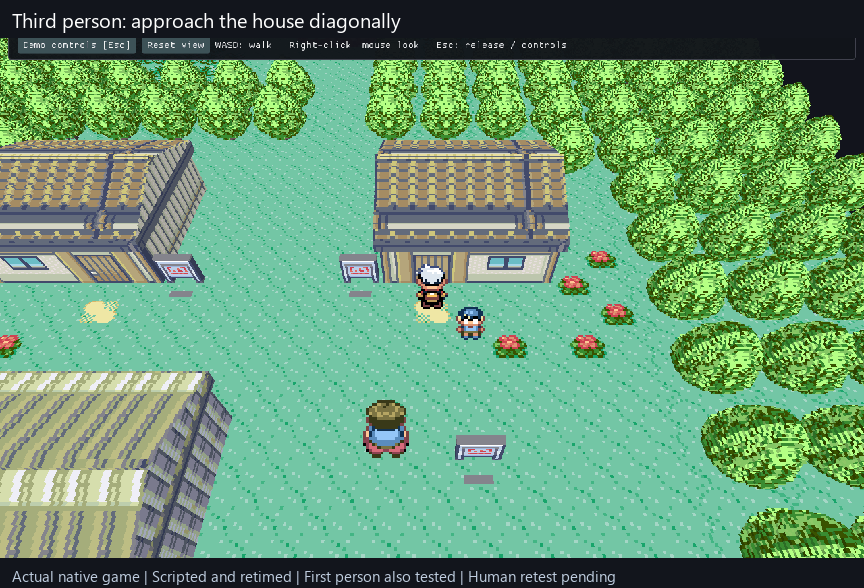

# Free walking, third-person and first-person

**Batch 2, M5/M6/M9 — diagonal shake, angled ledges and interior control handoff repaired; human retest pending.**
Third person and First person now move between Ruby's tile centres, including
diagonally. The view can turn smoothly with the mouse while walking. Grid remains
available. Player/NPC cards tilt toward the camera around their feet, so steep
views retain a readable sprite instead of showing its thin top edge.



This recording uses the actual native game and shared renderer, with scripted
input. It is sampled, captioned and retimed for review; it does not establish
physical mouse feel, performance or headset acceptance.

## Diagonal shake follow-up — 13 September

The maintainer reported earthquake-like diagonal motion after the `6c9bcd1`
handoff; they did not restate the tested revision. This fails the movement
acceptance case, despite the earlier short automated walk passing. That evidence
is retained as historical; it did not check sustained diagonal continuity.

Two errors are repaired: a tile crossing discarded the second movement axis,
and the 3D camera followed rounded GBA sprite pixels. The bounded movement step
now completes both collision-checked axes and notifies Ruby once at the resulting
cell. The renderer/camera receives the active player's precise foot in its
immutable snapshot. It is validated against the actor, cell and load epoch;
ordinary/native special movement keeps its source-pixel placement. No camera
smoothing or change to mouse sensitivity is used to conceal the error.

New long-diagonal tests cover all four signs across many tile boundaries at
constant speed. Both deliberately broken controls fail their intended checks.
An actual native open-ground segment had 0.0442-cell sideways camera deviation
before; the corrected sampled positions remain on the diagonal to the recorded
precision. The GL consumer also checks the exact fractional foot. Component,
sanitizer, ledge/checkpoint/input and encounter/Bag/connection regressions pass.
These measurements are not physical-input acceptance: repeat steps 1 and 3 below
in particular before considering the batch ready to merge.

## Angled ledge follow-up — 13 September

After the `ce1b542` handoff, the maintainer reported that ledges refused angled
approaches in Third person/First person and diagonal input at cardinal views.
The native reproducer confirmed it: straight approaches passed, while all ten
angled/diagonal approaches failed. Earlier cardinal-only ledge evidence did not
cover this case. Movement acceptance remains failed/pending human retest.



The body now reports which axis hit the ledge, even while sliding along its
other axis. The adapter checks the adjacent native tile in that direction and
lets Ruby execute its original jump. Shallow approaches use the ledge direction,
even when sideways input is stronger. A pending cell entry completes its event
first. Ordinary walls still slide/stop; parallel motion and uphill approaches
do not acquire a downhill jump. Collision boxes and ledge artwork are unchanged.

The 10-second comparison uses the actual native game and the same checkpoint
and approach directions, scripted and retimed. All twelve native approaches
now pass across both modes: straight, both cardinal-view diagonals, oblique,
and shallow left/right. Each checks checkpoint placement, the original south
jump action and landing, unchanged camera heading, and blocked uphill movement
(48 assertions). The 49-case public movement suite also passes optimized and
ASan/UBSan, covering all four contact normals and parallel/departing motion.
Repeat the affected ledge check below; this does not repair corner geometry or
the separately tracked visible-lip/trigger mismatch.

## House/interior follow-up — 13 September

After the `4d1fb46` handoff, the maintainer reported house-entry hangs in oblique
Third person and First person. The native reproducer found two defects. Indoors,
the free adapter consumed walking input even though the viewer used Ruby's
original view. At a shallow doorway approach, the dominant sideways input could
also prevent Ruby's earlier door-opening handler from seeing a northward push.



The adapter now yields indoors using the current native map type. At an outdoor
door contact, it supplies the contact direction to Ruby's next normal input
pass while the player keeps pushing into the door. Ruby still checks and runs
the original warp/script. Releasing or turning away cancels that direction.
The selected camera and heading remain available when returning outdoors.
Interiors still use their original 2D graphics and controls.

All four native house approaches pass: cardinal-view diagonal keys, oblique
Third person, oblique First person and shallow First person. Each verifies
normal collision, entry, walking indoors, exit with the same mode/heading and
resumed outdoor movement ownership (20 assertions). The lab sequence also passed
six ownership, walking and return checks after the interior gate repair. The
10-second clip shows the actual house sequence in Third person, scripted and
retimed. It is not an all-interior or physical-input acceptance result.

## Try the prepared build

Close the old game, then use the same Windows launcher:

```powershell
& E:\Coding\vr-modding-research\_worktrees\live-camera\tools\run-dev-game.ps1
```

The existing prepared runner, local game inputs and named checkpoints are the
prerequisites. This is the maintainer's prepared Windows game, not the separate
WSL Studio editor or a public installation recipe. The launcher verifies the
executable and pack; existing saves/checkpoints and the previous binary are kept.
The new **House approach** checkpoint starts outside the tested house with
obstacle bypass off; all ten previous checkpoints remain available.

Open **Demo controls → Camera and movement → Third person**. WASD/arrows walk;
right-click toggles mouse look. Right-click again releases it. Escape releases
the mouse and opens the panel; changing focus also releases it. **Mouse speed**
has Slow/Normal/Fast choices. J/L turn smoothly, I/K tilt, U/O change distance,
and R resets the view. **First person** uses the same walking controls and hides
the player's own sprite. **Grid** restores quarter-turn J/L and native stepping.
Enter opens Start, X confirms/talks, and Z goes back in every mode.

## Human playtest — pending before merge

Use the implementation/build revision recorded in the PR and printed by the
launcher. Agent results below do not tick these boxes.

- [ ] **Start and walk:** load **NPC views**, select **Third person**, close the
  panel and use W, then hold W+D, W+A, S+D and S+A over open ground for several
  seconds each, including after rotating the view. Expect a steady, straight
  diagonal with no shake and no extra speed. Approach a tree/building:
  ordinary collision should stop you.
- [ ] **Mouse and release:** right-click, look and walk; select Slow if needed.
  Right-click again, press Esc, and Alt-Tab away/back. Expect a released cursor,
  usable panel and no stuck walking/spinning; release held keys before resuming.
- [ ] **Camera and actors:** orbit around the nearby NPC and tilt steeply with I.
  Expect readable, foot-anchored player/NPC art. Try **First person**, then
  **Grid**: your own card disappears only in first person. Repeat a sustained diagonal
  in first person; the camera should remain steady. Grid restores 90° turns.
- [ ] **Ledge and connection:** load **Demo ledge**, choose Third person and
  approach the straight ledge diagonally. Reload, rotate away from a 90° heading
  and approach again, including a shallow angle. Repeat in First person.
  Expect the native downhill jump with the same camera heading; walking back up
  must stay blocked. Walk between Route 101 and Littleroot and look back:
  expect the connected scenery to remain. Corner shape defects remain below.
- [ ] **Battle and ordinary UI:** choose a heading, walk in encounter grass,
  choose Run and return. Repeat with another heading. Expect the chosen view/mode
  to survive. Open Start → Bag and return, then talk to an NPC: original menus
  and dialogue should still respond without walking through them.
- [ ] **House entry and return:** load **House approach**, select **Third person**,
  reset the view with R, and approach the door using W+D. Expect the house to
  open, then ordinary indoor walking with WASD/arrows. Walk back out and expect
  the same Third person view. Reload the checkpoint, select **First person**,
  turn the camera obliquely with J/L and approach again. Expect indoor controls
  and the same First person heading on exit; release held keys before resuming.
- [ ] **Save and reopen:** stop between tile centres, save a uniquely named
  checkpoint, move and reload it. Expect the same foot position within one source
  pixel. Close/reopen using the command above and load it again. The new process
  starts in Grid; camera/mouse preferences are currently session-only.

## Known limits beside the playtest

- **M2/M5:** broken ledge corners remain deferred. Special actions such as ledge
  jumps, pushing and map-border transfers hand back to Ruby and can centre the
  player within the current cell. Stopping exactly at the visible ledge lip and
  moving its physical trigger are not finished by this batch.
- **M5/M9:** free walking is an experimental on-foot adapter. Vehicles, forced
  movement and scripts retain original behavior. Obstacle bypass remains bounded
  by source-map and story rules. There is no all-map traversal acceptance.
- **M9:** camera collision avoidance is not implemented; orbit/first-person can
  clip scenery. Eye height uses terrain plus a fixed 1.35-cell offset. Modes and
  mouse speed are session-only; VR comfort/head tracking are untested.
- **M5/M7/M9:** the reported north-to-west battle reset was not independently
  reproduced on its original revision. A real successful Run and arbitrary-angle
  scene-return checks now pass, but broader battle/warp checks remain open. Ruby
  can centre an actor during an original scene transition.
- **M6/M9:** original actor art still supplies four directions, not new 3D bodies
  or eight-direction artwork. Distant NPCs can retain their last known pose.
- **M4/M5/M10:** foliage, missing scenery, void edges, save latency, public runner
  setup and performance budgets remain open. Battles/interiors still use the
  original graphics where voxel coverage is unavailable.
- **M5:** the existing button-only input recording/replay format cannot capture
  fractional movement and camera vectors. Free modes are refused when that
  recorder/replayer is active; use Grid for those developer sessions.

## Implementation and reference checks

The small body advances at most one source pixel per guest tick. A completed
step that enters a new cell notifies Ruby's original event handling once,
including a diagonal corner crossing. Both body axes are checked before that
notification; the next step waits for the original event handlers. Native collision,
ledge, dialogue, encounter and connection routines remain authoritative. A
checkpoint load invalidates host movement state and reconstructs the foot from
the original sprite/camera data. Returning focus to the original window returns
movement ownership to its normal controls.

Native testing exposed a Ruby camera case that normal full-tile movement does
not reach: reversing partway through a Y scroll updates X instead. A bounded
function-entry adapter executes the original camera routine through its correct
Y path. Repeated partial reversals now preserve X. The public
[`free-walk-hooks.toml`](../integration/free-walk-hooks.toml) declares the three
required guards; [integration notes](../integration/README.md#continuous-on-foot-adapter)
explain the private host requirement.

The focused reference pass used cached Emerald `OverworldController.lua` at
engine `b2a28281b1042eb25ce0b83941be0ef756fcade9`, companion `FreeMove.lua` and
`VoxelScene.lua` at `4a114b3e344db629ac7c7ac5108bd3d910fc4554`, and Dramatic Shape
APK 2.4.2's `FreeMove`, `FirstPerson` and `VoxelScene` modules. Relevant behavior:
fractional feet, normalized direction, small-body collision, once-per-cell
events, original special-action handoff and camera-facing cards. These informed
the contract; no restricted implementation was copied or translated. Ruby's
pinned `pret/pokeruby` source is `63a8cbf0016b351a4e68f7036fa0b77e23d2f2c1`;
the adapter verifies Ruby USA rev1 before reading/writing its supported layout.

For the angled-ledge repair, the cached companion `FreeMove.lua` resolves blocked
axes separately and checks special actions while the other axis slides. Ruby's
`field_player_avatar.c` takes a cardinal direction in `player_step`; its
`GetLedgeJumpDirection` reads the adjacent tile's permitted jump direction. The
native hook registry restores registers when a callback declines, so the adapter
must execute one bounded original step with the contact direction and handle its
return. Merely changing a register and declining cannot redirect the jump.

For the interior repair, the same cached `FreeMove.lua` yields to script/input
locks and uses original collision/warp behavior. Ruby's pinned
`field_control_avatar.c` handles north-facing warp doors in
`ProcessPlayerFieldInput`, before `player_step`; the adapter therefore supplies
one contact-directed input pass rather than dispatching a warp itself. Both
input mapping and free ownership use `outdoor_controls_available`: verified,
unlocked town/city/route maps only. Generic field controls remain valid indoors.
This native gate does not depend on the renderer's possibly older scene.

## Agent verification — scope and limitations

| Evidence | Result and scope |
|---|---|
| Free-walk component | 66 checks, optimized and ASan/UBSan: sustained diagonals, speed, sliding/contact normals, corner blocking, bounded steps, cell notification and cancelling pending door direction on release/reversal/parallel/invalid input |
| Billboard component | 10,079 assertions, optimized and ASan/UBSan: basis, near-vertical view, foot pivot, finite guards and vertex geometry |
| Camera/presentation/actor checks | Camera 1,372 and presentation 53 pass on Windows and WSL ASan/UBSan; camera coverage includes all 256 map-type bytes and indoor native control. Earlier unchanged player frame 3,504, NPC frame 16,363 and actor range 25 results remain regression evidence |
| Actual Windows OpenGL viewer | Exact fractional camera/actor foot survives rounded source pixels; steep card retains height; first person hides only player; arbitrary yaw retained; battle-return yaw/pitch/mode preserved; existing actor, menu, overlay and connected-scene checks pass |
| Native movement sequence | 16 checks: fractional/diagonal movement, grid return, native ledge/reverse collision, fractional checkpoint, repeated partial reversals and scripted Windows mouse capture/release |
| Native angled ledges | 48 assertions across twelve Third/First person approaches: original jump action, landing, unchanged heading and blocked reverse; old build fails all ten angled/diagonal jump cases |
| Native house/interior return | 20 house assertions across four approaches: normal collision, completed entry, native indoor walking, restored camera/heading and outdoor ownership. Six lab checks passed after the ownership gate repair |
| Native gameplay journey | Six checks: a real wild encounter, successful Run (`gBattleOutcome == 4`) with north/free mode preserved, Bag retention/return, native connection and return |
| Native Windows build | Passed with existing upstream warnings. No physical input or headset acceptance inferred |

The native connection outward leg used the existing obstacle bypass to reach
the border; return used ordinary collision. The Bag sequence followed battle
return; it is not exhaustive coverage of every fractional menu position. Native
drivers, private saves and raw captures remain local under `build/dev-session`.
The first movement regression run could not acquire window focus and failed its
two mouse assertions. With no other probe active, the unchanged rerun acquired
focus and passed all 16 checks. This still does not establish physical mouse feel.
The reproducible public component checks need no SDL, OpenGL or game assets:

```bash
bash tools/test-free-walk.sh
bash tools/test-billboard.sh
bash tools/test-actor-frame.sh
bash tools/test-actor-range.sh
python3 tools/test-camera-input.py
python3 tools/test-live-presentation.py
```

**Worker accounting:** the configured InferX DeepSeek Harness implemented only
the independent billboard helper/tests. Session
`rubyvr-inferx-billboard-d2a7edb4cbfe4c8a85158f6064a1b680` completed in **20m 24s**
within the 30-minute limit. Expected promotional API charge: **US$0**; provider
debit was not exposed. No paid fallback. Astra independently ran the helper
tests, integrated the renderer and accepted the bounded result; no functional
repair to the worker helper was required. Native movement, integration, the
partial-reversal repair, recording and acceptance work were Astra's work and
are not claimed as worker time savings.

This follow-up is Astra integration rework attributed to PR #35, with no new
DeepSeek call or API charge. The original billboard worker result is unchanged.
