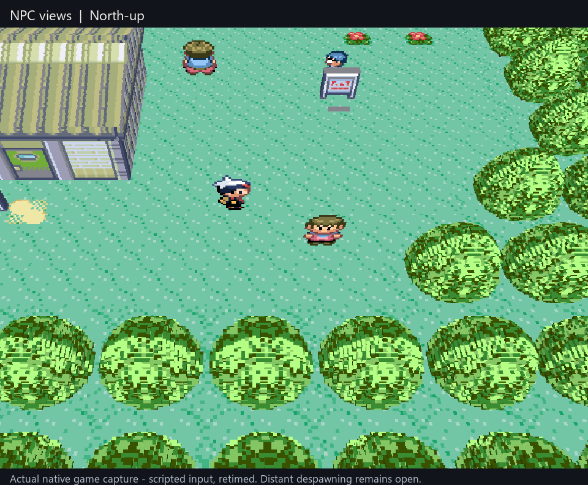

# NPC views and nearby visibility

**M6 / RV-010, supporting the M5 playable demo — in review.** Ordinary NPCs now
show their available front, back or side art when the camera turns. Loaded NPCs
also remain visible past Ruby's original 2D screen edge. The game still owns
their movement, animation, palette, script visibility and collision.



An 18-second close-up from the actual native viewer, retimed from scripted input.
The four camera views are followed by walking away and back below Birch's lab.
NPCs continue their original walking routines. This is agent visual evidence;
the human steps below remain pending. It does not demonstrate distant actors
outside Ruby's live object slots, free movement or a headset.

## Try it with the existing launcher

Use the prepared Windows game session:

```powershell
& E:\Coding\vr-modding-research\_worktrees\live-camera\tools\run-dev-game.ps1
```

In the original Ruby window, **Esc > Checkpoints**, select **NPC views** and
load it. This new local checkpoint starts beside the walking NPCs in Littleroot.
Existing checkpoints are preserved. The launcher prints the exact prepared
source revision; the draft PR records its build hash. No game assets or saves
are distributed in this repository. The WSL Studio editor is a separate program.

Focus the viewer: **arrows** walk, **J/L** turn in quarter-turns, **R** resets
north-up, **I/K** change tilt and **U/O** change zoom. Release arrows before
turning. **Enter** opens Start; **X** confirms/talks and **Z** goes back.

## Known limits beside the human check

- **M6, fixed here:** ordinary directional NPC art, short/tall/wide frame
  handling, verified animation/flip transitions and culling by the original
  screen. No alternate NPC animation clock or gameplay actors are introduced.
- **M6, still open:** Ruby can remove distant actors entirely from its 16 live
  slots. This change does not invent those NPCs or restore all neighbour-map
  actors. Special poses, effects, steep-view readability and full actor coverage
  still need work. Unknown/fixed-frame profiles retain their original art.
- **M9, still required:** smooth 360-degree third-person orbit and first-person
  are separate planned modes. They need the continuous-movement adapter and
  verified collision, cell-entry, ledge, encounter, warp and script behavior.
  The current grid mode keeps 90-degree turns. This PR does not add those modes.
- **M2/M4/M5:** ledge/contact alignment, foliage polish, the outer void and
  noclip's map/story limits remain open. Scenery still uses up to three nearby
  maps. **M7:** ordinary menus retain the world; battles/interiors use the original
  game in the same viewer. Walking inventory and diegetic VR UI remain later work.
- **M5/M10/M11:** public runner installation and desktop/headset performance
  acceptance remain open; this is the prepared private native runner.

## Human functional check — pending for this revision

1. [ ] Launch and load **NPC views**. Focus the viewer and watch both the small
   child and taller walkers. Expect complete sprites with feet on the ground.
2. [ ] While standing still, press J or L four times, releasing each press.
   Watch an NPC's walking direction and front/back/side drawing. Expect the
   drawing to match the viewpoint, with no reversed stride or reset to a wrong
   view. R returns north-up. Check once at a lower tilt using K.
3. [ ] With north-up restored, walk left to the lab entrance area, then a couple
   of tiles down and back. Watch the child farther north: crossing the original
   screen edge should not alone hide a still-loaded NPC. Larger-distance
   despawning remains a known limit, not a pass claim for this step.
4. [ ] Open Start with Enter, navigate and close it with Z; walk and release
   arrows, then switch focus between windows. Expect normal menu directions,
   no stuck movement and unchanged NPC appearance on return.
5. [ ] Close the game, reopen with the same command and load **NPC views** again.
   Turn the camera, then load **Demo field ready**. Expect the correct current
   NPCs and situation, without an actor carried over from the previous state.

## Sources and capture contract

The [existing Emerald/APK audit](emerald-camera-actor-audit.md) was revisited
before implementation. Exact references:

- `UNDERdecoded/Gen2Recomped-DramaticShapes` at
  `4a114b3e344db629ac7c7ac5108bd3d910fc4554`, `lib/VoxelScene.lua`:
  `frameFor`, `viewFacing`, fixed-frame exclusions and pose collection.
- `UNDERdecoded/Gen2Recomped` at `b2a28281b1042eb25ce0b83941be0ef756fcade9`,
  `src/world/OverworldController.lua`: script-aware object visibility and
  separate neighbour presentation objects.
- Local Dramatic Shape APK **2.4.2**, SHA-256
  `ff1bcf51f45dd01b7b61f79fdd0581691f13d2599ca9d17bd920abe08a834831`,
  `mods/DRAMATIC_SHAPE/lib/VoxelScene.lua` (`frameFor`/`viewFacing`),
  `FirstPerson.lua` and `FreeMove.lua` as traced in the earlier audit.
- `pret/pokeruby` at `63a8cbf0016b351a4e68f7036fa0b77e23d2f2c1`,
  `src/event_object_movement.c`, `src/sprite.c`, `include/global.fieldmap.h`,
  `include/sprite.h`, and the object graphics, animation and image tables.
  Actual addresses come from the runner's imported Ruby USA rev1 symbols.

The useful reference pattern is one game-owned pose with a camera-dependent
drawing, plus visibility distinct from the original screen. Ruby's native
adapter implements that independently; no restricted Lua was copied.

Capture binds each copied Sprite to its active owning ObjectEvent. Explicit
event hiding outranks the off-screen flag; unexplained sprite hiding remains
hidden. No guest flags are changed. Inactive/recycled slots cannot retain art.

After the existing ROM hash gate, graphics IDs select verified ROM records.
Only the Standard, QuintyPlump and Brendan/May Normal directional tables and
16x16, 16x32 or 32x32 frames are accepted. Image pointers, sizes, commands,
pixels and flips must agree. Fixed-frame script state and other profiles keep
the original frame. Four bounded host-owned images carry the displayed phase;
rendering never reads mutable guest memory or rebuilds scenery for a camera turn.

Native testing also exposed a mixed boundary: Ruby updates mirror bits before
its queued image copy completes. Recovery requires exactly one matching pending
copy with the current command's ROM source, OBJ destination, size and flips.
Overlapping/duplicate/malformed requests are refused. The resident view remains
pixel-exact; alternative views use that resident phase's own mirror, preventing
a second reversal. No previous snapshot or timer is substituted.

## Verification

- **2,590 player and 16,363 NPC checks** pass on Windows and WSL, including
  WSL ASan/UBSan: `bash tools/test-actor-frame.sh`. Tests use original synthetic
  art and need no game assets, SDL, OpenGL or physical input.
- The actual GL regression checks directional NPC pixels at four views,
  short-frame proportions, loaded viewport visibility, script hiding/despawn,
  stable feet, scene invalidation and existing menu/connected-world behavior.
- Three disposable negative controls fail the intended assertions when pending
  transition recovery, viewport permission or script hiding is removed.
- **Eight native replay checks pass.** The final closer-camera run matches all
  **3,888 captured actor poses**, including **2,882 NPC poses** and seven queued
  flip transitions. It samples short/tall NPCs, every walking phase and four
  directions. All 58 sampled viewport-culled NPC poses remain drawable. The
  native cohort is Littleroot's child, large walker and boy; wider profiles have
  synthetic coverage, not a whole-game visual pass.
- The native run records **48 distinct interpreter-fallback misses** with
  self-healing recompilation disabled. Timing/capture counts are not a
  strict-static, performance or headset acceptance claim.
- Early replay routes hit a house and a wandering NPC; the final route uses
  the clear path below the lab. The mixed-flip failures prompted the queued-copy
  repair and regression tests; failed runs remain local. Codex performed the
  implementation, repair and acceptance review. External review did not run;
  no DeepSeek call or paid fallback was used.

The [roadmap](roadmap.md#current-focus) records this as an in-review M6 follow-up
to the NPC report after PR #32. The earlier player and PR #32 human acceptance
remain recorded separately; this revision still needs the five steps above.
