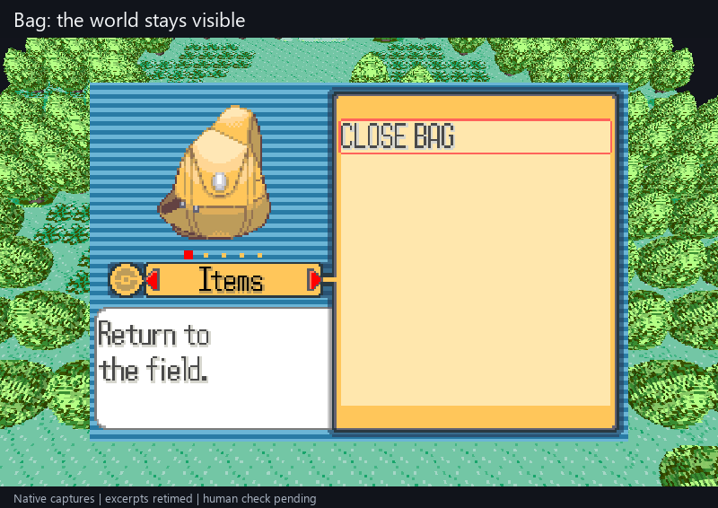

# Play through menus, battles and interiors in the viewer

**M5/M7 — in review; human acceptance pending.** The native desktop viewer now
keeps scenery behind ordinary Bag, Party and Options, and places the original
Start menu, dialogue and save windows over the world. Battles, interiors and
unrecognized screens show the original game in this same window. Closing a
supported field menu restores live scenery after the field is valid again.



26 seconds of excerpts from an actual native run, retimed for viewing. The isolated local
harness supplies game input and host checkpoint actions. It walks to Birch's
bag, chooses a starter, completes the first battle, talks to Birch, enters and
leaves his lab, opens Party and uses the original save UI. No guest memory,
collision rules, party data or story flags are edited to make this journey.
The recording and automated checks are agent evidence; physical input and
headset acceptance remain separate.

## One launch and reopen workflow

Use the existing prepared Windows session:

```powershell
& E:\Coding\vr-modding-research\_worktrees\live-camera\tools\run-dev-game.ps1
```

The launcher prints the prepared source revision. Focus the viewer: **arrows**
walk, **J/L** turn 90 degrees, **R** resets north-up. **Enter** opens Start,
**X** confirms and **Z** goes back. Menu arrows follow the original interface;
interior movement follows the original top-down view, regardless of outdoor yaw.

In the original Ruby window, **Esc > Checkpoints** selects and loads a named
situation. Existing checkpoints are preserved. The prepared session adds:

| Checkpoint | Use |
|---|---|
| Demo Bag | Direct load into Bag; intentionally original-only until returning to a valid field |
| Demo battle | The real starter battle, ready for original battle commands |
| Demo lab ready | Inside Birch's lab after the introductory dialogue; walk down to leave |
| Demo field ready | Outside the lab with the earned starter; Party, Bag and save are available |

The launcher uses isolated test saves. New checkpoint names never overwrite
existing ones. These local fixtures are not distributed in the repository.

## Known limits beside the human checks

- **M5/M7:** ordinary field Bag, Party and Options retain scenery. Other menus
  can intentionally switch to the original frame. Directly loading a menu
  checkpoint starts without a remembered world; close it to rebuild the field.
  A runtime reset/load always discards the previous presentation cache.
- **M7:** interiors and battles use their original 2D graphics. Original menus
  pause field gameplay according to Ruby's rules. Walking while browsing a
  custom inventory, 3D interiors/battles and VR panels are later work. This
  change is desktop-only; the existing OpenXR menu path is unchanged.
- **M6:** distant NPC pop-in, special poses, field effects and broader animation
  coverage remain open. This change does not extend the guest's actor range.
- **M2/M4/M5/M9:** the reported ledge/contact mismatch, foliage polish, wide-view
  outer void and noclip's map/story limits remain open. Three nearby maps are
  still the scenery limit. No geometry or collision changes are included here.
- **M5/M10/M11:** this is the prepared private Windows runner. Studio's WSL
  editor is separate. Public runner setup/distribution, whole-game and headset
  performance remain pending.

## Human functional check — pending

Use the exact revision printed by the prepared launcher and recorded in the PR.
These checks are not ticked by automated results or the recording.

1. [ ] Launch, focus the viewer, turn with J/L and walk. Press Enter: the Start
   menu should appear over the world. Move its selection, press Z and resume
   walking. Releasing arrows and changing window focus must not leave movement held.
2. [ ] In the original window, load **Demo field ready** from Esc > Checkpoints.
   Back in the viewer, open Bag, then Party, then Option from Start using X.
   Expect readable menus and scenery around them. J/L can turn the retained
   world; arrows navigate the menu. Z returns to the correct field each time.
3. [ ] Load **Demo battle**. In the viewer use X to choose FIGHT and SCRATCH;
   finish the battle and advance Birch's dialogue with X. Expect the original
   battle here, then outdoor dialogue over the restored scenery, then the
   original lab. No stale outdoor scene should appear behind the lab.
4. [ ] Load **Demo lab ready**. Walk down through the lab's exit; expect original
   screen directions indoors and live outdoor scenery after the warp. Open
   Start > SAVE and complete the original prompts with X in the viewer.
5. [ ] Save a new named host checkpoint, close the game and reopen with the same
   command. Load it and verify the situation. Load **Demo Bag**: original-only
   Bag is expected; closing it must restore the correct world. Load **Demo field
   ready** again and confirm normal movement/menu controls.

## Source and integration contract

Inspected before implementation; no restricted Lua was copied:

- Gen2Recomped engine `b2a28281b1042eb25ce0b83941be0ef756fcade9`,
  `src/world/OverworldController.lua`: overworld identity survives stack changes.
- DramaticShapes companion `4a114b3e344db629ac7c7ac5108bd3d910fc4554`,
  `mod/main.lua`: always-running update/VR path and source-frame UI anchoring.
- Dramatic Shape APK **2.4.2**, SHA-256
  `ff1bcf51f45dd01b7b61f79fdd0581691f13d2599ca9d17bd920abe08a834831`,
  `mods/DRAMATIC_SHAPE/lib/VR.lua::uiShowing/uiCanvas` and `VRXR.lua`: separate
  transparent UI canvas, stable native frame coordinates and bounded UI texture.
- Pinned `pret/pokeruby` `63a8cbf0016b351a4e68f7036fa0b77e23d2f2c1`,
  `src/overworld.c`, `start_menu.c`, `item_menu.c`, `pokemon_menu.c`,
  `party_menu.c`, `option_menu.c`, `text.c`,
  `include/main.h`, `palette.h`, `global.fieldmap.h`; the runner's imported
  **Ruby USA rev1** symbols supply actual callback/data addresses.

Ruby has no matching Lua UI stack/canvas. The new display-independent
`live_presentation` adapter classifies exact callbacks, map type, battle flag,
Bag context and fade state only after the existing cartridge hash gate. A host
state machine owns the last validated field snapshot, including textures and
actors. Only recognized same-identity menus retain it. Epoch changes, unknown
modes, battles, interiors and incompatible identities discard it. Return
callbacks wait for valid, unfaded field data before resuming live updates.

The native adapter consumes the runner's `g_runtime_state_epoch` after file,
rewind and debugger state loads; `world::reset_capture()` covers the named-host
checkpoint path. This additional runner contract is required alongside the
existing frame sink/input hooks; the public adapter is not a complete upstream
patch. Runner source provenance and distribution limits remain in
[integration](../integration/README.md).

For the supported field BG0 template, UI ownership comes from original 4bpp
tile indices and hardware window bounds. Transparent index zero stays clear;
opaque black text stays visible. Colors come from the same frame's original
composited RGB. Unsupported display layouts use the original frame instead of
guessing transparency from color. A nearest-filtered, aspect-preserving quad
draws UI after the existing shared world renderer, at integer scale when it fits.
Menus never supply their repurposed VRAM/OBJ as new scenery. Retention does not
pause guest execution; the guest itself controls normal menu/battle timing.

## Verification and repairs

- **53** headless callback/lifetime/UI ownership checks pass on Windows and
  under Linux ASan/UBSan. Run `python tools/test-live-presentation.py`; add
  `--sanitize` on Linux. No SDL, OpenGL, game assets or input devices are required.
- The local GL viewer regression checks actual original-frame orientation,
  transparent/opaque UI pixels, inset/full-frame bounds, retained actors,
  zero menu mesh uploads, safe return/load and original interior controls.
  It retains existing connected-map/material/camera tests.
- **16 native journey checks pass**, using the real first battle and lab warp,
  original input and isolated checkpoints. The exact executable hash is
  recorded in the PR; human checks above remain pending.
- All **four new checkpoint situations reopen in fresh native processes**:
  Bag, battle, lab ready and field ready. Each reaches its expected presentation
  mode and exits normally after a bounded 120-frame run.
- The broader journey records **270 distinct interpreter-fallback misses** in
  the development runner, with self-healing recompilation disabled. This is
  native integration evidence, not a strict-static or performance acceptance.
- Native testing found missing field-Bag/Party entry callbacks and the completed
  fade's still-black material frame; both were repaired and added to headless
  coverage. The local journey assertion also needed to wait for the first
  unfaded return, and its dialogue driver needed enough time for source text.
- Claude Opus/max read-only subscription review timed out after 360 seconds
  without a review or usage report. Codex performed review, implementation and
  repairs; no paid fallback or DeepSeek call was used. The local compiler cache
  stalled and was disabled for this private build; it is not a source change.

This advances the [short playable-session target](roadmap.md#route-to-a-shareable-playable-demo).
It does not complete all scene categories, M5/M7, public installation or VR.
