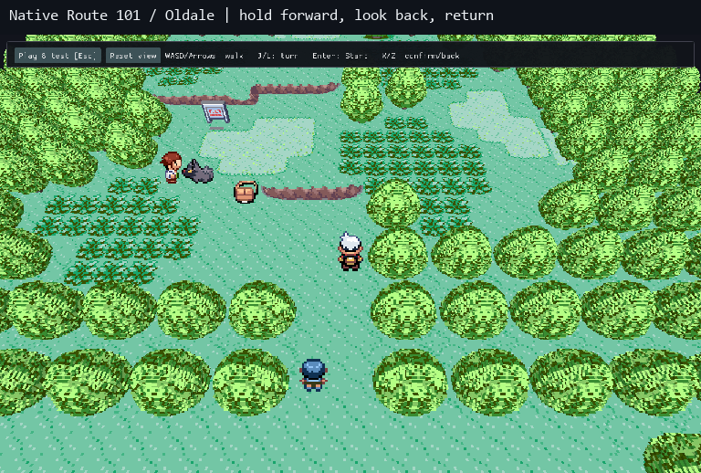

# Connected walking and usable fast-forward

**M5/M10 — in review, 17 September 2026.** This batch addresses two reproduced
border problems and the speed plateau from [issue #38](https://github.com/ChronoHaxx/rubyvr-studio/issues/38).
It keeps the native game and the complete scenery pack, including PR #39.



This 10.4-second sampled montage shows the real hidden native viewer in third
person. Movement stays held across both borders. Debug obstacle bypass provides
the test lane; border transitions still run through Ruby. Timing was measured
separately without capture. Grid and first-person journeys also pass locally.

## What changed

- Ruby can change the map header one VBlank before updating player coordinates.
  The viewer now retains the last coherent connected frame for that interval,
  avoiding a whole-map camera jump and a redundant mesh build.
- A border crossing no longer looks like a menu/focus change to the input
  mapper. Held movement resumes automatically. Real menu, focus and checkpoint
  transitions retain their release requirements.
- The native runner uses **Release**. The old empty CMake configuration left
  the host runtime and mesher unoptimized; unspecified configurations are now
  refused. Debug remains an explicit developer choice.
- **Test tools → Location / frame** shows measured **actual speed**, counted
  from guest VBlanks, independently of displayed frames.

## Measured result

Same Route 101 checkpoint and complete pack; hidden 1280×800 desktop viewer,
three seconds per selection after warm-up. 1× is approximately 59.73 guest
frames/second. Results apply to this PC and fixture, not every map or machine.

| Selection | Previous voxel runner, guest FPS | Release voxel runner, guest FPS |
|---|---:|---:|
| 1× | 59.3 | 59.5 |
| 2× | 118.3 | 118.6 |
| 4× | 128.3 | 239.0 |
| 8× | 124.9 | 383.3 |
| MAX | 136.4 | 383.6 |

The measured ceiling rises from approximately **2.3× to 6.4×**. The original
view, with the capture hook still attached, reaches 496 guest FPS in Release.
Returning to 1× gives 59.2 guest FPS. First connected-area CPU preparation drops
from 3,211 to 802 ms. Geometry and the three-map budget are unchanged. GPU
upload, larger areas and subsequent streaming stalls remain M10 work.

## Try this revision

Close the previous game. Prerequisites: the maintainer's existing Windows x64
setup, Python 3 and local Ruby/BIOS inputs. From any PowerShell directory:

```powershell
& E:\Coding\vr-modding-research\rubyvr-studio\build\playable-demo\run-dev-game.ps1
```

This isolated session imports existing checkpoints and the normal save, keeping
old sessions intact. It starts at Route 101; reopening resumes the last
saved/opened checkpoint as before.

- [ ] Choose **Third person**, continue playing and hold W through Route 101's
  northern exit into Oldale. Keep holding for another second. Expect continued
  walking without another key press or a whole-map camera jump.
- [ ] Turn around and return while holding movement. Repeat in **First person**
  or **Grid**. Expect stable surroundings and continued movement after crossing.
- [ ] In Test tools select **4×**, then **8×/MAX**, and watch **actual speed**.
  Expect a clear improvement over 2× on this PC; restore **1×** afterwards.
- [ ] Open Bag and return, save a new **Crossing check** checkpoint, wait for
  Saved, close and reopen with the same command. Expect the checkpoint/camera
  restored, normal speed, and earlier checkpoints preserved.

Known limits: **M5** the exact originally reported failing journey is unknown;
tested coverage is Route 101 ↔ Oldale, not all Hoenn. **M4/M2** provisional
foliage/interiors and ledge corners are unchanged. **M10** speed selections are
targets and streaming can still hitch. **M11** public native distribution and a
Linux live-game build remain unresolved. Human and headset acceptance are pending.

## Verification and references

- 122 synthetic scene checks and 27 neighbourhood/handoff checks, optimized and
  ASan/UBSan; 45 checkpoint/transport/speed-measurement checks.
- Hidden production GL checks cover the retained crossing frame, input
  ownership, completion, checkpoint epoch changes, existing menus and actors.
- Native forward/return journeys in Grid/third/first person, with movement held
  across both borders, original world origins and look-back retained.
- Removing the input-handoff fix in a disposable test build reproduces the
  held-key stall in both directions; restoring it passes the same journey.
- Native pause/one-frame step, save/load, collision/obstacle-bypass, load reset
  and return from accelerated speed pass on the Release build.
- Private phase logs separate guest execution, PPU rendering, presentation and
  pacing. Evidence is in `build/playable-performance/`; the PR pins source and
  executable digests. These tests use copied saves and process-local input.

The focused reference pass inspected cached Gen2Recomped-DramaticShapes commit
`726782f223cac76b4e78cdadb24fa6ac78edaef0`, `lib/BuildBudget.lua` and
`lib/ChunkMesher.lua`: keep cached geometry while background work progresses.
RubyVR already does asynchronous CPU preparation. Pinned `pret/pokeruby`
`fieldmap.c::CameraMove`, `overworld.c::LoadMapFromCameraTransition` and
`event_object_movement.c::UpdateObjectEventCoordsForCameraUpdate` establish the
header-before-coordinate ordering and seven-cell backup-map offset. No Lua code
is copied; guest coordinates and collision rules are not rewritten.

Developer setup: configure the compatible private runner with
`-DCMAKE_BUILD_TYPE=Release`, then use [the local preparation tool](demo-runner.md#developer-setup-for-another-local-directory).
`RUBYVR_AUTOMATED_TEST=1` hides the viewer; the local host must also create its
original window hidden. `RUBYVR_VIEWER_TRACE=1` logs presented map/foot and
handoff/input ownership. Neither switch establishes physical mouse feel.
