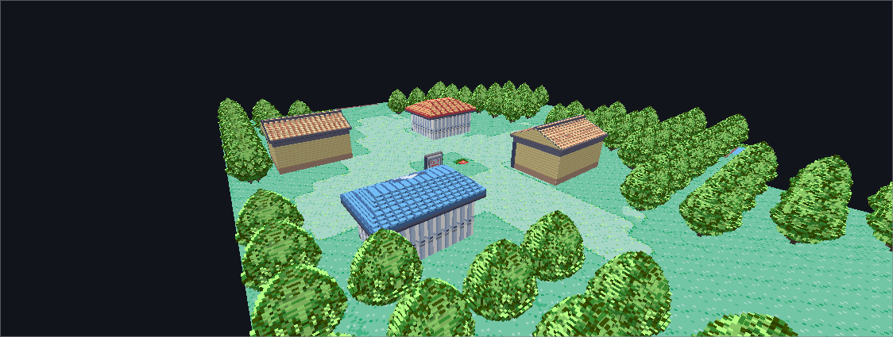
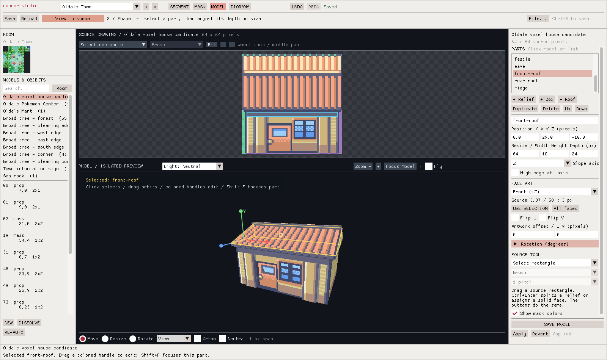

# Verification and its limits

## Live border restoration — in review in PR #29, 2026-09-12

[Evidence, sources and limits](live-borders.md): 75 component checks pass on
Windows/MinGW and WSL/GCC, including WSL ASan/UBSan. A disabled-substitution
negative control fails the phase assertion. A local 394-map simulated-grid
audit preserves body/copied data and guest RAM while resolving 281,939 border
cells. Ten actual native camera/menu/checkpoint/idle-turn checks pass; four
native before/after views were inspected. This adds substantial tree geometry;
it is not a performance or human-acceptance result. Earlier camera/facing
verification below remains historical evidence for PR #30, now merged into
the open parent PR #29.

## Normal-player apparent facing — PR #30 evidence, 2026-09-12

[The player-facing follow-up](live-facing.md) passes 2590 actor checks on Windows
and WSL, including WSL ASan/UBSan. It covers both known player profiles, every
world/view quadrant, phase/flips and exact resident-frame recovery at transitions.
The actual GL test verifies the corresponding colored directional pixels,
stationary feet, no scenery rebuild and invalidation. A disposable implementation
that keeps the original view fails the directional check.

The final native run passes ten movement/menu/checkpoint/idle-turn checks and
matches all **741 captured player poses**, recovering **eight** instances where
the displayed image differed from current animation metadata. An earlier strict
metadata-only pass missed four of 755 poses; its trace prompted the resident-pose
repair and remains local. The 16-second GIF was inspected, including matching
front/back/side views while stationary. A tree occludes part of the eastward
walking excerpt; the idle east view and GL checks provide the visible side test.
Native May, NPC/special profiles, broad animation/pop-in and physical user
acceptance remain open. Codex performed this repair's review; the earlier Claude
allowance failure below is retained, not a claimed review of this revision.

## Native camera controls — PR #30 evidence, 2026-09-12

`python tools/test-camera-input.py` passes 1079 assertions on Windows;
WSL `python3 tools/test-camera-input.py --sanitize` passes all 1079 under ASan/UBSan. These
checks need no SDL/OpenGL, assets or display. They cover four viewpoints,
direction combinations, unchanged action bits, held orbit, context/focus/reset
transitions and verified field-gate refusal. Disabling direction rotation in a
disposable source copy fails the four-viewpoint assertion as expected; the
production files are unchanged by that negative control. The 55 existing live-scene checks
pass in optimized and sanitized builds. The shared GL test passes north-up
initialization/reset and an orbit with no scenery rebuild, alongside existing
actor/invalidation checks.

After the maintainer rejected free yaw with grid movement, J/L were changed to
single 90-degree turns, deferred while arrow keys remain held. New component
checks cover repeat/queue/opposing/focus behavior and the GL test rejects
non-cardinal view requests. The native build and nine scripted movement/menu
checks were rerun successfully. Physical controls need the updated human check.
The report's broader animation and distant sprite pop-in remain **unfixed**;
the normal-player facing/phase subset is repaired in review above, with the
[actual Emerald implementation comparison](emerald-camera-actor-audit.md) recorded.

The native Windows build passes nine scripted checks of actual cardinal
movement, raw Start-menu/Bag navigation, no movement during Start-menu navigation,
noclip reset and north-up reset. The first harness failed to acquire focus; the
second skipped timed stages during a game stall. The final explicit-source
harness advances one stage at a time and passes without weakening movement
expectations. This validates the production mapping/gating adapter, not physical
focus or keyboard input. [Recording, scope and pending human checks](live-camera.md).

Claude's attempted read-only Opus review returned an allowance-limit error
before reviewing code. Codex performed the review and checks; no paid fallback ran.

## Native developer controls — in review, 2026-09-12

`python tools/test-dev-session.py` passes 40 checkpoint/transport checks on
Windows and WSL without graphics or assets. The native adapter additionally
passes scripted pause, exact one-frame step, named checkpoint capture/reload,
tree collision off/on, reset of speed/noclip on load, and accelerated/uncapped
execution. Eight native functional checks pass; the final recording misses
the exploratory 2x throughput target, reaching 1.63x at 4x requested and 1.76x
at MAX. Keep that M10 limitation visible. The same portable checks run in CI. The [developer-mode recording,
scope and pending human checks](developer-mode.md) distinguish this from
physical input and headset acceptance.

Checks use the production renderer and real document/input paths. They do not
replace human visual review or prove complete gameplay. Initial standalone
verification ran on 2026-09-08 on Windows with MSYS2 mingw64, an NVIDIA OpenGL
3.3 context and the pinned local source checkout in the build guide.

## Reproduce locally

The [live actor slice](live-actors.md) adds `bash tools/test-actor-frame.sh`:
original 29 checks, expanded to 2590 by the normal-player facing repair, in
optimized and sanitized builds without graphics/assets.
The local GL lifecycle test also verifies rendered actor pixels, fractional
motion, explicit height, unresolved refusal and clearing. Native walking,
mode reloads, editor regression results and the five checked PR #28 human steps
are recorded separately in that guide. The subsequent camera/control/facing and
missing-border report remains open; those behaviors need repair and retesting.

The [live map identity decoder](live-map-identity.md) runs 55 checks in each
optimized/sanitized build with `bash tools/test-live-scene.sh`; no graphics or
assets are required. Its optional GL lifecycle test and local native evidence
are recorded separately. The maintainer passed all five PR #27 human checks on
`825b1ae`; broader live transitions and the M5/M7 menu presentation follow-up
remain open. The cleared Bag background tested there is temporary.

The [connected-region query component](terrain-region-query.md) needs only Bash
and GCC with ASan/UBSan, without graphics libraries, assets or a display:

```bash
bash tools/test-terrain-region-query.sh
```

It runs optimized and sanitized builds: 16 named cases / 9,299 checks each,
including 8,000 repeatability probes. The [coordinator review](terrain-region-query-review.md)
separates coordinator results, original worker evidence and the three human CLI
passes recorded for PR #26 on `d2755ce` (merged as `b894df7`).

Use the native Ubuntu/WSL setup in [building](building.md). The supported
entrypoints are Bash and native Linux executables:

```bash
bash tools/build.sh --jobs 4
python3 tools/prepare-assets.py
python3 tools/check-repo.py
python3 tools/test-native-portability.py
python3 tools/test-studio-mouse-look.py
python3 tools/test-bash-launcher.py
python3 tools/test-editor.py
python3 tools/test-connected-studio.py
python3 tools/test-camera-map-streaming.py
```

The file/capture and launcher fixtures need no game data or display. The
editor/connected/streaming suites use local source assets and hidden real SDL
windows on WSLg. They passed on the reviewed native build; all eight frozen
geometry hashes and 32,000 connected atlas pixels remain unchanged.

The headless batch suites pass with DISPLAY unset: terrain 197, foundation 23,
connected 69 and portability 29 checks. The Bash suite passes 26 cases,
including a real minimal CMake build from outside a repository with spaces.
The native review reader and all original coverage/source-inventory suites pass.
Asset preparation completed all 394 maps, retaining the eight known oversized
proposals. Native launch/save/resume of the six-map preset also passed.

[Native evidence, toolchain and limitations](native-wsl.md) records the support
boundary. Linux OpenXR/live gameplay is unsupported. Historical Windows-only
rendering scripts below are references; only the portable commands above and
the headless CI suites have been rerun on Linux. Hosted Linux CI passes for
[PR #22](https://github.com/ChronoHaxx/rubyvr-studio/actions/runs/34542217204).
Do not substitute old captures or change frozen hashes.

| Check | What it verifies | Limits |
|---|---|---|
| `check-repo.py` | Python/JSON/YAML syntax, local doc links, notices and issue metadata | Not a full security/legal audit or hosted Actions run |
| `check-repo.py --publication` | Exact staged/tracked bytes, including force-added forbidden paths | Does not audit unstaged edits, private history or image ownership |
| `test-coverage-ledger.py` | Original synthetic source/recipe/renderer changes, retained independent reviews, removed/duplicate entries, exact placements, padding and export fragments | No game data or GL required; the local 394-map merge is separate evidence |
| `test-dynamic-inventory.py` | Original source events, aliases/variables, conditional scripts, generated movement macros, native calls, dependency retention, malformed/mutated input and independent review states | Source parsing only; no game execution, GL or network |
| `test-native-trace.py` | Ten original fixtures for helper paths, same-file static binding, ambiguous definitions/cycles, literal callback candidates, unresolved calls/macros/stores, false declarations and retained independent reviews | Conservative lexical source audit; no full C semantics, game execution, art or GL |
| `test-coverage-disposition.py` | Twelve original fixtures for complete/partial/mixed authored roles, field/battle ownership, runtime controls, variable identities, manual/stale intent, map/treatment/milestone filters, read-only reports, concurrent sync and CLI/Studio agreement | Intended treatment only; no automatic source-role guessing or visual/runtime approval |
| `test-coverage-review.py` | Read-only deterministic export, padded coordinates/anchors, partial coverage, independent and stale reviews, atomic publication, malformed paths/footprints; native filters/reader when `RUBYVR_REVIEW_BATCH` names the built batch executable | Nine original synthetic tests; native check enabled in CI after build, no art/GL/network |
| `test-studio-review.py` | Actual SDL review filters, source/model navigation and orbit at two sizes, flat/padding toggles, search, unchanged save/ledger, unsaved-edit cancellation and keyboard ownership | Requires local synced/exported coverage and source/GL; static placements only; no human usability/live/headset claim |
| Standalone build | GUI/batch compile/link without gbarecomp or the XR loader | Does not build a game or establish other platforms |
| `--test-terrain` | 197 original synthetic checks of surfaces/layers, guards, native UV bands, corner grades, neighbour projection, shared model height, persistence and memory bounds | No source art or GL; included in CI |
| `test-terrain-region-query.sh` | Explicit layers, primary ownership, fractional seams, malformed region refusal and borrowed-pointer preservation; optimized plus ASan/UBSan | No graphics libraries/assets/display; included in CI; no consumers, live gameplay or performance claim |
| `--test-foundation` | 23 original synthetic checks: actual base bounds exclude roof overhang, highest-corner pad, rigid movement/contact, native art, source/outside-terrain preservation, atomic refusal and exact v7 persistence | No source art or GL; included in CI; rectangular ground pads only |
| `--test-connected` | 69 synthetic checks of ownership, overhangs, seams, source indices, atomic refusal, rigid reuse, ordered equivalence, camera seam hysteresis, fixed/revisited origins, cancellation and closed ground bases including undefined padding and snapshot boundaries | No source art or GL; included in CI |
| `test-native-portability.py` | 39 native checks: 29 original writer/loader/capture cases plus ten mouse-input policy cases | Headless file/capture and input policy; no OS pointer grab, GUI journey, rendering or OpenXR runtime |
| `test-studio-mouse-look.py` | Twelve checks through the actual SDL event loop: inconsistent raw deltas, stationary coordinates, release/re-grab, focus/Escape, window bounds and unchanged documents/geometry | Synthetic input in a hidden window; [physical WSL mouse check](wsl-mouse-look.md) remains separate |
| `test-bash-launcher.py` | 26 native Bash cases: exact arguments, build location, fresh/resume, presets, cleanup, capture options, failure propagation, GUI identity, newer-source warning and cross-directory resume | Original fixtures; real GUI launch/save/resume verified separately |
| `--test-connected-source` | Four- and six-map authored fixtures plus a three-map/two-atlas source-floor fixture: offsets, expanded/stored counts and geometry hashes | Requires pinned local source and generated regional pack; third fixture deliberately has no scenery patterns |
| `test-connected-studio.py` | 20 SDL checkpoints at two sizes: enter, fly across a boundary, stop, blocked edits, return, repeat, save and unchanged source; 32,000 rendered pixels match a neighbour's own source-floor view | Cached uploads and whole-map culling checked; timings cover synchronized single-eye GL draw only, not whole-app or headset frame time |
| `test-region-model-reuse.py` | Native reuse/source audit, existing 20 SDL checkpoints plus 28 north/west flight/overview checkpoints, now preserving positions through moving residency | Optional PR #30 same-camera comparison applies before travel/after restoration; changed outer windows are excluded explicitly; [historical evidence](region-model-reuse-evidence-2026-09-10.json) |
| `test-camera-map-streaming.py` | 24 SDL checkpoints: two return journeys, unchanged source/document/history, GPU releases/reuse, cancellation during preparation, exact reentry and new maps beyond the initial window | Extra maps use source floors without authored terrain; timings exclude UI/rendering and are not headset FPS |
| `render-camera-map-streaming.py` | 36 inspected production captures in an 11-second GIF, actual flight and resident memory changes | Frames sampled with pauses; outer borders/foliage unfinished; [current evidence](camera-map-streaming-evidence-2026-09-10.json) |
| `render-region-model-reuse.py` (also `render-connected-scene.py`) | 27 actual production frames in a 13-second GIF: Littleroot through Oldale, Petalburg's offset join, and the full area | Uses verified captures; [scope and memory limits](region-model-reuse.md); outer frontiers and foliage unfinished |
| `test-studio-foundation.py` | 14 SDL checkpoints at two sizes: application, undo/redo, repeated no-op, save/reopen, 16 changed terrain cells and unchanged models/source | Controlled test slope, not proposed Oldale geography; [evidence](terrain-foundations-evidence-2026-09-10.json) |
| `render-terrain-foundations.py` | Six actual SDL captures from the tested executable, three paired views in a 12-second GIF | Inspected desktop evidence; no live/headset or entrance-route acceptance |
| `test-studio-terrain.py` | 49 SDL checkpoints: plateau/stairs/slopes, material pick, deck, refusal, history/save/reopen; real corner/seam orbit. Builds all 394 maps to check copied source ownership, 720 terrain copies and 40 two-map seam edges | [Authored local example](terrain-authoring.md); not complete geography, live traversal or headset acceptance |
| `test-terrain-regions.py` | 13 original synthetic tests: offset joins, integer continuity, tapered ends/reversed elbow, level concave water/shore constraints, source guards and malformed input refusal | Source-free; included in CI |
| `test-terrain-bridges.py` | Source-free guarded selection/layers/clearance, refusal and immutable input checks | Included in CI; no asset or runtime claims |
| `test-studio-bridge.py` | 38 decks/299 water planes, four bank contacts, 30 owner seams, 6,000 source-material triangles, five rejected mutations and five SDL save/reopen checkpoints; six previous maps retained | Local Route 104 example; [PR #25 human result recorded](terrain-bridge.md#human-functional-check--recorded-result) |
| `render-terrain-bridge.py` | Six actual paired SDL captures in a 12-second GIF | Same source/camera; original flat-floor baseline; no live/headset acceptance |
| `test-terrain-region-source.py` | 200 native boundary checks, 495 level water cells/7,920 surface triangles and 266 flat shore cells; rejects broken seam/water levels, changed guards, conflicting anchors and input with existing terrain; source art, Route 101 and patterns retained | Pinned local source; [bounded region example](terrain-regions.md) and [water contact](terrain-water.md), not complete geography |
| `render-terrain-water.py` | Eight actual SDL captures, paired at identical cameras/source art in a 12-second GIF | [Inspected desktop evidence](terrain-water-evidence-2026-09-10.json); no gameplay/headset claim |
| `prepare-assets.py` | Exact catalog map set, retained export diagnostics/fragments, starter generation | Does not establish visual approval or terrain completion |
| `test-editor.py` | Self-checks, object invariants, eight frozen hashes, four layouts, SDL camera/authoring and save/reopen | Disk source only; no live/headset claim |
| `test-studio-guided.py` | Visible next actions, part selection, mask/model/scene navigation and saving at two window sizes | A reproducible UI journey, not a timed human usability result |
| `test-studio-part-selection.py` | Direct roof, door, pane and frame selection in perspective/orthographic views at two sizes; focus, orbit, empty clicks, unchanged saves and zero mesh uploads | Starter-house coverage; included in `test-editor.py` |
| `test-studio-environment.py` | Lighting dropdown, real sky bands, source-art tint, neutral reset, immutable model/source data, zero mesh uploads and draw cost at three sizes/scales | Fixed editor phases; [recorded evidence](environment-verification.md); no game clock/weather or headset test |
| `review-voxel-world.py` | Geometry, matching, actual isolated/town renders and exact resave | Does not approve every placement visually |
| `test-voxel-emblems.py` | Complete source rows and roof-riser mapping for nine emblems | Does not establish subjective appearance at every distance |
| `test-voxel-trees.py` | All 28 Oldale broad-tree placements, complete native-scale crowns, trunk contact, adjacent ground masks and shared Mart/tree ownership | Requires a fresh pack review; does not establish coverage of every tree family |

`rubyvr_studio --scenes` alone prints disk-built geometry. The Python wrapper
explicitly checks the eight frozen hashes. It runs object invariants in a
separate process so a warm mesh cache cannot suppress the first scene's output.
This is disk-source regression, not a new comparison with a live game snapshot.

## Recorded standalone baseline

The intended-treatment continuation passes 57 synthetic checks across the five
coverage suites. Every one of 199,335 entries has a reason, evidence and a
milestone owning its next action; 163,271 remain unresolved. Reports and Studio
use the same policy, and recorded/stale decisions take precedence. Reporting,
exporting and the actual SDL journeys leave the ledger and authored pack
byte-identical. The native reader validates the new 165,777-row export.

Fresh Studio journeys pass 36 checkpoints at 1600×950 and 1280×720, including
navigation, search, notes, save and unsaved-edit protection. The updated filter
check verifies zero unresolved nonflat Oldale objects with known authored intent,
then 208 unresolved ground entries when included; 65 nonflat entries remain
visually unreviewed. It does not weaken visual approval or geometry checks.
[Watch the 20-second acceptance](acceptance.md) or inspect
[the recorded identities/results](disposition-evidence-2026-09-09.json).
This verifies the new report/export data with the existing GUI/batch renderer;
no new live-game or headset acceptance is claimed.

The native-path continuation passed all 45 synthetic tests across the static
ledger, source adapter, native trace and review-export suites (including the
built native review reader). Its real 394-map scan adds 374 target audits,
including helper/callback witnesses for Petalburg's doors and direct tile changes
for Mauville's switches and Sootopolis's cracked ice. All remain pending runtime
review. Existing entries and review payloads survive; the two gym rejection
records become stale because the batch renderer changed since their original
receipt, with their result/evidence and open defects retained. The authored pack
is byte-identical. [Concise acceptance](native-audit-acceptance.md) records exact
counts, input identities and limitations. This backend change does not supply
new GUI, live-game or headset acceptance.

The M1 source-state continuation scans all 394 maps and records 27,927 source
candidates: map events/connections, script blocks and changes, movement commands,
animation/sprite declarations, tileset frames/callbacks, behavior constants and
native mutation references. There are 1,156 warp entries, including 41 intentional
saved-destination warps; all fixed targets resolve in the source inventory.
The 56 used tilesets have 21 named callbacks and 35 explicit null callbacks.
The scanner recognizes every command name in this pinned source; this does not
prove complete execution-path or C-memory-write coverage.

The ledger adds these records without promoting visual/live/headset approval.
The 13 static ledger tests and 13 source-adapter tests use original fixtures.
The real merge retained both saved gym rejection records exactly, and a repeat
sync left all 198,961 present entries unchanged. The native audit checked all
394 maps with 5,832 accepted model/floor-mask placements and no rejected claims.
Local manifests, source fingerprints and the native match audit remain under
`build/coverage/`; they are separate from any rendered or runtime evidence.

The subsequent tree-boundary correction adds the two previously flat Oldale
trees, including the one sharing a roof tile with the Mart. Fifteen broad-tree
models now include the five-pixel crown above their repeating source unit.
Four variants also needed the lowest visible wood row continued one voxel to
the ground. Six source-only masks clear 102 crown pixels across neighbouring
ground-tile variants while preserving the other 239 pixels in each tile.
These masks emit no solid geometry; the existing closed/connected and positive
volume checks still apply to every actual model. They are omitted from the
model browser and retain ordinary source-role editing and exact persistence.

The final pack passed all 394 maps with no rejected claims: 3,653 model
placements inside maps and 1,121 in padding, plus 786/272 floor-mask placements.
The full editor suite, nine complete emblems and the new tree regression passed.
Actual four-angle Oldale views and textured/neutral tree views were inspected.
This is editor evidence; other source families and full-game/headset coverage
remain pending. Pack SHA-256:
`53ba55e86a560b338a541602c637cde53c415e651b6318de58e9f9eba03090a1`.
Local reports are in `build/tree-ground-final/`, `build/tree-context/` and
`build/editor-verification.json`.



The 2026-09-08 part-selection follow-up passed the editor suite (including both
direct-picking layouts) and guided navigation. Picking produced no GPU uploads,
undo entries or changed saved geometry. The tree recipe correction reclassified
1,045 retained floor pixels across 13 broad and three slender tree variants.
All 64 patterns retain their prior parts, source mapping and object masks; only
those 16 ground/shadow masks changed. Production before/after renders for forest,
west-edge and slender trees retained the same isolated geometry hashes, closed
meshes and exact save/reopen. This does not approve every adjacent map tile.
That earlier mask-only pack SHA-256 was
`2969481395519e1c88a1e22af62ed94dd2e0e7abded0c609c1fef0e1f969efad`.
Local evidence is in `build/part-selection-verification.json`,
`build/editor-verification.json` and `build/tree-cleanup-*-renders/`.



The following measurements describe the earlier standalone extraction:

- Both standalone executables built without the game runtime.
- 394 source maps loaded, 4,787 source families inventoried, zero map failures;
  eight oversized proposals remain with 22 retained fragments.
- Generated pack SHA-256:
  `372f2e9844d14104c564c05223b3db43538e818c963e432eae75fd16de61d1dd`.
  Local regeneration matched the prior development pack exactly.
- 270 GUI/document self-checks, eight unchanged inference hashes, four layouts,
  37 camera checks and 36 manual voxel input checks passed on the UX build.
  The visible next-action/save journey also passed at 1600×950 and 1280×720.
  Current local results are in `build/editor-verification.json` and
  `build/guided-verification.json`.
- Pack audit passed 64 definitions, closed/connected solids and exact resaves:
  3,651 map-body placements in 64 maps plus 1,119 in padding, across 394 checked
  maps. Oldale, Littleroot, Petalburg and Rustboro loaded and rendered.
- Nine emblems and 2,520 complete source pixels passed their source-row audit.

The compact, asset-free [verification record](verification-2026-09-08.json)
records the exact tested executable hashes and check scopes.

Local reports contain exact binary hashes, timestamps and artifact paths. They
remain local because nearby fixtures/images contain game-derived data. The
documentation screenshots/GIFs are actual application output. The geometry
comparison GIFs show before on the left and after on the right; they are not a
measurement of human authoring speed.

## UX follow-up

The initial usability pass adds a contextual next action, current-room model
filter/search, a selected-object scene panel and a consistent save action.
Scene diagnostics and output-path editing move out of the normal flow. This
does not establish full [Dramatic Studio parity](reference-parity.md) or prove
intuitive authoring; a timed human trial remains work package RV-004.

After inspecting fresh frames, adjust test input coordinates only where a
control moved. Keep semantic checks for source pixels, exact documents,
geometry, history and input ownership unchanged.

## Evidence still needed

Earlier development live/batch comparisons and short runtime fixtures remain
historical evidence for their exact inputs. They are not a current full-pack
runtime run. This extraction does not ship those captures or build the runner.
Full-pack live gameplay, complete playthrough, strict-static coverage and
current target-headset acceptance remain unverified.

[GitHub Actions](https://github.com/ChronoHaxx/rubyvr-studio/actions) records
hosted source metadata checks and native Linux builds with read-only
permissions. Earlier revisions used Windows jobs. Those jobs do not fetch ROM/decomp assets, run graphics/headset
checks or upload game data. The dated local baseline predates the first hosted
run; consult the result for the revision being reviewed.

Visual changes need actual front, back, both sides, roof and ground-contact
views plus a neutral view. Check native scale, object/ground/shadow ownership,
unseen materials and another compatible placement. A closed mesh or a passing
count does not substitute for that inspection.
